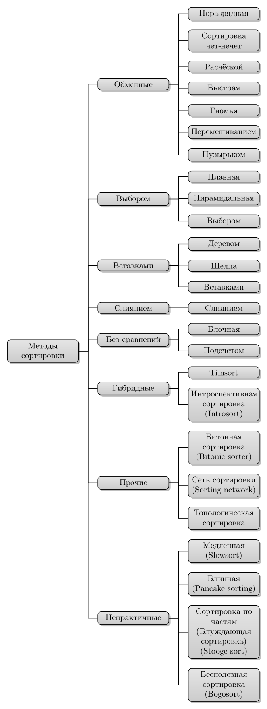

---
jupyter:
  jupytext:
    text_representation:
      extension: .md
      format_name: markdown
      format_version: '1.3'
      jupytext_version: 1.16.4
  kernelspec:
    display_name: Python 3 (ipykernel)
    language: python
    name: python3
---

<!-- #region editable=true slideshow={"slide_type": ""} -->
## Алгоритмы сортировки
<!-- #endregion -->

<!-- #region editable=true slideshow={"slide_type": ""} -->
### Цель работы

изучение основных алгоритмов на сортировки.


### Продолжительность и сроки сдачи

Продолжительность работы: - 4 часа.

Мягкий дедлайн (10 баллов): 10.10.2024

Жесткий дедлайн (5 баллов): 17.10.2024
<!-- #endregion -->

<!-- #region editable=true slideshow={"slide_type": ""} -->
### Теоретические сведения
<!-- #endregion -->

<!-- #region jp-MarkdownHeadingCollapsed=true -->
При обработке данных в ЭВМ важно знать и информационное поле элемента, и его размещение в памяти машины. 
Для этих целей используется сортировка.

В общем сортировку следует понимать как процесс перегруппировки
заданного множества объектов в некотором определенном порядке. Цель
сортировки облегчить последующий поиск элементов в таком отсортированном
множестве. 

Мы встречаемся с отсортированными объектами в телефонных книгах, в списках
подоходных налогов, в оглавлениях книг, в библиотеках, в словарях, на складах,
почти везде, где нужно искать хранимые объекты. 

В частности, сортировка это идеальный объект для демонстрации огромного разнообразия алгоритмов, все они изобретены для одной и
той же задачи, многие в некотором смысле оптимальны, большинство имеет свои достоинства.
Поэтому это еще и идеальный объект, демонстрирующий необходимость анализа производительности алгоритмов.

К тому же на примерах сортировок можно показать, как путем усложнения алгоритма, хотя под рукой и
есть уже очевидные методы, можно добиться значительного выигрыша в эффективности.
Выбор алгоритма зависит от структуры обрабатываемых данных 

Различают следующие типы сортировок:
- внутренняя сортировка − это сортировка, происходящая в оперативной памяти машины;
- внешняя сортировка − сортировка во внешней памяти.

Если сортируемые записи занимают большой объем памяти, то их перемещение требует больших затрат. 
Для того, чтобы их уменьшить, сортировку производят в таблице адресов ключей, делают перестановку указателей, т.е. сам
массив не перемещается. 
Это метод сортировки таблицы адресов.

Эффективность сортировки можно рассмотреть с нескольких критериев:
- время, затрачиваемое на сортировку;
- объем оперативной памяти, требуемой для сортировки;
- время, затраченное программистом на написание программы.

Если у нас есть элементы $а_1, а_2, ..., а_n$, то сортировка есть
перестановка этих элементов массив $а_{k_1}, а_{k_2}, ..., а_{k_n}$, где при некоторой
упорядочивающей функции $f$ выполняются отношения 
$f(а_{k_1}) \leqslant f(а_{k_2}) \leqslant ... \leqslant f(а_{k_n})$.

Обычно упорядочивающая функция не вычисляется по какому-либо правилу,
а хранится как явная компонента поля каждого элемента. 
Ее значение называется ключом кеу элемента. 

<!-- #endregion -->

<!-- #region editable=true slideshow={"slide_type": ""} -->
### Классификация алгоритмов сортировки

#### Устойчивость (стабильность)

При сортировке могут встретиться одинаковые ключи. 
В этом случае при сортировке желательно расположить после сортировки одинаковые в том же расположении, что и ключи в исходном файле. 

Алгоритм сортировки называется **устойчивым (stable)**, если он сохраняет исходный порядок равных имен. 
Данное свойство важно в тех случаях, когда элементы уже упорядочены по какому-то вторичному ключу и необходимо провести сортировку по первичному ключу (не зависящему от вторичного) так, чтобы внутри групп с одинаковыми первичными ключами сохранялся порядок, определяемый вторичным ключом. 

Если алгоритм сортировки не обладает свойством устойчивости (**неустойчивый (unstable)**), то эту задачу придется решать, сортируя элементы по составному ключу, являющемуся объединением первичного и вторичного ключей.


#### Место хранения данных

Выделяют два вида сортировки: внутреннюю и внешнюю.
**Внутренняя сортировка (Internal sorting)** решает задачу полной сортировки для случая достаточно малого массива, умещающегося непосредственно в оперативной памяти. 
**Внешняя сортировка (External sorting)** решает задачу полной сортировки для случая такого большого массива, не умещающегося в оперативной памяти, что доступ к нему организован по частям, расположенным на внешних запоминающих устройствах.

#### Выделение дополниетльного места

Если алгоритм перемещает элементы внутри исходного массива, то говорят, что выполняется сортировка **на месте (on place)**.
Сортировка, которая использует дополнительное пространство равное или большее исходному, называется сортировкой **не на месте**.


#### Адаптивность

Алгоритм сортировки называется **адаптивным**, если он использует преимущества уже «отсортированных» элементов в списке, который должен быть отсортирован. 
То есть при сортировке, если в исходном списке уже есть какой-то элемент, адаптивные алгоритмы примут это во внимание и постараются не переупорядочивать их.

**Неадаптивный** алгоритм – это алгоритм, который не учитывает элементы, которые уже отсортированы. 
Они пытаются принудительно переупорядочить каждый элемент, чтобы подтвердить их сортировку. 


#### Сложность

Естественной мерой оценки временной сложности алгоритма сортировки массива $X_n$ являются:

  - количество сравнений (обозначим $C(n)$);
  - количество перемещений элементов (обозначим $M(n)$).
  
При этом оценку желательно проводить по количеству операций, выполняемых в лучшем, среднем и худшем случаях.

<!-- #endregion -->

<!-- #region editable=true slideshow={"slide_type": ""} -->
#### Некоторые алгоритмы сортировки


<p style="text-align:center">
    
</p>
<p style="text-align:center">
    <em>Рисунок 1. Некоторые виды сортировки</em> 
</p>
<!-- #endregion -->

<!-- #region editable=true slideshow={"slide_type": ""} -->
### Задания на лабораторную работу
<!-- #endregion -->

<!-- #region editable=true slideshow={"slide_type": ""} -->
| Вариант | n1     | n2     | n3     | n4     | Метод сортировки 1        | Метод сортировки 2        |
|:------- |:-------|:-------|:-------|:-------|:--------------------------|:--------------------------|
|  1      | 1000   | 5000   | 10000  | 100000 | Медленная сортировка      | Пузырьковая сортировка    |
|  2      | 1000   | 5000   | 10000  | 100000 | Сортировка слиянием       | Блочная сортировка        |
|  3      | 1000   | 5000   | 10000  | 100000 | Метод Шелла               | Блинная сортировка        |
|  4      | 1000   | 5000   | 10000  | 100000 | Быстрая (Хоара)           | Сортировка перемешиванием |
|  5      | 1000   | 5000   | 10000  | 100000 | Шейкерная сортировка      | Сортировка Деревом        |
|  6      | 1000   | 5000   | 10000  | 100000 | Сортировка расческой      | Поразрядная сортировка    |
|  7      | 1000   | 5000   | 10000  | 100000 | Гномья сортировка         | Пирамидальная сортировка  |
|  8      | 1000   | 5000   | 10000  | 100000 | Сортировка чёт-нечет      | Stooge sort               |
|  9      | 1000   | 5000   | 10000  | 100000 | Поразрядная сортировка    | Сортировка перемешиванием |
| 10      | 1000   | 5000   | 10000  | 100000 | Сортировка Деревом        | Сортировка выбором        |
| 11      | 1000   | 5000   | 10000  | 100000 | Топологическая сортировка | Плавная сортировка        |
| 12      | 1000   | 5000   | 10000  | 100000 | Timsort                   | Метод Шелла               |
| 13      | 1000   | 5000   | 10000  | 100000 | Bogosort                  | Метод Шелла               |
| 14      | 1000   | 5000   | 10000  | 100000 | Stooge sort               | Introsort                 |
| 15      | 1000   | 5000   | 10000  | 100000 | Пирамидальная сортировка  | Сортировка чёт-нечет      |
| 16      | 1000   | 5000   | 10000  | 100000 | Блинная сортировка        | Сортировка слиянием       |
| 17      | 1000   | 5000   | 10000  | 100000 | Битонная                  | Пузырьковая сортировка    |
| 18      | 1000   | 5000   | 10000  | 100000 | Introsort                 | Bogosort                  |
| 19      | 1000   | 5000   | 10000  | 100000 | Блочная сортировка        | Сортировка подсчетом      |
| 20      | 1000   | 5000   | 10000  | 100000 | Сортировка подсчетом      | Timsort                   |    

1. Провести классификацию алгоритмов сортировки.
2. Подготовить теоретическое описание алгоритмов сортировки согласно номеру индивидуального варианта.
3. Подготовить блок-схему алгоритмов.
4. Представить описание алгоритмов на псевдокоде.
5. Описать достоинства и недостатки каждого алгоритма.
6. Реализовать алгоритмы сортировки согласно номеру индивидуального варианта. 
7. Протестировать корректность реализации алгоритма
8. Провести ручную трассировку алгоритма.
9. Провести сравнение указанных алгоритмов сортировки массивов, содержащих n1, n2, n3 и n4 элементов. 
10. Каждую функцию сортировки вызывать трижды: для сортировки упорядоченного массива, массива, упорядоченного в обратном порядке и неупорядоченного массива. Сортируемая последовательность для всех методов должна быть одинаковой (сортировать копии одного массива). 
11. Проиллюстрировать эффективность алгоритмов сортировок по заданному критерию. Построить диаграммы указанных зависимостей.

<!-- #endregion -->

### Методика и порядок выполнения работы

Для успешного выполнения и ащиты лабораторной работ, необходимо выполнить следующие этапы:

1. изучить теоретический материал по теме лабораторной работы (лекции, учебники);
2. написать программу для каждого задания;
3. оформить отчет по лабораторной работе;
4. защитить лабораторную работу.


### Содержание отчета и его форма

Отчет по лабораторной работе должен содержать:

1. Номер и название лабораторной работы; цель и задачи лабораторной работы.

2.  Словесная постановка задачи.
    В этом подразделе проводится полное описание задачи.
    Описывается суть задачи, анализ входящих в нее переменных, возможные ограничения, анализ условий
    при которых задача имеет решение (не имеет решения), анализ ожидаемых результатов;

3.  Листинг программного кода с комментариями, показывающие порядок выполнения лабораторной работы, и результаты, полученные в ходе её выполнения.

4. Выводы по лабораторной работе.

5. Ответы на контрольные вопросы.


### Важные замечания


<!-- #region jp-MarkdownHeadingCollapsed=true -->
### Контрольные вопросы

1. В чем состоит суть метода сортировки вставками?
2. Какие шаги выполняет алгоритм сортировки вставками?
3. Как программно реализуется сортировка вставками?
4. В чем достоинства и недостатки метода сортировки вставками?
5. Приведите практический пример сортировки массива методом вставок.
6. В чем состоит суть сортировки методом Шелла?
7. За счет чего метод Шелла дает лучшие показатели по сравнению с простейшими методами?
8. Приведите практический пример сортировки массива методом Шелла.
9. Какой фактор оказывает наибольшее влияние на эффективность сортировки методом Шелла?
10. Какие последовательности шагов группировки рекомендуются для практического использования в методе Шелла?
11. Как программно реализуется сортировка методом Шелла?
12. В чем состоит суть метода сортировки выбором?
13. Какие шаги выполняет алгоритм сортировки выбором?
14. Как программно реализуется сортировка выбором?
15. В чем достоинства и недостатки метода сортировки выбором?
16. Приведите практический пример сортировки массива методом выбора.
17.  В чем состоит суть метода сортировки обменом?
18. Какие шаги выполняет алгоритм сортировки обменом?
19. Как программно реализуется сортировка обменом?
20. В чем достоинства и недостатки метода сортировки обменом?
21. Приведите практический пример сортировки массива методом обмена.
22. В чем состоит суть метода быстрой сортировки?
23. За счет чего метод быстрой сортировки дает лучшие показатели по сравнению с простейшими методами?
24. Что такое опорный элемент в методе быстрой сортировки и как он используется?
25. Приведите практический пример быстрой сортировки массива.
26. Что можно сказать о применимости метода быстрой сортировки с точки зрения его эффективности?
27. Какой фактор оказывает решающее влияние на эффективность метода быстрой сортировки?
28. Почему выбор серединного элемента в качестве опорного в методе быстрой сортировки может резко ухудшать эффективность метода?
29. Какое правило выбора опорного элемента в методе быстрой сортировки является наилучшим и почему его сложно использовать?
30. Какое простое правило выбора опорного элемента в методе быстрой сортировки рекомендуется использовать на практике?
31. Какие усовершенствования имеет базовый алгоритм метода быстрой сортировки?
32. Почему быстрая сортировка проще всего программно реализуется с помощью рекурсии?
33. Как программно реализуется рекурсивный вариант метода быстрой сортировки?
34. Какие особенности имеет не рекурсивная программная реализация метода быстрой сортировки?
35. В чем состоит суть метода пирамидальной сортировки?
36. Какой набор данных имеет пирамидальную организацию?
37. Чем отличаются друг от друга дерево поиска и пирамидальное дерево?
38. Приведите пример пирамидального дерева с целочисленными ключами.
39. Какие полезные свойства имеет пирамидальное дерево?
40. Какие шаги выполняются при построении пирамидального дерева?
41. Что такое просеивание элемента через пирамиду?
42. Приведите практический пример построения пирамидального дерева.
43. Какие шаги выполняются на втором этапе пирамидальной сортировки?
44. Приведите практический пример реализации второго этапа пирамидальной сортировки.
45. Что можно сказать о трудоемкости метода пирамидальной сортировки?
<!-- #endregion -->

### Список литературы

1. Кнут, Д. Э. Искусство программирования: пер. с англ. / Д. Э. Кнут . - 3-е изд. - Москва : Вильямс, 2007. - Т. 1 : Основные алгоритмы, 2007. - 720 с. : ил.. - Прил.: с. 683-691. - Предм.-имен. указ.: с. 692-712. - ISBN 5-8459-0080-8.
2. Кнут, Д. Э. Искусство программирования / Д. Э. Кнут ; под общ. ред. Ю. В. Козаченко. - 2-е изд. - М. : Вильямс, 2009. - (Классический труд : Исправленное и дополненное издание). Т. 3 : Сортировка и поиск. - , 2009. - 823 с. : ил.. - Прил.: с. 794-803. - . - Предм.-имен. указ.: с. 804-822 - ISBN 978-5-8459-0082-1.
3. Кормен, Т. Алгоритмы: Построение и анализ / Т. Кормен, Ч. Лейхерсон, Р. Риверст. – М.: МЦМНО, 2002.
4. Давыдов, В. Г.  Программирование и основы алгоритмизации: учеб.
пособие для вузов / В. Г. Давыдов. - М. : Высш. шк., 2003. - 447 с. : ил - ISBN 5-06-
004432-7.
5. Ахо, А. Построение и анализ вычислительных алгоритмов / А. Ахо, Дж. Хопкрофт, Дж. Ульмен. – М.: Мир, 1989. – 369с.
6. Никлаус Вирт Алгоритмы и структуры данных. – Санкт-Петербург: «Невский диалект», 2001.

```python

```
