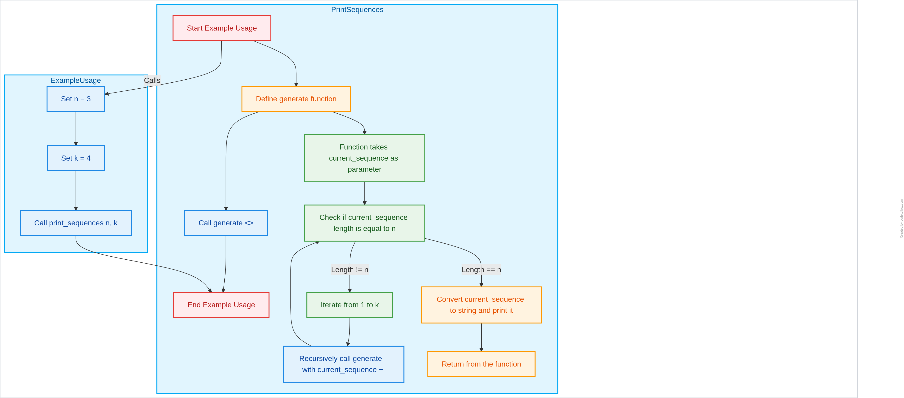

<!-- #region editable=true slideshow={"slide_type": ""} -->
## Лабораторная работа № 5  (Хеш-таблицы и хеш-фукнции)
***Выполнил***: Зейналли С.Р,  ***Группа***: ИУ10-36
<!-- #endregion -->

### **Цель работы**

Изучить рекурсивные алгоритмы и рекурсивные структуры данных; научиться проводить анализ итеративных и рекурсивных процедур; исследовать эффективность итеративных и рекурсивных процедур при реализации на ПЭВМ.


### **Задание №1**
#### 7. Реализуйте рекурсивный алгоритм, распечатывающий по одному разу в лексикографическом порядке все последовательности длины $N$, составленные из натуральных чисел $1, 2, \ldots, K$.


```python
def print_sequences(n: int, k: int) -> None:  # Corrected type hint
    """Prints all sequences of length n with elements from 1 to k."""
    
    def generate(current_sequence):
        if len(current_sequence) == n:
            print("".join(map(str, current_sequence)))
            return

        for i in range(1, k + 1):
            generate(current_sequence + [i])

    generate([])

# Example usage:
n = 3  # Length of sequence
k = 4  # Maximum element value
print_sequences(n, k)
```

    111
    112
    113
    114
    121
    122
    123
    124
    131
    132
    133
    134
    141
    142
    143
    144
    211
    212
    213
    214
    221
    222
    223
    224
    231
    232
    233
    234
    241
    242
    243
    244
    311
    312
    313
    314
    321
    322
    323
    324
    331
    332
    333
    334
    341
    342
    343
    344
    411
    412
    413
    414
    421
    422
    423
    424
    431
    432
    433
    434
    441
    442
    443
    444


### **Задание №2**

#### Реализуйте алгоритмы из задания №1 не используя рекурсию.


```python
import collections

def print_sequences_iterative_corrected(n: int, k: int) -> None:
    """Prints all sequences of length n with elements from 1 to k iteratively (corrected)."""

    sequences = collections.deque([([0] * n)])  # Use a deque for FIFO

    while sequences:
        current_sequence = sequences.popleft() #popleft from deque
        
        if all(x !=0 for x in current_sequence):
            print("".join(map(str, current_sequence)))
            continue

        for i in range(n):
            if current_sequence[i] == 0:
                for j in range(1,k+1):
                    new_sequence = list(current_sequence)
                    new_sequence[i] = j
                    sequences.append(new_sequence)
                break

# Example usage
n = 3
k = 4
print_sequences_iterative_corrected(n,k)

```

    111
    112
    113
    114
    121
    122
    123
    124
    131
    132
    133
    134
    141
    142
    143
    144
    211
    212
    213
    214
    221
    222
    223
    224
    231
    232
    233
    234
    241
    242
    243
    244
    311
    312
    313
    314
    321
    322
    323
    324
    331
    332
    333
    334
    341
    342
    343
    344
    411
    412
    413
    414
    421
    422
    423
    424
    431
    432
    433
    434
    441
    442
    443
    444


### **Задание №3** 
#### Для каждого реализованного алгоритма:
- #### составьте блок-схему;

- #### оцените верхнюю границу размерности задачи, для которой при рекурсивной реализации не происходит переполнение стека вызовов;

- #### модернизируйте рекурсивную реализацию так, чтобы сохранялись промежуточные результаты вызова рекурсии (реализуйте подобный механизм вручную, а также, с помощью декоратора);

- #### сравните производительность реализованных алгоритмов (количество итераций (соответственно вызовов рекурсии) подбирайте исходя из условий задачи).
<!-- #endregion -->

- #### **Составьте блок-схему:**




- #### **Оцените верхнюю границу размерности задачи, для которой при рекурсивной реализации не происходит переполнение стека вызовов:** 
Чтобы оценить верхнюю границу размерности задачи, при которой не происходит переполнение стека вызовов в вашей рекурсивной реализации функции `print_sequences`, необходимо рассмотреть несколько факторов, включая глубину рекурсии и потенциальное количество вызовов функции.

##### Глубина рекурсии

В вашей функции `generate` происходит рекурсивный вызов с добавлением нового элемента к текущей последовательности. Глубина рекурсии логически равна длине последовательности \( n \), поскольку рекурсивный вызов осуществляется каждые \( n \) уровней, когда длина `current_sequence` достигает \( n \). 

##### Количество вызовов функции

В течение рекурсивного процесса она вызывает себя \( k \) раз на каждом уровне до достижения глубины \( n \). Таким образом, полное количество последовательностей, которые будут сгенерированы, равно \( k^n \). Тем не менее, нас интересует только количество уровней рекурсии и запоминаемое состояние, так как это напрямую влияет на стек вызовов.

##### Оценка глубины стека

Значение, определяющее максимальную глубину рекурсии, обычно определяется настройками интерпретатора Python и системными ограничениями (например, размером стека). В Python вы можете использовать функцию `sys.getrecursionlimit()`, чтобы узнать текущее ограничение на глубину рекурсии, которое по умолчанию составляет 1000. Однако в зависимости от платформы оно может различаться.

##### Анализ

1. **Глубина рекурсии**: Мы можем выполнять \( n \) вложенных рекурсий, прежде чем достигнем предела. Если уровень вложенности \( n \) превышает размер стека (например, 1000 в большинстве интерпретаторов Python), произойдет переполнение.
  
2. **Полное количество состояний**: Если одновременно в каждой функции хранится состояние, мы не должны превышать \( n \), что также не должно превышать системный рекурсивный лимит.

Таким образом, в общем случае, мы можем оценить верхнюю границу для \( n \) в зависимости от вашей системы. Примем, что безопасное значение для \( n \), если \( k \) не слишком велико, это \( n \leq 1000 \). Но если \( k \) значительно больше для одной из поступающих последовательностей, стек может переполниться еще до достижения \( n = 1000 \).

##### Вывод

**Оцененная верхняя граница размерности проблемы**: 

- Для большинства систем, в которых учитывается стандартное ограничение на глубину рекурсии в 1000, разумно устанавливать \( n \leq \text{число, близкое к } 1000 \) с учетом того, что каждая функция работает только с небольшими фрагментами данных.
- При этом важно учитывать, что реальное значение будет зависеть от величины \( k \) и использованной памяти на каждом уровне рекурсии.

Если какие-то дополнительные алгоритмические или продуктивные изменения будут внедрены для сокращения занимаемой памяти, это также может позволить обрабатывать большие значения \( n \) и \( k \).

- **Модернизируйте рекурсивную реализацию так, чтобы сохранялись промежуточные результаты вызова рекурсии (реализуйте подобный механизм вручную, а также, с помощью декоратора):**


```python
def memoize(func):
    memo = {}
    
    def wrapper(*args):
        if args not in memo:
            memo[args] = func(*args)
        return memo[args]

    return wrapper

def print_sequences(n: int, k: int) -> None:
    """Prints all sequences of length n with elements from 1 to k, 
    using a decorator to save intermediate results."""
    
    results = []  # To store intermediate results
    
    @memoize
    def generate(current_sequence):
        if len(current_sequence) == n:
            results.append("".join(map(str, current_sequence)))
            return

        for i in range(1, k + 1):
            generate(current_sequence + (i,))  # Convert to tuple with (i,)

    generate(())

    # Print results
    for result in results:
        print(result)

# Example usage:
n = 3  # Length of sequence
k = 4  # Maximum element value
print_sequences(n, k)

```

    111
    112
    113
    114
    121
    122
    123
    124
    131
    132
    133
    134
    141
    142
    143
    144
    211
    212
    213
    214
    221
    222
    223
    224
    231
    232
    233
    234
    241
    242
    243
    244
    311
    312
    313
    314
    321
    322
    323
    324
    331
    332
    333
    334
    341
    342
    343
    344
    411
    412
    413
    414
    421
    422
    423
    424
    431
    432
    433
    434
    441
    442
    443
    444


- #### Cравните производительность реализованных алгоритмов (количество итераций (соответственно вызовов рекурсии) подбирайте исходя из условий задачи):


```python
import time

# Простой рекурсивный вариант
def generate_sequences_recursive(n, k, current_sequence=[]):
    if len(current_sequence) == n:
        return
    for i in range(1, k + 1):
        generate_sequences_recursive(n, k, current_sequence + [i])

# Вариант с мемоизацией
def memoize(func):
    memo = {}
    
    def wrapper(*args):
        if args not in memo:
            memo[args] = func(*args)
        return memo[args]

    return wrapper

def generate_sequences_memoized(n, k):
    @memoize
    def generate(current_sequence):
        if len(current_sequence) == n:
            return
        for i in range(1, k + 1):
            generate(current_sequence + (i,))

    generate(())

# Тестирование производительности
def test_performance(n, k):
    start_time = time.time()
    generate_sequences_recursive(n, k)
    print(f"Recursive time for n={n}, k={k}: {time.time() - start_time:.6f} seconds")

    start_time = time.time()
    generate_sequences_memoized(n, k)
    print(f"Memoized time for n={n}, k={k}: {time.time() - start_time:.6f} seconds")

# Пример теста
test_performance(3, 4)

```

    Recursive time for n=3, k=4: 0.000043 seconds
    Memoized time for n=3, k=4: 0.000086 seconds

