---
jupyter:
  jupytext:
    text_representation:
      extension: .md
      format_name: markdown
      format_version: '1.3'
      jupytext_version: 1.16.4
  kernelspec:
    display_name: Python 3 (ipykernel)
    language: python
    name: python3
---

<!-- #region editable=true slideshow={"slide_type": ""} -->
# Алгоритмы на графах
<!-- #endregion -->

<!-- #region editable=true slideshow={"slide_type": ""} -->
## Цель работы

изучение основных алгоритмов на графах.


### Продолжительность и сроки сдачи

Продолжительность работы: - 4 часа.

Мягкий дедлайн (10 баллов): 29.11.2024

Жесткий дедлайн (5 баллов): 13.12.2024
<!-- #endregion -->

<!-- #region editable=true slideshow={"slide_type": ""} -->
## Основные алгоритмы на графах

### Алгоритмы обхода графов.

Существует множество алгоритмов на графах, в основе которых лежит систематический перебор вершин графа, причем такой, что каждая вершина
просматривается (посещается) в точности один раз. 
Поэтому важной задачей является нахождение «хороших»  методов такого перебора.
Под обходом графа (поиском на графе) мы будем понимать процесс систематического просмотра всех вершин графа с целью отыскания вершин,
удовлетворяющих некоторому условию.

**Обход (поиск) в глубину**.

Идея алгоритма: из текущей вершины движемся в первую вершину, смежную с текущей, в которой мы еще не были, если таковая есть. 
Если таковой нет, то возвращаемся в вершину, из которой мы попали в текущую. 
Если же таковой нет, и мы оказались в исходной вершине (возвращаться некуда), то это означает, что перебор вершин графа закончен.
Номера просмотренных вершин графа запоминаются в стеке.

**Обход (поиск) в ширину**.

Идея алгоритма: метод поиска в ширину получается из алгоритма поиска в глубину, если мы заменим стек возврата на очередь. 
Эта простая замена модифицирует порядок обхода вершин так, что обход идет равномерно во все стороны, а не вглубь как при поиске в глубину.


##### Алгоритмы поиска на графе.

**Нахождение эйлерова цикла**.

Определение: Если граф имеет цикл (не обязательно простой), содержащий все ребра графа по одному разу, то такой цикл называется эйлеровым циклом.
Идея алгоритма: начиная с произвольной вершины, строим путь, удаляя ребра и запоминая вершины в стеке, до тех пор, пока множество смежности очередной вершины не окажется пустым, что означает, что путь удлинить нельзя. 
Заметим, что при этом мы с необходимостью придем в ту вершину, с которой начали. 
В противном случае это означало бы, что вершина $v$ имеет нечетную степень, что невозможно по условию. 
Таким образом, из графа были удалены ребра цикла, а вершины цикла были сохранены в стеке $S$. 
Заметим, что при этом степени всех вершин остались четными. 
Далее вершина $v$ выводится в качестве первой вершины эйлерова цикла, а процесс продолжается, начиная с вершины, стоящей на вершине
стека.

**Нахождение гамильтонова цикла**.

Определение: Граф называется гамильтоновым, если в нем имеется цикл, содержащий каждую вершину этого графа. 
Сам цикл также называется гамильтоновым.

Идея алгоритма: в основе лежит перебор с возвратом (backtracking).
Начинаем поиск решения, например, с первой вершины графа. 
Предположим, что уже найдены первые $k$ компонент решения. 
Рассматриваем ребра, выходящие из последней вершины. 
Если есть такие рёбра, что идут в ранее не просмотренные вершины, то включаем эту вершину в решение и помечаем ее как
просмотренную. 
Получена ($k+1$) компонента решения. 
Если такой вершины нет, то возвращаемся к предыдущей вершине и пытаемся найти ребро, выходящее из нее в другую вершину. 
Решение получено при просмотре всех вершин графа и возможности достичь из последней первой вершины. 
Решение (цикл) выводится и продолжается процесс нахождения следующих циклов.

##### Алгоритм нахождения кратчайших путей в графе.

**Алгоритм Дейкстры**.

Определение: Дан простой взвешенный граф $G(V,E)$ без петель и дуг отрицательного веса. 
Найти кратчайшие пути от некоторой вершины a графа $G$ до всех остальных вершин этого графа.

Идея алгоритма: метка самой вершины $u$ полагается равной 0, метки остальных вершин — бесконечности. 
Это отражает то, что расстояния от $u$ до других вершин пока неизвестны.
Все вершины графа помечаются как непосещенные. 
Если все вершины посещены, алгоритм завершается. 
В противном случае из еще не посещенных вершин выбирается вершина $u$, имеющая минимальную метку. 
Мы рассматриваем всевозможные маршруты, в которых $u$ является предпоследним пунктом. 
Вершины, соединенные с вершиной $u$ ребрами, назовем соседями этой вершины. 
Для каждого соседа рассмотрим новую длину пути, равную сумме текущей метки $u$ и длины ребра, соединяющего $u$ с этим соседом. 
Если полученная длина меньше метки соседа, заменим метку этой длиной.
Рассмотрев всех соседей, пометим вершину $u$ как посещенную и повторим шаг.

<!-- #endregion -->

<!-- #region editable=true slideshow={"slide_type": ""} -->
### Задания на лабораторную работу
<!-- #endregion -->

<!-- #region editable=true slideshow={"slide_type": ""} -->
**1.** Реализовать программу, выполняющую описанный набор операций на графах:

Требования:
 - граф должен быть реализован в виде класса;
 - каждая операция должна быть реализована как метод класса.

**2.** Реализовать приложение, для работы с графом, которое реализует следующий набор действий:

 а) инициализация графа;

 б) организация диалогового цикла с пользователем;

 **3** Реализовать индивидуальные задание.
 
<!-- #endregion -->

<!-- #region editable=true slideshow={"slide_type": ""} -->
### Индивидуальные задания

Задание 1: Найти кратчайший путь на графе между парами вершин ориентированного графа.


| Вариант | Начальная и конечная вершины| Граф |
|:---|:---|:---|
| 1  | 1, 6 | 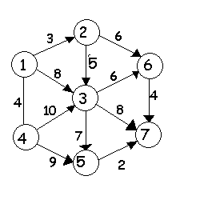 |
| 2  | 1, 6 | 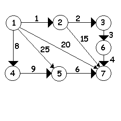 |
| 3  | 2, 6 | 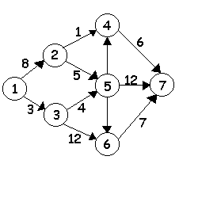 |
| 4  | 1, 7 | 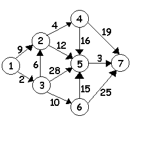 |
| 5  | 2, 6 | 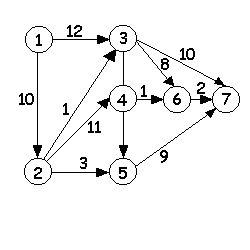 |
| 6  | 1, 6 | 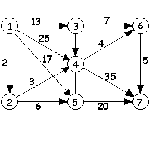 |
| 7  | 1, 6 |  |
| 8  | 5, 7 | 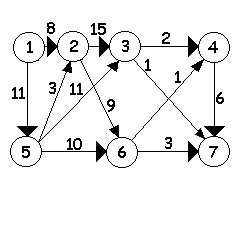 |
| 9  | 1, 7 | 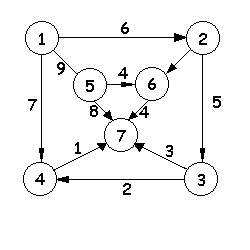 |
| 10 | 1, 6 | 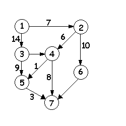 |
| 11 | 4, 7 |  |
| 12 | 1, 7 |  |
| 13 | 3, 7 |  |
| 14 | 3, 7 |  |
| 15 | 1, 7 |  |
| 16 | 2, 7 |  |
| 17 | 2, 5 |  |
| 18 | 1, 6 |  |
| 19 | 1, 3 |  |
| 20 | 2, 5 |  |


Задание 2. Реализовать алгоритм Дейкстры поиска кратчайшего пути на графе между парами вершин:

| Вариант | Начальная и конечная вершины| Граф |
|:---|:---|:---|
| 1  | 3, 6 | 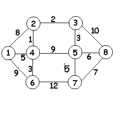 |
| 2  | 2, 8 | 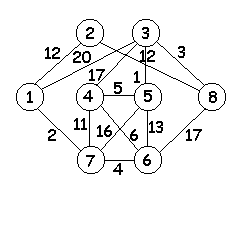 |
| 3  | 1, 5 | 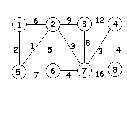 |
| 4  | 3, 8 | 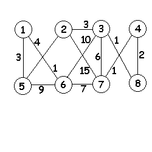 |
| 5  | 1, 6 | 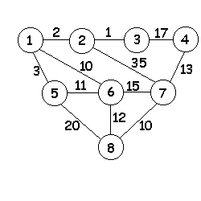 |
| 6  | 3, 8 | 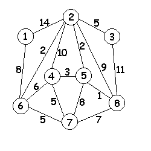 |
| 7  | 8, 2 | 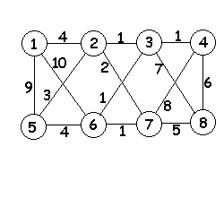 |
| 8  | 7, 3 | 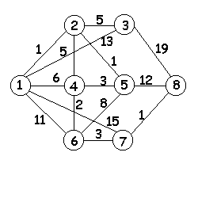 |
| 9  | 2, 7 | 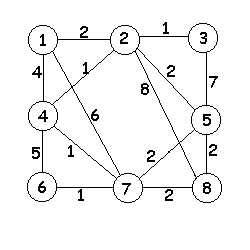 |
| 10 | 5, 8 | 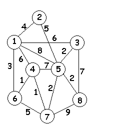 |
| 11 | 3, 7 |  |
| 12 | 8, 2 |  |
| 13 | 1, 4 |  |
| 14 | 5, 7 |  |
| 15 | 1, 6 |  |
| 16 | 2, 7 |  |
| 17 | 3, 8 |  |
| 18 | 1, 6 |  |
| 19 | 6, 2 |  |
| 20 | 2, 5 |  |

Задание 2: Реализовать прогрммно один из алгоритмов поиска кратчайшего пути на графе между парами вершин из задания 2.
<!-- #endregion -->

<!-- #region editable=true slideshow={"slide_type": ""} -->
### Методика и порядок выполнения работы

Для успешного выполнения и ащиты лабораторной работ, необходимо выполнить следующие этапы:

1. изучить теоретический материал по теме лабораторной работы (лекции, учебники);
2. написать программу для каждого задания;
3. оформить отчет по лабораторной работе;
4. защитить лабораторную работу.
<!-- #endregion -->

### Содержание отчета и его форма

Отчет по лабораторной работе должен содержать:

1. Номер и название лабораторной работы; цель и задачи лабораторной работы.

2.  Словесная постановка задачи.
    В этом подразделе проводится полное описание задачи.
    Описывается суть задачи, анализ входящих в нее переменных, возможные ограничения, анализ условий
    при которых задача имеет решение (не имеет решения), анализ ожидаемых результатов;

3.  Листинг программного кода с комментариями, показывающие порядок выполнения лабораторной работы, и результаты, полученные в ходе её выполнения.

4. Выводы по лабораторной работе.

5. Ответы на контрольные вопросы.


### Важные замечания


<!-- #region jp-MarkdownHeadingCollapsed=true -->
### Контрольные вопросы

1.  Что такое граф? Что такое ребро и дуга графа?
2. Что такое ориентированный граф и неориентированный граф?
3. Какие вершины называют смежными? Какие ребра называют смежными? Что означает слово инцидентные?
4. Что такое вес вершины, вес ребра?
5. Какие способы представления графов существуют?
6. В чем разница между алгоритмами поиска в ширину и поиска в глубину?
7. Описать алгоритм нахождения кратчайшего пути.
8. Описать алгоритмы нахождения эйлерова и гамильтонова цикла.
<!-- #endregion -->

### Список литературы

1. Кнут, Д. Э. Искусство программирования: пер. с англ. / Д. Э. Кнут . - 3-е изд. - Москва : Вильямс, 2007. - Т. 1 : Основные алгоритмы, 2007. - 720 с. : ил.. - Прил.: с. 683-691. - Предм.-имен. указ.: с. 692-712. - ISBN 5-8459-0080-8.
2. Кнут, Д. Э. Искусство программирования / Д. Э. Кнут ; под общ. ред. Ю. В. Козаченко. - 2-е изд. - М. : Вильямс, 2009. - (Классический труд : Исправленное и дополненное издание). Т. 3 : Сортировка и поиск. - , 2009. - 823 с. : ил.. - Прил.: с. 794-803. - . - Предм.-имен. указ.: с. 804-822 - ISBN 978-5-8459-0082-1.
3. Кормен, Т. Алгоритмы: Построение и анализ / Т. Кормен, Ч. Лейхерсон, Р. Риверст. – М.: МЦМНО, 2002.
4. Давыдов, В. Г.  Программирование и основы алгоритмизации: учеб.
пособие для вузов / В. Г. Давыдов. - М. : Высш. шк., 2003. - 447 с. : ил - ISBN 5-06-
004432-7.
5. Ахо, А. Построение и анализ вычислительных алгоритмов / А. Ахо, Дж. Хопкрофт, Дж. Ульмен. – М.: Мир, 1989. – 369с.
6. Никлаус Вирт Алгоритмы и структуры данных. – Санкт-Петербург: «Невский диалект», 2001.

```python

```
