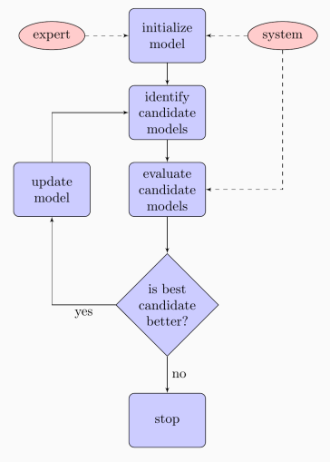
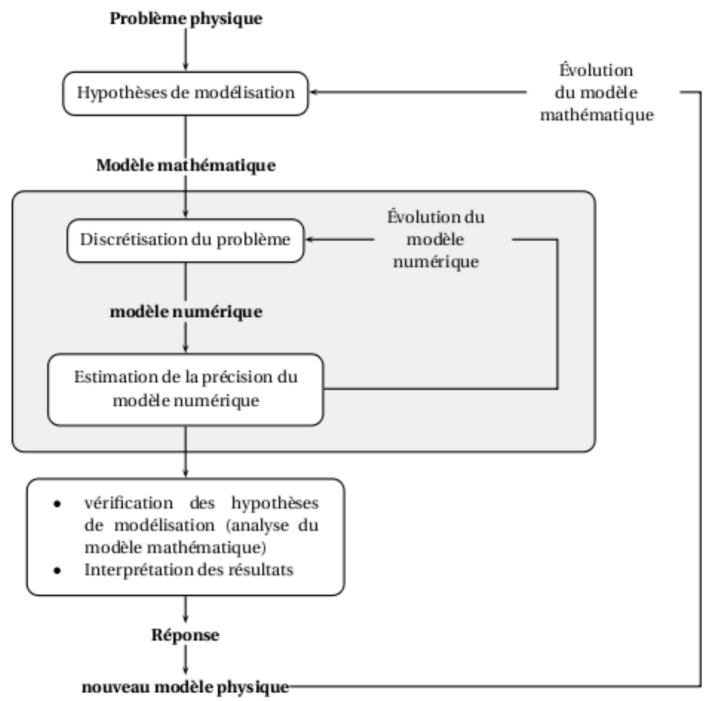
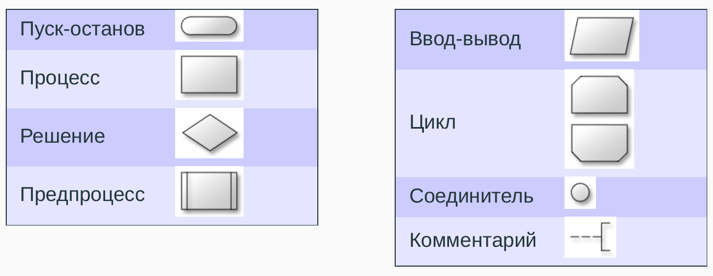
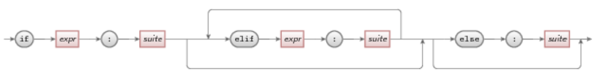
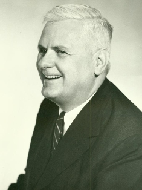
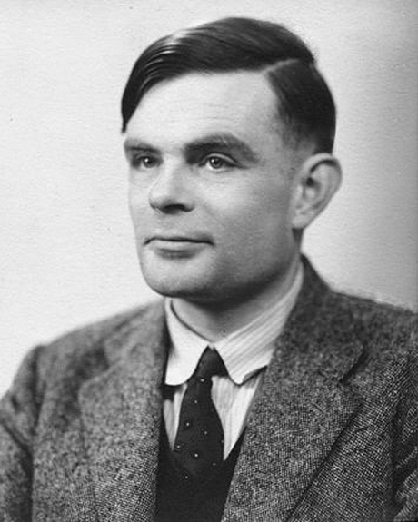
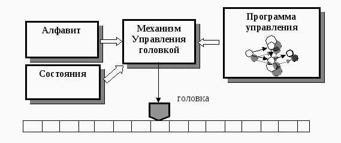

---
jupytext:
  formats: ipynb,md:myst
  text_representation:
    extension: .md
    format_name: myst
    format_version: 0.13
    jupytext_version: 1.16.4
kernelspec:
  display_name: Python 3 (ipykernel)
  language: python
  name: python3
---

+++ {"editable": true, "slideshow": {"slide_type": "slide"}}

# Лекция 1. Алгоритмы и их свойства

Алгоритмы и структуры данных

МГТУ им. Н.Э. Баумана

Красников Александр Сергеевич

2024

+++ {"editable": true, "slideshow": {"slide_type": "slide"}}

## Понятие алгоритма

Слово **алгоритм** арабского происхождения и связано с именем математика и астронома Абу Абдулла Абу Джафар Мухамад ибн Муса **ал-Хорезми**, который в 825 г. н.э. описал придуманную в Индии позиционную десятичную систему исчисления.


+++ {"editable": true, "slideshow": {"slide_type": "slide"}}

## Определение алгоритма

**Алгоритм** - совокупность точно заданных правил (набор инструкций) решения некоторого класса задач, описывающих порядок действий исполнителя для решения определённой задачи за конечное число шагов (конечное время).

+++ {"editable": true, "slideshow": {"slide_type": "slide"}}

## Свойства алгоритмов

+++ {"editable": true, "slideshow": {"slide_type": "subslide"}}

### Дискретность 

Алгоритм должен представлять процесс решения задачи как упорядоченное выполнение некоторых простых шагов. При этом для выполнения каждого шага алгоритма требуется конечный отрезок времени, то есть преобразование исходных данных в результат осуществляется во времени дискретно.

+++ {"editable": true, "slideshow": {"slide_type": "subslide"}}

### Детерминированность (Определенность)

В каждый момент времени следующий шаг работы однозначно определяется состоянием системы. Каждое действие определено и после выполнения каждого действия однозначно определяется, какое действие будет выполнено следующим. 

Таким образом, алгоритм выдаёт один и тот же результат (ответ) для одних и тех же исходных данных. В современной трактовке у разных реализаций одного и того же алгоритма должен быть изоморфный граф. 

С другой стороны, существуют вероятностные алгоритмы, в которых следующий шаг работы зависит от текущего состояния системы и генерируемого случайного числа. Однако при включении метода генерации случайных чисел в список «исходных данных» вероятностный алгоритм становится подвидом обычного.

Независимые инструкции могут выполняться в произвольном порядке, параллельно, если это позволяют используемые исполнители.

+++ {"editable": true, "slideshow": {"slide_type": "subslide"}}

### Понятность (Элементарность действий)

Алгоритм должен включать только те команды, которые доступны исполнителю и входят в его систему команд. Каждое действие является настолько простым, что оно не допускает возможности неоднозначного толкования.

+++ {"editable": true, "slideshow": {"slide_type": "subslide"}}

### Связанность
На каждом следующем шаге используются результаты предыдущих.

+++ {"editable": true, "slideshow": {"slide_type": "subslide"}}

### Конечность (Завершаемость)

При правильно заданных начальных данных алгоритм должен завершать работу и выдавать результат за определённое (конечное) число шагов (конечное время). 

Однако довольно часто определение алгоритма не включает завершаемость за конечное время. Дональд Кнут называет процедуру, которая удовлетворяет всем свойствам алгоритма, кроме, возможно, конечности, **методом вычисления (computational method)**. 

Для вероятностных алгоритмов завершаемость как правило означает, что алгоритм выдаёт результат с вероятностью 1 для любых правильно заданных начальных данных (то есть может в некоторых случаях не завершиться, но вероятность этого должна быть равна 0).

+++ {"editable": true, "slideshow": {"slide_type": "subslide"}}

### Массовость (Универсальность)

Алгоритм должен быть применим к решению задач с разным набором начальных данных.

+++ {"editable": true, "slideshow": {"slide_type": "subslide"}}

### Результативность

В момент прекращения работы алгоритма известно, что является результатом.

+++ {"editable": true, "slideshow": {"slide_type": "slide"}}

Алгоритм считается **правильным**, если при любых допустимых данных он заканчивает работу и выдает результат, удовлетворяющий требованиям задачи.

Алгоритм **однозначен**, если при применении к одним и тем же входным данным он дает один и тот же результат.

Для работы алгоритма требуется **исполнитель** - человек или механизм, понимающий способ записи и интерпретации действий.

+++ {"editable": true, "slideshow": {"slide_type": "slide"}}

## Алгоритмизация

процесс систематического составления алгоритмов для решения поставленных задач. 

Алгоритмизация является необходимым шагом в процессе разработки программного обеспечения.

Для составления алгоритмов нужны творческие способности, знание теории и способов записи алгоритма.

Для исполнения алгоритма необходимо неукоснительно следовать каждому шагу.

+++ {"editable": true, "slideshow": {"slide_type": "slide"}}

## Способы записи алгоритмов

1. Словесный (естественный язык, ЕЯ)
2. Словесный (ограниченный естественный язык, ОЕЯ)
3. Схемы и диаграммы
4. Синтаксические диаграммы
5. Псевдоязык (Псевдокод)
6. Язык программирования

+++ {"editable": true, "slideshow": {"slide_type": "slide"}}

### Словесный (естественный язык, ЕЯ)

Наиболее простой способ

+++ {"editable": true, "slideshow": {"slide_type": "subslide"}}

Пример алгоритма для приготовления кипятка

1. взять чайник
2. открыть крышку
3. если есть вода, перейти к шагу 5
4. налить воды
5. поставить на огонь
6. дождаться струи пара

+++ {"editable": true, "slideshow": {"slide_type": "subslide"}}

Достоинства:
1. Понятен всем носителям языка
2. Не требует специального синтаксиса
3. Легко поддаётся редактированию

Недостатки:
1. Неоднозначен (некоторые слова и выражения могут толковаться по-разному)
2. Трудно изучаем для иностранцев, не владеющих языком
3. Несёт в себе избыточность в плане количества информации

+++ {"editable": true, "slideshow": {"slide_type": "slide"}}

### Словесный (ограниченный естественный язык, ОЕЯ)

Устранить неоднозначность можно оставив только однозначные слова.

Каждое слово может быть командой или параметром.

+++ {"editable": true, "slideshow": {"slide_type": "subslide"}}

Пример
1. Посмотреть налево
2. Посмотреть направо
3. Перейти дорогу

Слова Перейти, Посмотреть относятся к командам, а остальные - к параметрам.

Хороший пример командного языка: армейский. 
В условиях боевых действий нет времени задумываться о смысле заданий.

+++ {"editable": true, "slideshow": {"slide_type": "slide"}}

### Схемы и диаграммы

Схемы, рисунки и диаграммы часто бывают более наглядны, но могут требовать и пояснений.

+++ {"editable": true, "slideshow": {"slide_type": "subslide"}}



+++ {"editable": true, "slideshow": {"slide_type": "subslide"}}



+++ {"editable": true, "slideshow": {"slide_type": "slide"}}

### Блок-схемы

Элементы блок-схем строятся (согласно ГОСТ 19.701-90) из следующих элементов:



+++ {"editable": true, "slideshow": {"slide_type": "slide"}}

### Синтаксические диаграммы

Направленный граф с одним входным ребром и одним выходным ребром и помеченными вершинами. Синтаксическая диаграмма задаёт язык. Цепочка пометок при вершинах на любом пути от входного ребра к выходному — это цепочка языка, задаваемого синтаксической диаграммой. Между входным/выходным рёбрами находятся блоки двух видов: "круг" — определяет базовое (первичное) понятие; и "прямоугольник" — определяет вторичное понятие, которое определённо ( т.е. метапеременная). 



+++ {"editable": true, "slideshow": {"slide_type": "slide"}}

### Псевдоязык (Псевдокод)

Псевдоязык очень напоминает алгоритмический язык программирования, но использует обобщённые для многих языков конструкции

```
01: procedure Euclid(a, b)    # НОД а и b
02:   r ← a mod b
03:   while r ̸= 0 do          # ответ получен, если r равно 0
04:     a ← b
05:     b ← r
06:     r ← a mod b
07:   end while
08:   return b                # НОД - b
09: end procedure
```

+++ {"editable": true, "slideshow": {"slide_type": "subslide"}}

Блок IF
```
01: if quality ≥ 9 then
02:   a ← perfect
03: else if quality ≥ 7 then
04:   a ← good
05: else if quality ≥ 5 then
06:   a ← medium
07: else if quality ≥ 3 then
08:   a ← bad
09: else
10:   a ← unusable
11: end if
```

+++ {"editable": true, "slideshow": {"slide_type": "subslide"}}

Блок WHILE
```
01: sum ← 0
02: i ← 1
03: while i ≤ n do
04:   sum ← sum + i
05:   i ← i + 1
06: end while
```

+++ {"editable": true, "slideshow": {"slide_type": "subslide"}}

Блок REPEAT
```
01: sum ← 0
02: i ← 1
03: repeat
04:   sum ← sum + i
05:   i ← i + 1
06: until i > n
```

+++ {"editable": true, "slideshow": {"slide_type": "subslide"}}

Блок FOR
```
01: sum ← 0
02: n ← 10
03: for i ← 1, n do
04:   sum ← sum + i
05: end for
```

+++ {"editable": true, "slideshow": {"slide_type": "slide"}}

### Язык программирования

```{code-cell} ipython3
---
editable: true
slideshow:
  slide_type: fragment
---
def euclid(a, b):   
    """НОД а и b"""
    r = a % b
    while r != 0: # ответ получен, если r равно 0
        a = b
        b = r
        r = a % b
    return b # НОД - b
```

```{code-cell} ipython3
---
editable: true
slideshow:
  slide_type: fragment
---
fractions = [
    (10, 15), 
    (32, 40),
    (72, 567),
]

for numerators, denominator in fractions:
    print(f'НОД({numerators}, {denominator}) = {euclid(numerators, denominator)}')
```

+++ {"editable": true, "slideshow": {"slide_type": "slide"}}

## Теоретические подходы к понятию алгоритма

+++ {"editable": true, "slideshow": {"slide_type": ""}}

## Определение А.Н. Колмогорова:

Алгоритмом принято называть систему вычислений, которая для некоторого класса математических задач из записи $А$ «условий» задачи позволяет при помощи однозначно определенной последовательности операций, совершаемых «механически», без вмешательства творческих способностей человека, получить запись $В$ «решения» задачи.

+++ {"editable": true, "slideshow": {"slide_type": "subslide"}}

Таким образом, алгоритм - это процедура, которая:

1. Применяется к строго определенным исходным данным $А$.

2. Представляется в виде последовательности простых шагов; каждый шаг состоит в
непосредственной обработке возникшего к этому шагу состояния $S$ в состояние $S^∗ = \Omega(S)$.

3. Преобразование $S$ в $S^∗$ производится однозначно заданным способом.

4. Процесс переработки $A$ продолжается до тех пор, пока либо не произойдет
безрезультатная остановка, либо не появится сигнал о получении решения $В$. При этом
не исключается возможность непрекращающегося процесса переработки.

+++ {"editable": true, "slideshow": {"slide_type": "subslide"}}

Каждый алгоритм задает функцию, которая по набору исходных данных выдает результат применения алгоритма к этим данным. 

Такая функция называется вычислимой.

$A_0 = A$

$A_1 = \Omega(A_0)$

$A_2 = \Omega(A_1)$

$\cdots$

$A_k = \Omega(A_{k-1}$

$\cdots$

$B = A_n$

+++ {"editable": true, "slideshow": {"slide_type": "slide"}}

## Подходы к понятию алгоритма

1. Нормальные алгоритмы (алгорифмы) Маркова
2. Лямбда-исчисление Чёрча
3. Машина Тьюринга

В настоящее время интерес представляют два последних подхода.

Лямбда-исчисление легло в основу функционального подхода к программированию.

Машина Тьюринга заложила фундамент архитектуры ЭВМ и привела к появлению императивного подхода.

+++ {"editable": true, "slideshow": {"slide_type": "slide"}}

### Нормальный алгоритм Маркова


Андрей Андреевич Марков (младший) (1903 - 1979)

+++ {"editable": true, "slideshow": {"slide_type": "subslide"}}

Для определения нормального алгоритма Маркова (НАМ) вводится алфавит, с помощью которого описывается и алгоритм и обрабатываемые данные. В алфавит также включается пустой символ, например $\epsilon$, который может означать пустое слово.

Всякий НАМ определяется множеством пар слов алфавита, которые называются подстановками. В паре слов подстановки левое (первое) слово непустое, а правое может быть и непустым и пустым. Слова разделяются стрелками. 
В качестве данных берется непустая строка символов.
Схема подстановки: $\alpha \rightarrow \beta$.

На основе НАМ был создан функциональный язык программирования Рефал.

+++ {"editable": true, "slideshow": {"slide_type": "subslide"}}

#### Схема работы НАМ 

Работа НАМ состоит из последовательности шагов, которые описываются следующем образом:
1. В последовательности подстановок ищем самую первую подстановку, левое слово которой входит в строку данных.
2. В строке данных ищем самое левое (первое) вхождение левого слова $\alpha$ найденной подстановки
3. Это вхождение заменяем на правое слово $\beta$ найденной подстановки (преобразование данных).

Шаги повторяются до тех пор, пока
- возникает ситуация когда шаг не может быть выполнен из-за отсутствия подстановки - правило остановки;
• устанавливается, что процесс подстановок не может остановиться.

Следует обратить особое внимание на тот факт, что на каждом шаге формулы в НАМ всегда просматриваются начиная с самой первой.

+++ {"editable": true, "slideshow": {"slide_type": "subslide"}}

#### Пример работы НАМ № 1

Алгоритм увеличения десятичного целого числа на единицу.
Алфавит состоит из цифр от 0 до 9 и служебного символ *.
Работа алгоритма описывается следующим набором правил:
1. $0∗ \rightarrow 1$
2. $1∗ \rightarrow 2$
3. $2∗ \rightarrow 3$
4. $3∗ \rightarrow 4$
5. $4∗ \rightarrow 5$
6. $5∗ \rightarrow 6$
7. $6∗ \rightarrow 7$
8. $7∗ \rightarrow 8$
9. $8∗ \rightarrow 9$
10. $9∗ \rightarrow ∗0$
11. $∗∗ \rightarrow 1$
12. $∗ \rightarrow \epsilon$

Рассмотрим работу НАМ на примере чисел 30, 79, 99:

$$ *30* \xrightarrow{1} *31 \xrightarrow{12} 31$$

$$ *79* \xrightarrow{10} *7*0 \xrightarrow{8} *80 \xrightarrow{12} 80$$

$$ *99* \xrightarrow{10} *9*0 \xrightarrow{10} **00 \xrightarrow{11} 100$$

+++ {"editable": true, "slideshow": {"slide_type": "subslide"}}

#### Пример работы НАМ № 2

Пусть дано слово, состоящее из символов $\{a,b\}$ произвольной длины.

Преобразовать его таким образом, чтобы сначала шли символы $a$, а затем $b$.

Единственное правило НАМ в данном случае: $ba \rightarrow ab$

Пока во входном слове справа хотя бы от одного символа $b$ есть символ $a$, эта формула будет переносить $a$ налево от этого $b$. 
Формула перестает работать, когда справа от $b$ нет ни одного $a$, это и означает, что все $a$ оказались слева от $b$. 

Например:
$$ babba \rightarrow abbba \rightarrow abbab \rightarrow ababb \rightarrow aabbb$$

Алгоритм остановился на последнем слове, т.к. к нему уже неприменимо правило.

+++ {"editable": true, "slideshow": {"slide_type": "subslide"}}

#### Пример работы НАМ № 3

Алгоритм преобразует двоичные числа в «единичные» (в которых записью целого неотрицательного числа N является строка из N палочек). Например, двоичное число 101 преобразуется в 5 палочек: |||||

Алфавит: $\{0, 1, | \}$

Правила:
1. $ 1 \rightarrow 0 |$
2. $ |0 \rightarrow 0 ||$ 
3. $ 0 \rightarrow \epsilon$  

Работу алгоритма рассмотрим на примере числа 5 (101)

$$ 101      \xrightarrow{1} 
   0|01     \xrightarrow{1} 
   0|00|    \xrightarrow{2} 
   00||0|   \xrightarrow{2} 
   00|0|||  \xrightarrow{2} 
   000||||| \xrightarrow{3} 
   00|||||  \xrightarrow{3} 
   0|||||  \xrightarrow{3} 
   |||||$$

+++ {"editable": true, "slideshow": {"slide_type": "slide"}}

### Лямбда-исчисление Чёрча



Алонзо Чёрч (1903 - 1995)

+++ {"editable": true, "slideshow": {"slide_type": "subslide"}}

Разработано А. Чёрчем в 1936 году. 
Представляет собой способ описания вычислимых функций и нашло яркое применение в современной функциональной парадигме программирования (например, в языке Haskell).

Чистое $\lambda$-исчисление, термы которого, называемые также объектами («обами»), или $\lambda$-термами, построены исключительно из переменных применением аппликации и абстракции. Изначально наличие каких-либо констант не предполагается.

+++ {"editable": true, "slideshow": {"slide_type": "subslide"}}

В основе $\lambda$-исчисления лежат два фундаментальных понятия:

- **Аппликация** (лат. applicatio — прикладывание, присоединение) означает применение функции к заданному значению аргумента (то есть вызов функции).
Её обычно обозначают $f \ a$, где $f$ — функция, а $a$ — аргумент.
Это соответствует общепринятой в математике записи $f(a)$. 
Аппликация $f \ a$ может рассматриваться двояко: как результат применения $f$ к $a$, или же как процесс вычисления этого результата.
Последняя интерпретация аппликации связана с понятием $beta$-редукции.

- **Абстракция** или $\lambda$-абстракция (лат. abstractio — отвлечение, отделение) строит функции по заданным выражениям.
Наприме, если $t \equiv t[x]$ — выражение, свободно содержащее $x$, тогда запись $(\lambda x.t[x])$ означает: $\lambda$ функция от аргумента $x$, которая имеет вид $t[x]$, и обозначает функцию $ x\mapsto t[x]$.
Таким образом, с помощью абстракции можно конструировать новые функции.
Требование, чтобы $x$ свободно входило в $t$, не обязательно — в этом случае $ \lambda x.t$ обозначает функцию $ x\mapsto t$, то есть такую, которая игнорирует свой аргумент.

+++ {"editable": true, "slideshow": {"slide_type": "subslide"}}

**$\alpha$-эквивалентность** - это переименование связанных переменных, не меняющее «смысла» терма. Структурно, два $\lambda$-терма $\alpha$-эквивалентны если это один и тот же терм, либо если какие-либо их составляющие термы соответстветственно $\alpha$-эквивалентны.

Например, $\lambda x.x$ и $\lambda y.y$ - это альфа-эквивалентные $\lambda$-термы, которые оба представляют одну и ту же функцию — а именно, функцию тождества $x\mapsto x$.

Термы $x$ и $y$ не являются $\alpha$-эквивалентными, так как являются свободными переменными.

+++ {"editable": true, "slideshow": {"slide_type": "subslide"}}

**$\beta$-редукция** - применение некой функции к некоему аргументу выражается в $\lambda$-исчислении как аппликация $\lambda$-терма, выражающего эту функцию, и $\lambda$-терма аргумента.

Например, применение функции $f(x) = 2 x + 1$ к числу 3 выражается аппликацией
$(\lambda x.2\cdot x+1)\ 3$, в которой на первом месте находится соответствующая абстракция.

Для вычисления результата необходимо заменить каждое свободное появление переменной $x$ в терме $2\cdot x+1$ на терм 3.
В результате получается $2\cdot 3+1=7$.
Это соображение в общем виде записывается как $(\lambda x.t)\ a=t[x:=a]$.

+++ {"editable": true, "slideshow": {"slide_type": "skip"}}

**$\eta$**-преобразование выражает ту идею, что две функции являются идентичными тогда и только тогда, когда, будучи применёнными к любому аргументу, дают одинаковые результаты.

$\eta$-преобразование переводит друг в друга формулы $\lambda x.f\ x$ и $f$, но только если $x$ не появляется свободно в $f$. Иначе, свободная переменная $x$ в $f$ после преобразования стала бы связанной внешней абстракцией $\lambda x$, и наоборот; и тогда применение этих двух выражений сводилось бы $\beta$-редукцией к разным результатам.

Перевод $\lambda x.f\ x$ в $f$ называют $\eta$-редукцией, а перевод $f$ в $\lambda x.f\ x$ — $\eta$-экспансией.

+++ {"editable": true, "slideshow": {"slide_type": "subslide"}}

**Каррирование (карринг)** 

Функция двух переменных $x$ и $y$, например, $f(x, y) = x + y$ может быть рассмотрена
как функция одной переменной $x$, возвращающая функцию одной переменной $y$:
$$ \lambda x. \lambda y.x+y$$

Такой процесс применим к функциям любой «арности».

+++ {"editable": true, "slideshow": {"slide_type": "subslide"}}

#### Примеы из языка Scheme (диалект Lisp)
```
(define x (+ 3 5))
(* x x)
(* 8 8) - аппликативный порядок
(* (+ 3 5) (+ 3 5)) - нормальный порядок
```

+++ {"editable": true, "slideshow": {"slide_type": "slide"}}

### Машина Тьюринга



Алан Тьюринг (1912 - 1954)

+++ {"editable": true, "slideshow": {"slide_type": "subslide"}}



Машина Тьюринга

+++ {"editable": true, "slideshow": {"slide_type": "subslide"}}

#### Строение машины Тьюринга

В состав МТ входят:

1. Память в виде бесконечной в обе стороны ленты, разбитой на ячейки, в каждую из которых может быть записан один символ из алфавита  $A = \{a_0 , a_1 , \ldots, a_n \}$, причем $a_0$ является пустым символом.
2. Головка записи/чтения, способная читать и записывать символ в текущей ячейке.
3. Автомат, сдвигающий ленту влево или вправо относительно головки. Автомат подчиняется множеству команд $D = \{L, R, H\}$, что означает «влево», «вправо», «на месте».
4. Устройство управления (УУ), осуществляющее выработку команд на движение ленты, запись символов в текущую ячейку памяти в зависимости от текущего символа ячейки и текущего состояния машины, задаваемого символом из алфавита
$Q = \{q_0 , q_1 , q_2 , \ldots, q_m \}$.

+++ {"editable": true, "slideshow": {"slide_type": "subslide"}}

#### Принцип работы машины Тьюринга

В начальный момент на ленте находится непустое слово (входное слово), УУ находится в начальном состоянии $q_0$ , а головка записи/чтения находится над левым символом входного слова.

На каждом шаге работы головка считывает текущий символ с ленты и в зависимости от него и текущего состояния могут выполняться следующие действия:

- в текущую ячейку записывается новый символ;
- изменяется состояние УУ;
- автомат осуществляет сдвиг ленты по команде или остается на месте.
- 
Если в результате некоторого количества шагов МТ переходит в состояние, при котором состояние УУ не меняется, символ не меняется и движения ленты не происходит, то говорят, что МТ переходит в заключительное состояние останова. 
При этом слово, оставшееся на ленте и будет является результатом работы алгоритма.

Действия МТ записываются в виде таблицы правил, которые имеют вид
$$ q_i a_j \rightarrow q_{i1} a_{j1} d_k$$

Набор правил и является программой, по которой работает МТ.

+++ {"editable": true, "slideshow": {"slide_type": "subslide"}}

#### Пример работы МТ № 1 (Добавление единицы $f(n) = n + 1$)

Правила:
1. $q_0 ∗ \rightarrow q_1 R$ - если текущий символ $∗$, а состояние $q_0$, то перейти в
состояние $q_1$ и сдвинуться вправо.
2. $q_1 1 \rightarrow q_1 R$ - если текущее состояние $q_1$, а символ в ячейке 1, то не
изменяя состояние сдвинуться вправо.
3. $q_1 ∗ \rightarrow q_2 1$ - если текущее состояние $q_1$, а символ в ячейке $∗$, то
записать в ячейку 1 и остаться на месте.
4. $q_2 1 \rightarrow q_2 L$ - если текущее состояние $q_2$, а символ в ячейке 1, то
сдвинуться влево.
5. $q_2 ∗ \rightarrow q_3 ∗$ - состояние $q_3$ является состоянием останова.

Если на вход МТ подается лента с записанным входным словом $∗111∗$, то после работы программы на ленте останется слово $∗1111$.

+++ {"editable": true, "slideshow": {"slide_type": "subslide"}}

#### Пример работы МТ № 2 (Умножение двух чисел в унарной системе счисления)

Входное слово имеет вид
$$∗111..111\!\!\times\!\!111...11 = ∗$$
где символы $∗$ обозначают границы входного слова, единицы задают разряды перемножаемых чисел, а $\times$ - знак умножения (и разделитель чисел).
Полученное в результате перемножения число будет записано справа от символа равенства =.

| <!-- --> | <!-- --> | <!-- --> | <!-- --> |
|:---------|:---------|:---------|:---------|
|  1. $q_0* \rightarrow q_0 R$                     | 7. $q_2\!\!= \rightarrow q_2 \!\!=\!\!L$        | 13. $q_4a \rightarrow q_4 aR$             | 19. $q_6\times \rightarrow q_7 \!\!\times\!\! R$ |
|  2. $q_01 \rightarrow q_0 R$                     | 8. $q_2\times \rightarrow q_3 \!\!\times\!\! L$ | 14. $q_4\!\!= \rightarrow q_4 \!\!=\!\!R$ | 20. $q_7a \rightarrow q_7 aR$                    |
|  3. $q_0\times \rightarrow q_1 \!\!\times\!\! R$ | 9. $q_31 \rightarrow q_4 aR$                    | 15. $q_41 \rightarrow q_41 R$             | 21. $q_71 \rightarrow q_2 aR$                    |
|  4. $q_11 \rightarrow q_2 aR$                    | 10. $q_3a \rightarrow q_3 aL$                   | 16. $q_4* \rightarrow q_51 R$             | 22. $q_7\!\!= \rightarrow q_8 \!\!=\!\!L$        |
|  5. $q_21 \rightarrow q_2 1L$                    | 11. $q_3* \rightarrow q_6 \!\!*\!\!R$           | 17. $q_5* \rightarrow q_2 \!\!*\!\!L$     | 23. $q_8a \rightarrow q_81 L$                    |
|  6. $q_2a \rightarrow q_2 aL$                    | 12. $q_4\times \rightarrow q_4 \!\!\times\!\! R$| 18. $q_6a \rightarrow q_61 R$             | 24. $q_8\times \rightarrow q_9 H$                |


При входном слове
$$∗111\!\!\times\!\!11 = ∗$$
Получаем выходное слово
$$∗111\!\!\times\!\!111 = 111111∗$$
за 152 шага.

+++ {"editable": true, "slideshow": {"slide_type": "skip"}}

#### Пример работы МТ № 3 (Сложение двух чисел)

Правила:
1. $q_0 ∗ → q_1 R$
2. $q_1 1 → q_1 R$
3. $q_1 ∗ → q_2 1$
4. $q_2 1 → q_2 R$
5. $q_2 ∗ → q_3 L$
6. $q_3 1 → q_4 ∗$
7. $q_4 ∗ → q_5 L$
8. $q_5 1 → q_5 L$
9. $q_5 ∗ → q_6 ∗$

Состояние $q_6$ в этой программе является состоянием останова.
