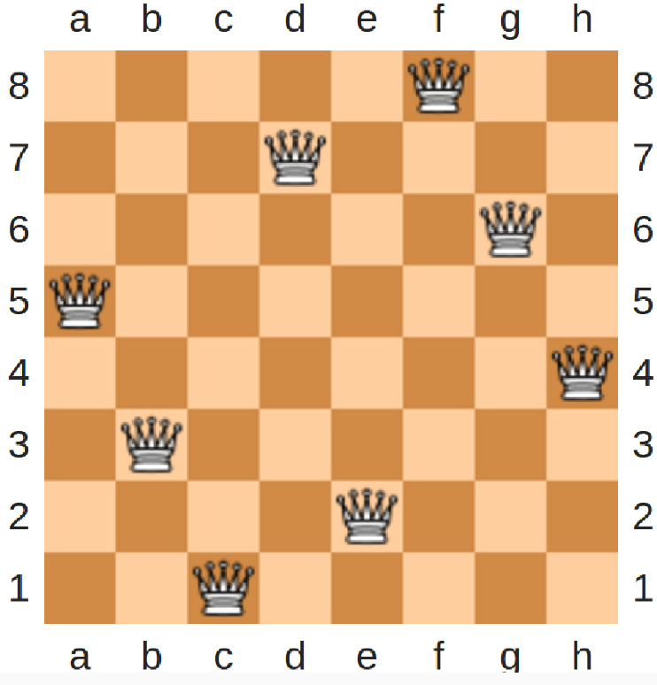

---
jupyter:
  jupytext:
    formats: ipynb,md
    text_representation:
      extension: .md
      format_name: markdown
      format_version: '1.3'
      jupytext_version: 1.16.4
  kernelspec:
    display_name: Python 3 (ipykernel)
    language: python
    name: python3
---

<!-- #region editable=true raw_mimetype="" slideshow={"slide_type": "slide"} -->
# Лекция 2. Методы разработки алгоритмов

Алгоритмы и структуры данных

МГТУ им. Н.Э. Баумана

Красников Александр Сергеевич

2024
<!-- #endregion -->

<!-- #region editable=true slideshow={"slide_type": "slide"} -->
## План лекции
1. Прототипирование.
2. Метод "грубой силы".
3. Метод "разделяй и влавствуй".
4. Жадные алгоритмы.
5. Динамическое программирование.
6. Перебор с возвратом.
<!-- #endregion -->

<!-- #region editable=true slideshow={"slide_type": "slide"} -->
## Прототипирование

Суть метода в том, чтобы написать упрощенную реализацию на простом языке, исследовать ее, а потом реализовать на нужном языке.
<!-- #endregion -->

<!-- #region editable=true slideshow={"slide_type": "slide"} -->
## Метод грубой силы

Данный метод предполагает решение "в лоб", опирается на описание задачи и те данные, которые в нем приводятся.

Популярные алгоритмы:

- Умножение матриц по определению.
- Поиск наибольшего/наименьшего элемента в списке.
- Сортировка выбором (Selectionsort). 
- Пузырьковая сортировка (Bubblesort).
- Поиск подстроки в строке методом грубой силы.
- Поиск пары ближайших точек на плоскоси.
<!-- #endregion -->

```python editable=true slideshow={"slide_type": "subslide"}
def brute_force_substring(haystack, needle):
    """Поиск всех вхождений подстроки needle в строке haystack"""
    occurrences = []
    for i in range(len(haystack) - len(needle) + 1):
        for j in range(len(needle)):
            if haystack[i+j] != needle[j]:
                break
        else:
            occurrences.append(i)
    return occurrences


str_ = 'поиск подстроки в строке — одна из простейших задач поиска информации'
for substr in ['поиск', 'строк', 'алгоритм', 'информации']:
    if not (pos := brute_force_substring(str_, substr)):
        print(f'\nПодстрока "{substr}" не найдена в строке "{str_}".')       
    elif len(pos) == 1:
        print(f'\nПодстрока "{substr}" найдена в строке "{str_}" в позиции: {str(pos[0])}.')
    else:
        print(f'\nПодстрока "{substr}" найдена в строке "{str_}" в позициях: {', '.join(str(_) for _ in pos)}.') 

```

<!-- #region editable=true slideshow={"slide_type": "slide"} -->
## Метод "разделяй и властвуй"

1. Задача (рекурсивно) разбивается на несколько меньших экземпляров той же задачи.
2. Решаются сформированные меньшие экземпляры задачи (обычно рекурсивно).
3. При необходимости решение исходной задачи формируется как комбинация решений меньших экземпляров задачи.
<!-- #endregion -->

<!-- #region editable=true slideshow={"slide_type": "subslide"} -->
Список алгоритмов:
- Сортировка слиянием (Mergesort)
- Быстрая сортировка (QuickSort) 
- Бинарный поиск (Binary search) 
- Обход двоичного дерева(Treetraverse) 
- Решение задачи о поиске пары ближайших точек
<!-- #endregion -->

<!-- #region editable=true slideshow={"slide_type": "subslide"} -->
### Пример. Вычисление квадратного корня

Наиболее часто для вычисления квадратного корня применяется Ньютонов метод последовательных приближений, который основан на том, что имея некоторое неточное значение $y$ для квадратного корня из числа $x$, можно с помощью простой манипуляции получить более точное значение (более близкое к настоящему квадратному корню), если взять среднее между $y$ и $\cfrac{x}{y}$ . 

Например, мы можем вычислить квадратный корень из 5 следующим образом: предположим, что начальное приближение равно 2.

| $y$            | $\cfrac{x}{y}$ | $\cfrac{x + \frac{x}{y}}{2}$ | 
|:---------------|:---------------|:---------------|
|2               |2,5             |2,25            |
|2,25            |2,22222222222222|2,23611111111111|
|2,23611111111111|2,23602484472050|2,23606797791580|
|2,23606797791580|2,23606797708378|2,23606797749979|
|2,23606797749979|2,23606797749979|2,23606797749979|
|2,23606797749979|2,23606797749979|2,23606797749979|
|2,23606797749979|2,23606797749979|2,23606797749979|
<!-- #endregion -->

```python editable=true slideshow={"slide_type": "subslide"}
DELTA = 1.e-8

def average(a, b):
    return (a + b) / 2

def is_good_sqrt(x, guess):
    return abs(guess**2 - x) < DELTA # Почему не abs(guess**2 - x) != DELTA ?

def improve(x, guess):
    return average(guess, x/guess)

def iter_(x, guess):
    if is_good_sqrt(x, guess):
        return guess
    else:
        return iter_(x, improve(x, guess))

def sqrt_(x):
    return(iter_(x, 1))

for i in (5, 9, 16, 37):
    print(f'Квадратный корень из {i} равен {(sqr:=sqrt_(i)):.8f}. Погрешность: {sqr**2-i:e}')

```

```python editable=true slideshow={"slide_type": "subslide"}
def sqrt_(x, guess=1, delta=1.e-8):
    if abs(guess**2 - x) < delta:
        return guess
    else:
        improve_guess = (guess + x/guess) / 2
        return sqrt_(x, improve_guess, delta)

for i in (5, 9, 16, 37):
    print(f'Квадратный корень из {i} равен {(sqr:=sqrt_(i)):.8f}. Погрешность: {sqr**2-i:e}')

```

<!-- #region editable=true slideshow={"slide_type": "slide"} -->
## Жадные алгоритмы

Это алгоритмы, принимающие на каждом шаге локально-оптимальное решение, предполагая, что конечное решение окажется оптимальным. 
В определенных случаях это приводит к правильному результату, а в других может приводить к неправильному.
<!-- #endregion -->

<!-- #region editable=true slideshow={"slide_type": "subslide"} -->
### Пример. Задача о монетах

Монетная система некоторого государства состоит из нескольких монет разного достоинства. 
Требуется выдать сумму S наименьшим возможным количеством монет.

Для одних монетных систем решение находится правильное, для других - нет. 

Cумму в 13 копеек монетами в 1, 5 и 7 коп. жадный алгоритм разменяет оптимально: 7 коп. — 1 шт., 5 коп. — 1 шт., 1 коп. — 1 шт.

Но сумму в 24 копейки монетами в 1, 5 и 7 коп. жадный алгоритм разменивает так: 7 коп. — 3 шт., 1 коп. — 3 шт., в то время как правильное решение — 7 коп. — 2 шт., 5 коп. — 2 шт.


<!-- #endregion -->

```python editable=true slideshow={"slide_type": "subslide"}
def greedy_exchange(amount, denominations):
    """Жадный алгоритм размена суммы amount монетами c номиналами denominations"""
    coins = []
    for x in sorted(denominations, reverse=True):
        coins += [x] * (amount // x)
        amount %= x
    return coins


denominations = [1, 5, 7]
for amount in [13, 24]:
    coins = greedy_exchange(amount, denominations)
    print(f'Сумму {amount} жадный алгоритм разменяет монетами: {', '.join(str(_) for _ in coins)}.')
```

<!-- #region editable=true slideshow={"slide_type": "subslide"} -->
### Пример. Задача о черепашке

Дана двумерная таблица с числами. 
Черепашка, двигаясь из вернего левого угла, должна найти такой путь к правому нижнему углу, чтобы сумма чисел на пути была максимальна. 
Двигаться можно только вправо и вниз.
<!-- #endregion -->

<!-- #region editable=true slideshow={"slide_type": "subslide"} -->
### Пример. Задача о черепашке

| <!-- --> | <!-- --> | <!-- --> | <!-- --> | 
|:--------:|:---------:|:-------:|:--------:|
|9         |8          |6        |2         |
|10        |11         |13       |11        |
|3         |7          |12       |8         |
|5         |9          |13       |9         |

При поиске решения жадным алгоритмом мы предполагаем, что выбирая на каждом шаге макимальное число (справа или снизу), мы в итоге получим наилучший путь.

| <!-- -->        | <!-- -->        | <!-- -->        | <!-- --> | 
|:---------------:|:---------------:|:---------------:|:--------:|
|9 $\downarrow$   |8                |6                |2         |
|10 $\rightarrow$ |11 $\rightarrow$ |13$\downarrow$   |11        |
|3                |7                |12 $\downarrow$  |8         |
|5                |9                |13 $\rightarrow$ |9         |

В данном случае жадный алгоритм дает верное решение.
Сумма 77.
<!-- #endregion -->

<!-- #region editable=true slideshow={"slide_type": "subslide"} -->
### Пример. Задача о черепашке

А теперь рассмотрим такой случай:

| <!-- --> | <!-- --> | <!-- --> | <!-- --> | 
|:--------:|:---------:|:-------:|:--------:|
|9         |8          |6        |2         |
|10        |11         |13       |11        |
|3         |7          |12       |8         |
|**555**   |9          |13       |9         |

При построении пути с помощью жадного алгоритма, он будет построен так же,
как и в предыдущем примере, что приводит к неверному результату (мы обошли число 555, которое само по себе больше всей суммы).

| <!-- -->        | <!-- -->        | <!-- -->        | <!-- --> | 
|:---------------:|:---------------:|:---------------:|:--------:|
|9 $\downarrow$   |8                |6                |2         |
|10 $\rightarrow$ |11 $\rightarrow$ |13$\downarrow$   |11        |
|3                |7                |12 $\downarrow$  |8         |
|**555**          |9                |13 $\rightarrow$ |9         |

Для правильного решения этой задачи нужно рассмотреть метод динамического программирования.
<!-- #endregion -->

<!-- #region editable=true slideshow={"slide_type": "slide"} -->
## Динамическое программирование

Это метод решения задач путем разбиения их на более простые подзадачи. 
Решение идет от простых подзадач к сложным, периодически используя ответы для уже решенных подзадач.

Типичный пример алгоритма: нахождение $n$-ого члена ряда Фибоначчи с использованием массива уже вычисленных значений.

<!-- #endregion -->

<!-- #region editable=true slideshow={"slide_type": "subslide"} -->
### Пример. Задача о черепашке

Рассмотрим правильное решение задачи о черепашке методом динамического программирования на примере той же таблицы:

| <!-- --> | <!-- --> | <!-- --> | <!-- --> | 
|:--------:|:---------:|:-------:|:--------:|
|9         |8          |6        |2         |
|10        |11         |13       |11        |
|3         |7          |12       |8         |
|5         |9          |13       |9         |

Построим вторую таблицу, в которой будут содержаться локальные решения для любых клеток.

| <!-- --> | <!-- --> | <!-- --> | <!-- --> | 
|:--------:|:---------:|:-------:|:--------:|
|9         |17         |23       |25        |
|19        |30         |43       |54        |
|22        |37         |55       |63        |
|77        |86         |99       |108       |
<!-- #endregion -->

<!-- #region editable=true slideshow={"slide_type": "subslide"} -->
### Пример. Задача о черепашке

Теперь, в правом нижнем углу мы видим максимально возможное значение, которое может "собрать" черепашка.
Двигаемся назад, к верхнему левому углу, выбирая максимальные значения.

| <!-- -->        | <!-- -->        | <!-- -->        | <!-- --> | 
|:---------------:|:---------------:|:---------------:|:--------:|
|9 $\downarrow$   |8                |6                |2         |
|10 $\rightarrow$ |11 $\rightarrow$ |13$\downarrow$   |11        |
|3                |7                |12 $\downarrow$  |8         |
|5                |9                |13 $\rightarrow$ |9         |
<!-- #endregion -->

<!-- #region editable=true slideshow={"slide_type": "slide"} -->
## Перебор с возвратом

общий метод нахождения решений задачи, в которой требуется полный перебор всех возможных вариантов в некотором множестве М. 
Как правило, позволяет решать задачи, в которых ставятся вопросы типа: «Перечислите все возможные варианты …», 
«Сколько существует способов …», 
«Есть ли способ …», 
«Существует ли объект…» и т. п.

Решение задачи методом поиска с возвратом сводится к последовательному расширению частичного решения.
Если на очередном шаге такое расширение провести не удается, то возвращаются к более короткому частичному решению и продолжают поиск дальше. 
Данный алгоритм позволяет найти все решения поставленной задачи, если они существуют.
Для ускорения метода стараются вычисления организовать таким образом, чтобы как можно раньше выявлять заведомо неподходящие варианты. 
Зачастую это позволяет значительно уменьшить время нахождения решения. 


<!-- #endregion -->

<!-- #region editable=true slideshow={"slide_type": ""} -->
### Пример. Задача заполнения матрицы

Заполнить матрицу размером 8×8 нулями и единицами таким образом, чтобы сумма всех элементов матрицы была равна 8, при этом сумма элементов ни в одном столбце, строке или диагональном ряде матрицы не превышала единицы.

Конечная цель, поставленная перед решающим задачу, может формулироваться в нескольких вариантах:
- Построить одно, любое решение задачи.
- Аналитически доказать, что решение существует.
- Определить количество решений.
- Построить все возможные решения.
<!-- #endregion -->

<!-- #region editable=true slideshow={"slide_type": "subslide"} -->
### Пример. Задача о расстановке восьми ферзей на шахматной доске

В более наглядной форме эта задача формулируется, как задача о расстановке ферзей

Расставить на стандартной шахматной доске 8 ферзей таким образом,
чтобы они не могли бить друг друга. 
Найти все возможные расстановки.



<!-- #endregion -->

<!-- #region editable=true slideshow={"slide_type": ""} -->
Одна из типовых задач по программированию алгоритмов перебора: создать компьютерную программу, находящую все возможные решения задачи о расстановке ферзей.

Эта задача впервые была опубликована в 1850 году.
Подсчитано, что на стандартном поле существует 4.426.165.368 различных комбинаций
расположения фигур, но только 92 ведут к правильному решению.

Один из типовых алгоритмов решения задачи - использование поиска с
возвратом: первый ферзь ставится на первую горизонталь, затем каждый
следующий пытаются поставить на следующую так, чтобы его не били ранее установленные ферзи. 
Если на очередном этапе постановки свободных полей не оказывается, происходит возврат на шаг назад - переставляется ранее установленный ферзь.
<!-- #endregion -->
