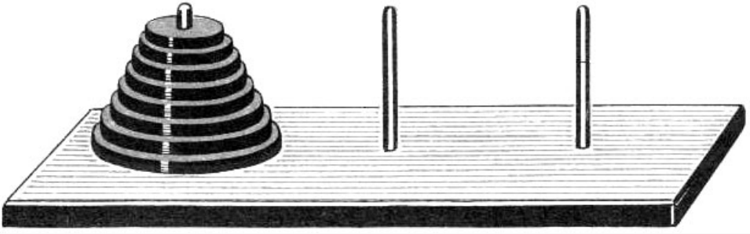
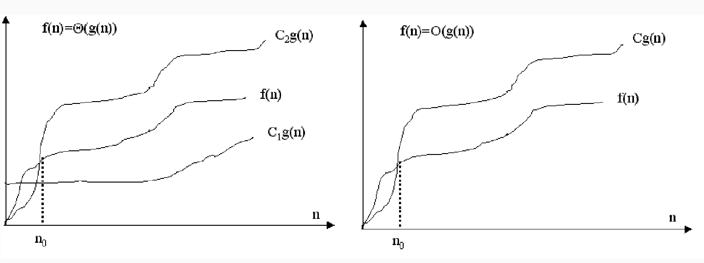
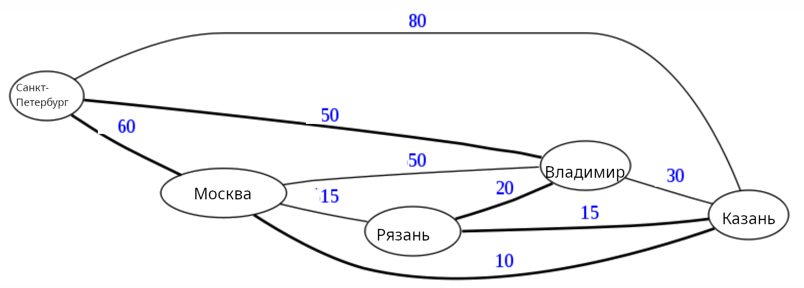

---
jupyter:
  jupytext:
    text_representation:
      extension: .md
      format_name: markdown
      format_version: '1.3'
      jupytext_version: 1.16.4
  kernelspec:
    display_name: Python 3 (ipykernel)
    language: python
    name: python3
---

<!-- #region editable=true slideshow={"slide_type": "slide"} -->
# Лекция 2. Методы анализа алгоритмов

Алгоритмы и структуры данных

МГТУ им. Н.Э. Баумана

Красников Александр Сергеевич

2024
<!-- #endregion -->

<!-- #region editable=true slideshow={"slide_type": "slide"} -->
## План лекции
1. Доказательство правильности алгоритмов
  - Метод индукции
  - Инвариант
2. Оценка сложности алгоритмов
  - Классификация по сложности
  - Примеры трудных задач
<!-- #endregion -->

<!-- #region editable=true slideshow={"slide_type": "slide"} -->
## Доказательство правильности алгоритмов
<!-- #endregion -->

<!-- #region editable=true slideshow={"slide_type": "slide"} -->
### Метод индукции

**Принцип индукции:** Наблюдение явления $X$, которое соответствует теории $T$,
увеличивает вероятность того, что $Т$ - истинна.
<!-- #endregion -->

<!-- #region editable=true slideshow={"slide_type": "subslide"} -->
### Метод  математической индукции

В математике применяется **метод математической индукции**, который ча-
ще всего используют в утверждениях с числами:

Пусть требуется доказать утверждение $S(n)$, зависящее от целого числа $n$.

Доказательство разбивается на два этапа:

1. Базис. Показываем, что $S(i)$ верно для $i$.
2. Индуктивный переход. Предполагаем, что $n \geqslant i$ и доказываем, что
из истинности $S(n)$ следует истинность $S(n + 1)$.
<!-- #endregion -->

<!-- #region editable=true slideshow={"slide_type": "subslide"} -->
### Ханойские башни

Есть три стержня и $n$ колец разного размера. 
Класть можно только кольцо меньшего размера на кольцо большего размера. 
Можно ли переместить пирамидку с одного стержня на другой? 


<!-- #endregion -->

<!-- #region editable=true slideshow={"slide_type": "subslide"} -->
- Пирамидку, в которой только одно кольцо ($n = 1$), переместить можно (очевидно).

- Предположим, что мы умеем перемещать пирамидки с числом колец $n \leqslant K$.

- Попробуем научиться перемещать пирамидку с $n = K + 1$.
Пирамидку из $K$ колец, лежащих на самом большом $K + 1$-м кольце, мы можем согласно предположению переместить на любой стержень.
Сделаем это, переместим её на третий стержень. Неподвижное $K + 1$-е кольцо не будет нам мешать провести алгоритм перемещения, так как оно самое большое.

- После перемещения $K$ колец переместим оставшееся $K + 1$-е кольцо на второй стержень.
Мы можем это сделать, так как второй стержень пустой.

- Теперь обратим внимание, тот факт, что второй стержень не пустой,
не мешает нам класть на него любые кольца, так как имеющееся на нём кольцо самое большое (любое кольцо можно положить на большее, а значит и самое большое по условию задачи).

- И затем опять применим известный нам по предположению алгоритм перемещения $K$ колец и переместим их на второй стержень, стержень с лежащим внизу $K + 1$-м кольцом.

- Таким образом, если мы умеем перемещать пирамидки с $K$ кольцами, то умеем перемещать пирамидки и с $K + 1$ кольцом.
Следовательно утверждение верно для всех случаев, то есть для всех $n$.
<!-- #endregion -->

<!-- #region editable=true slideshow={"slide_type": "slide"} -->
### Инвариант цикла
<!-- #endregion -->

```python editable=true slideshow={"slide_type": "subslide"}
TODO
```

<!-- #region editable=true slideshow={"slide_type": "slide"} -->
## Оценка сложности алгоритмов
<!-- #endregion -->

<!-- #region editable=true slideshow={"slide_type": "subslide"} -->
**Сложность алгоритма** помогает оценить затраты на его реализацию и определяется вычислительными мощностями, необходимыми для его выполнения.

Она часто измеряется двумя параметрами:
1. T - временная сложность
2. S - пространственная сложность

Сложность представляется как функция $f(n)$, где $n$ - размер входных данных. Чаще всего под размером понимают число обрабатываемых элементов (размер массива данных).

Определим $f(n)$ как рабочую функцию, дающую верхнюю границу для максимального числа основных операций (сложения, сравнения и т.д.), которые должен выполнить алгоритм.
<!-- #endregion -->

<!-- #region editable=true slideshow={"slide_type": "subslide"} -->
Определим **асимптотическую сложность алгоритма**.

Если $g(n)$ - некоторая функция, то запись $f(n) = \Theta(g(n))$ означает,
что найдутся такие $c_1 , c_2 > 0$ и такое $n_0$ , что 
$$c_1 g(n) \leqslant f(n) \leqslant c_2 g(n)$$ при всех $n \geqslant  n_0$.

Запись $f(n) = \Theta(g(n))$ включает в себя две оценки - верхнюю и нижнюю.

Их можно разделить (в данном случае нас больше интересует верхняя оценка). 

Говорят, что $f(n) = O(g(n))$, если найдется такая константа $c > 0$
и такое число $n_0$ , что $0 < f(n) \leqslant cg(n)$ для всех $n \geqslant  n_0$.
<!-- #endregion -->

<!-- #region editable=true slideshow={"slide_type": "subslide"} -->
Если алгоритм обрабатывает входную последовательность размера $n$ за
время $cn^2$ , то говорят, что временная сложность этого алгоритма - $\Theta(n^2) $.

Найдутся такие константы $c_1, c_2 > 0$ и такое число $n_0$ , что 
$$c_1 n^2 \leqslant f(n) \leqslant c_2 n^2$$ при всех $n \geqslant  n_0$ .
<!-- #endregion -->

<!-- #region editable=true slideshow={"slide_type": "subslide"} -->
Также существуют определения:


Функция $f(n)$ является $O(g(n))$ (O-большое) для больших $n$, если:

$$\lim\limits_{n\to\infty} \cfrac{f(n)}{g(n)} = const \neq 0.$$

Функция $f(n)$ является $o(g(n))$ (о-малое) для больших $n$, если:

$$\lim\limits_{n\to\infty} \cfrac{f(n)}{g(n)} = 0.$$
<!-- #endregion -->

<!-- #region editable=true slideshow={"slide_type": "subslide"} -->

<!-- #endregion -->

<!-- #region editable=true slideshow={"slide_type": "subslide"} -->
Определяя асимптотическую сложность алгоритма, мы отбрасываем члены меньшего порядка суммы, которые при больших n становятся малыми, по сравнению с другими слагаемыми.

Если временная сложность алгоритма описывается как $T(n) = 4n^2 + 7n + 12$, то вычислительная сложность определяется, как $O(n^2)$.

Запись оценки сложности позволяет увидеть, как объем входных данных влияет на требования ко времени выполнения. 

Например, если $T(n) = O(n)$, то удвоение входных данных удвоит и время работы алгоритма. 

Если $T = O(2^n)$, то добавление одного бита к входным данным удвоит время
выполнения.
<!-- #endregion -->

<!-- #region editable=true slideshow={"slide_type": "slide"} -->
## Классификация по сложности

Обычно алгоритмы классифицируют в соответствии с их временной сложностью. 
Можно выделить следующие их типы:

1. **Постоянный** - сложность оценивается как $O(1)$.
2. **Логарифмический** - сложность оценивается как $O(log(n))$.
3. **Линейный** - оценка равна $O(n)$.
4. **Квадратный** - $O(n^2)$
5. **Кубический** - $O(n^3)$.
6. **Полиноминальный** - $O(n^m)$
7. **Экспоненциальный** - $O(t^{p(n)})$, $t$- константа, $p(n)$ - некоторая полиномиальная функция.
8. **Факториальный** - $O(n!)$. Обладает наибольшей временной сложностью среди всех известных типов.
<!-- #endregion -->

<!-- #region editable=true jp-MarkdownHeadingCollapsed=true slideshow={"slide_type": "slide"} -->
- **Логарифмическая сложность** присуща алгоритмам, которые сводят большую задачу к набору меньших задач, уменьшая на каждом шаге размер задачи на постоянную величину. Например, двоичный поиск в массиве, когда на каждом шаге размер массива сокращается вдвое.

- **Линейное время выполнения** свойственно тем алгоритмам, в которых осу-
ществляется небольшая обработка каждого входного элемента.

- **Оценка $nlog(n)$ возникает в тех случаях, когда алгоритм решает задачу, разбивая её на меньшие подзадачи и решая их независимо друг от друга, а затем объединяя решение.

- **Квадратичное** время выполнения свойственно алгоритмам, обрабатывающим все пары элементов данных.

- **Кубическое** время соответсвует алгоритмам, которые обрабатывают все
тройки элементов данных.

- **Экспоненциальное** и **факториальное** время присуще алгоритмам, которые выполняют перебор всевозможных сочетаний элементов.
<!-- #endregion -->

```python editable=true slideshow={"slide_type": "subslide"}
import math
import matplotlib.pyplot as plt


# генерация данных
N = 100
n = range(1,N+1)

c = 1
t_const = [c for _ in n]
t_log = [c * math.log(item) for item in n]
t_nlog = [c * item * math.log(item) for item in n]
t_line = [c * item for item in n]
t_sqr = [c * item**2 for item in n]
t_cube = [c * item**3 for item in n]
t_exp = [c * 2**item for item in n]
t_fact = [c* math.factorial(int(item)) for item in n]

# Графики
fig = plt.figure(figsize=(6, 3))
ax = plt.subplot(111)

ax.plot(n, t_const, linewidth=2.0, color='green', label='$O(1)$')
ax.plot(n, t_log, linewidth=2.0, color='blue', label='$O(log(n))$')
ax.plot(n, t_nlog, linewidth=2.0, color='pink', label='$O(nlog(n))$')
ax.plot(n, t_line, linewidth=2.0, color='gray', label='$O(n)$')
ax.plot(n, t_sqr, linewidth=2.0, color='black', label='$O(n^2)$')
ax.plot(n, t_cube, linewidth=2.0, color='yellow', label='$O(n^3)$')
ax.plot(n, t_exp, linewidth=2.0, color='orange', label='$O(2^n)$')
ax.plot(n, t_fact, linewidth=2.0, color='red', label='$O(n!)$')

ax.set(xlim=(0, N), 
       ylim=(0, N),)

ax.legend(loc='upper center', 
          bbox_to_anchor=(1.5, 1.0), 
          ncol=3, 
          fancybox=True, 
          shadow=True
)

plt.show()
```

<!-- #region editable=true slideshow={"slide_type": "subslide"} -->
С ростом n временная сложность может стать настолько огромной, что это повлияет на практическую реализуемость алгоритма. Рассмотрим таблицу, в которой сравнивается время выполнения алгоритмов разных типов при $n = 10^6$, при условии, что единицей времени для компьютера является микросекунда $(10^{−6})$.

| Тип | Сложность | Количество операций | Время при $10^6$ операций в сек. | 
|:---:|:---:|:---:|:---:|
|Постоянные       |$O(1)$   |$1$           |1 мкс     |
|Линейные         |$O(n)$   |$10^6$        |1 с       |
|Квадратичные     |$O(n^2)$ |$10^{12}$     |11.6 дн   |
|Кубические       |$O(n^3)$ |$10^{18}$     |31709 лет |
|Экспоненциальные |$O(2^n)$ |$10^{301030}$ |в $10^{301006}$ раз больше времени существования Вселенной |
|Факториальные    |$O(n!)$  |$10^6!$       | еще в миллиарды раз больше          | 

<!-- #endregion -->

<!-- #region editable=true slideshow={"slide_type": "subslide"} -->
Часто приходится сталкиваться с показателями времени, выраженных в секундах. 
В следующей таблице содержится перевод секунд в другие единицы измерения времени.

| <!-- -->  | <!-- --> |
|:----------|:---------|
|$10^2$ c   |1.7 мин   |
|$10^3$ c   |16.7 мин  |
|$10^4$ c   |2.8 часа  |
|$10^5$ c   |1.1 дня   |
|$10^6$ c   |1.6 нед   |
|$10^7$ c   |3.8 мес   |
|$10^8$ c   |3.1 года  |
|$10^9$ c   |31 год    |
|$10^{10}$ c|310 лет   |
<!-- #endregion -->

<!-- #region editable=true slideshow={"slide_type": "subslide"} -->
## Сложность проблем

Существует теория сложности, которая классифицирует не только сложность самих алгоритмов, но и сложность самих задач. 
Теория рассматривает минимальное время и объем памяти, необходимые для решения
самого трудного варианта проблемы на теоретическом компьютере, или машине Тьюринга.

Проблемы, которые можно решить с помощью алгоритмов с полиномиальным временем, называют **решаемыми**, потому что при разумных входных данных обычно могут быть решены за разумное время (точное определение "разумности" зависит от конкретных обстоятельств). 

Проблемы, которые невозможно решить за полиномиальное время, называют **нерешаемыми**, потому что нахождение их решений быстро становится невозможным. 
Нерешаемые проблемы иногда называют **трудными**.

Алан Тьюринг доказал, что некоторые проблемы **принципиально неразрешимы**, то есть даже отвлекаясь от временной сложности, невозможно создать алгоритм их решения.
<!-- #endregion -->

<!-- #region editable=true slideshow={"slide_type": "subslide"} -->
## Сложность проблем

Выделяют несколько классов сложности алгоритмов:

- **Класс P**. Задачи, относящиеся к классу сложности P, могут быть решены за полиномиальное время. Класс P является одним из самых узких классов сложности.

- - Примерами алгоритмов класса P являются стандартные алгоритмы целочисленного сложения, умножения, деления, взятия остатка от деления, перемножения матриц, выяснение связности графов и
некоторые другие.

- **Класс NP**. Это класс недетминированно-полиномиальных алгоритмов.
Для них невозможно (или пока невозможно) создать реализацию, выполняющуюся за полиномиальное время, но возможно получить некоторое решение недетерминированным способом, а затем проверить его допустимость за полиномиальное время.
- - Среди всех задач класса NP можно выделить "самые сложные" — NP-полные задачи.
Если мы научимся решать любую из них за полиномиальное время, то все задачи класса NP можно будет
решить за полиномиальное время.
<!-- #endregion -->

<!-- #region editable=true jp-MarkdownHeadingCollapsed=true slideshow={"slide_type": "subslide"} -->
### Примеры NP-полных задач:

1. Задача о выполнимости булевых формул
2. Кратчайшее решение «пятнашек» размера n × n
3. Задача коммивояжёра
4. Проблема раскраски графа
5. Задача о вершинном покрытии
6. Задача о покрытии множества
7. Задача о клике
8. Задача о независимом множестве
9. Задача о рюкзаке
10. Сапер (игра)
11. Тетрис
<!-- #endregion -->

<!-- #region editable=true slideshow={"slide_type": "subslide"} -->
### Пример. Вскрытие алгоритма шифрования по ключу (Подбор пароля)

Рассмотрим проблему вскрытия алгоритма шифрования по ключу. 
Временная сложность такого вскрытия пропорциональна числу возможных ключей, которое экспоненциально зависит от длины ключа. 
Если $n$ - длина ключа, то сложность вскрытия грубой силой равна $O(2^n)$. 
В следующей таблице приведены параметры перебора с использованием суперкомпьютера с производительностью  (1 EFLOPS = $10^{18}$ FLOPS ).

https://ru.wikipedia.org/wiki/Top500

| Длина ключа, бит| Количество вариантов | Время перебора | 
|:---|:---|:---|
|40 (5 символов)   |$2^{40} \approx 10^{12}$          |$10^{-6}$ c  |
|48 (6 символов)   |$2^{48} \approx 2.81\cdot10^{14}$ |$2\cdot10^{-3}$ c   |
|56 (7 символов)   |$2^{56} \approx 7.21\cdot10^{16}$ | 0.7 c  |
|64 (8 символов)   |$2^{64} \approx 1.84\cdot10^{19}$ | 18.4 с |
|72 (9 символов)   |$2^{72} \approx 4.72\cdot10^{21}$ | 78.7 мин  |
|80 (10 символов)  |$2^{80} \approx 1.21\cdot10^{24}$ | 14 дн |
|88 (11 символов)  |$2^{88} \approx 3.1\cdot10^{26}$  | 9.8 лет |
|96 (12 символов)  |$2^{96} \approx 7.92\cdot10^{28}$ | 2.5 тыс лет |
|104 (13 символов) |$2^{104} \approx 2\cdot10^{31}$   | 640 тыс лет |
|112 (14 символов) |$2^{112} \approx 5.2\cdot10^{33}$ | 160 млн лет |
|120 (15 символов) |$2^{120} \approx 1.33\cdot10^{36}$| 42 млрд лет |
<!-- #endregion -->

<!-- #region editable=true slideshow={"slide_type": "slide"} -->
### Пример. Задача коммивояжера

**Постановка задачи**

Комивояжер должен объехать N городов с целью осуществления продажи своих товаров.
Все N городов соединены дорогами по принципу "каждый с каждым".
Известна стоимость проезда между двумя любыми городами.
Найти оптимальный маршур движения так, чтобы побывать во всех городах и при этом иметь минимальные
затраты на дорогу.

Исходная информация задана в виде перечня городов и соответствующей матрицы стоимостей, то есть двумерного массива с элементами $C_{ij}$, равными стоимости проезда из города i в город j. 
В данном случае матрица имеет N строк и N столбцов.
Следует также уточнить, что маршрут начинается и заканчивается в одном (базовом) городе и не может дважды проходить через один и тот же город.


<!-- #endregion -->

<!-- #region editable=true slideshow={"slide_type": "subslide"} -->
### Пример. Задача коммивояжера
 
**Решение задачи методом полного перебора**

Произвольно пронумеруем N городов целыми числами от 1 до N, причем базовый город имеет номер N. Каждый тур (один из возможных маршрутов) однозначно соответствует перестановке целых чисел $1, 2, \ldots, N − 1$. 
Для каждой перестановки строим тур и определяем его стоимость. 
Обрабатывая все перестановки запоминаем маршрут, который имеет на текущий момент самую низкую стоимость. 
Если находится маршрут с меньшей стоимостью, то все дальнейшие сравнения осуществляем с ним.

Алгоритм является факториальным, с оценкой $O(n!)$. 
В задаче требуется найти $(N − 1)!$ перестановок целых чисел.
<!-- #endregion -->

```python editable=true slideshow={"slide_type": "subslide"}
import math

print('Построим таблицу, иллюстрирующую вычислительную сложность алгоритма, \
предполагая, что производительность компьютера (1 EFLOPS = FLOPS).\n\n')

print(f'|Кол-во городов, N | Кол-во туров | Время, с | Время, дн | Время, лет |')

power = 10**18

for N in range(2, 41):
    number_of_tours = math.factorial(N-1)
    seconds = number_of_tours / power
    days = seconds / (24*60*60)
    years = days / 365   
    '''print(
        f'|{N:16} |\
        {number_of_tours:19} |\
        {seconds}')
     '''
    print(f'|{N:17} | {number_of_tours:12.1e} | {seconds:8.1e} | {days:9.1e} | {years:10.1e} |')
```
