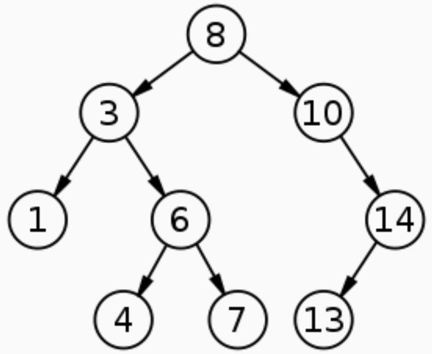

---
jupyter:
  jupytext:
    text_representation:
      extension: .md
      format_name: markdown
      format_version: '1.3'
      jupytext_version: 1.16.4
  kernelspec:
    display_name: Python 3 (ipykernel)
    language: python
    name: python3
---

<!-- #region editable=true slideshow={"slide_type": "slide"} -->
#### Лекция 4. Структуры данных и их классификация

Алгоритмы и структуры данных

МГТУ им. Н.Э. Баумана

Красников Александр Сергеевич

2024
<!-- #endregion -->

<!-- #region editable=true slideshow={"slide_type": "subslide"} -->
## План лекции
1. Классификация структур данных
2. Фундаментальные структуры данных
3. Абстрактные структуры данных
4. Операции над структурами данных
<!-- #endregion -->

<!-- #region editable=true slideshow={"slide_type": "subslide"} -->
> Плохие программисты думают о коде. Хорошие программисты
думают о структурах данных и их взаимосвязях (Линус Торвальдс, создатель Linux)

> Алгоритмы + структуры данных = программы (Никлаус Вирт)
<!-- #endregion -->

<!-- #region editable=true slideshow={"slide_type": "subslide"} -->
Структура данных (СД) - это программная абстракция, позволяющая хранить и обрабатывать данные, представленные в определенном виде. 
Структура данных неразрывно связана с набором операций, которые можно к этим данным применять. 
Структура должна обеспечивать удобство и скорость применения определенных операций. 
Связь между структурой хранения данных и операциями формально закрепляется в языках программирования с помощью понятия тип данных.

Математически, структуру данных можно определить как совокупность трех множеств <I, O, R>:

- I - множество элементов
- O - множество операций
- R - множество отношений между элементами
<!-- #endregion -->

<!-- #region editable=true slideshow={"slide_type": "subslide"} -->
## Классификация структур данных

Все структуры данных можно разделить на две группы:

1. **Примитивные (скалярные)**

К примитивным структурам относятся традиционные (классические) типы данных, реализованные в различных языках программирования и состоящие из битов. 
Сюда можно отнести числа, символы, логические значения, значения адреса, перечисления. 
При реализации в разных языках программирования могут быть свои особенности. 

2. **Составные (векторные)**

В рамках нашего курса наибольший интерес вызывают составные структуры, в которых составными частями являются другие структуры данных.

<!-- #endregion -->

<!-- #region editable=true slideshow={"slide_type": "subslide"} -->
### Физическая и логическая структуры

Следует различать физическую и логическую структуру данных. 

Когда говорят о физической структуре простых типов, то под этим понимают их размер и способ размещения битов в памяти. 
С точки зрения логической структуры простой тип является неделимой элементарной единицей.

Для того чтобы подчеркнуть именно физический характер СД, лучше использовать термин **структура хранения**.
<!-- #endregion -->

<!-- #region editable=true slideshow={"slide_type": "subslide"} -->
### Изменчивость

Изменчивостью структуры называется изменение числа элементов и связей между ними.

В соответсвии с признаком изменчивости структуры делятся на

1. Статические (массив, запись, множество, битовое поле)
2. Динамические (связанный список, дерево)

Основным отличием статических структур от динамических, является распределение памяти и, соответственно, изменение числа элементов. 
Для статических структур память отводится заблаговременно и не меняется в процессе работы программы. 
Для динамических структур память отводится «на ходу» в процессе выполнения программы. 
Для работы с динамическими типами данных в разных языках программирования широко
используются указатели.
<!-- #endregion -->

<!-- #region editable=true slideshow={"slide_type": "subslide"} -->
### Расположение в памяти

По расположению в памяти выделяют структуры внутренней и внешней памяти. 
К СД внешней памяти относят файлы.
<!-- #endregion -->

<!-- #region editable=true slideshow={"slide_type": "subslide"} -->
### Линейные и нелинейные структуры

Элементы в структуре могут быть упорядоченными и неупорядоченными. 
В соответствии с этим признаком структуры делятся на

1. Нелинейные (деревья, графы, сети)
2. Линейные (вектор, строка, массив, стек, очередь, список);

В линейной коллекции можно выделить первый, второй, ..., последний элементы. 
В нелинейной коллекции такой упорядоченности нет.
<!-- #endregion -->

<!-- #region editable=true slideshow={"slide_type": "slide"} -->
## Фундаментальные структуры данных

Элементы в структуре могут быть упорядоченными и неупорядоченными. 
В соответствии с этим признаком структуры делятся на

1. Нелинейные (деревья, графы, сети)
2. Линейные (вектор, строка, массив, стек, очередь, список);

В линейной коллекции можно выделить первый, второй, ..., последний элементы. 
В нелинейной коллекции такой упорядоченности нет.
<!-- #endregion -->

<!-- #region editable=true slideshow={"slide_type": "subslide"} -->
### Массив

Массив - набор из однотипных данных, занимающих смежную память.

<!-- #endregion -->

<!-- #region editable=true slideshow={"slide_type": "subslide"} -->
###  Связанный список

Связанный список - набор из однотипных данных, линейно связанных друг с другом посредством ссылок (указателей).

<!-- #endregion -->

<!-- #region editable=true slideshow={"slide_type": "subslide"} -->
### Дерево

Дерево - набор из однотипных данных, нелинейно связанных друг с другом посредством ссылок (указателей).

<!-- #endregion -->

<!-- #region editable=true slideshow={"slide_type": "subslide"} -->
### Запись

Запись - набор из разнотипных данных, занимающих смежную память.

<!-- #endregion -->

<!-- #region editable=true raw_mimetype="" slideshow={"slide_type": "subslide"} -->
К структурам, которые могут быть созданы на основе фундаментальных можно отнести:

1. Многомерный массив - на основе обычного массива.
2. Вектор - на основе массива.
3. Хеш-таблица (ассоциативный массив) - на основе массива и списка (массив списков).
<!-- #endregion -->

<!-- #region editable=true slideshow={"slide_type": "slide"} -->
## Абстрактные структуры данных (АСД)

Некоторые структуры данных не имеют конкретной реализации и могут создаваться за счет разных структур. 

К ним относятся:

1. Стек - на основе массива или списка.
2. Очередь - на основе массива или списка.
3. Дек - на основе массивов или списка.
4. Множество - на основе хеш-таблицы или дерева.
5. Словарь (отображение) - на основе хеш-таблицы или дерева.

<!-- #endregion -->

<!-- #region editable=true slideshow={"slide_type": ""} -->
## Операции над структурами данных

К числу основных оепераций над структурами данных можно отнести:

1. Вставка элемента.
2. Удаление элемента.
3. Доступ к элементу.
4. Поиск элемента.

Рассмотрим ассимптотическую сложность операций, применительно к различным структурам данных.
<!-- #endregion -->
