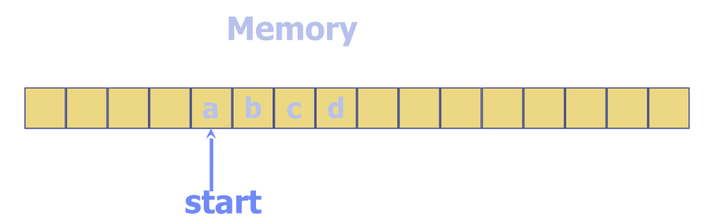

---
jupyter:
  jupytext:
    text_representation:
      extension: .md
      format_name: markdown
      format_version: '1.3'
      jupytext_version: 1.16.4
  kernelspec:
    display_name: Python 3 (ipykernel)
    language: python
    name: python3
---

<!-- #region editable=true slideshow={"slide_type": "slide"} -->
# Лекция 6. Массивы

Алгоритмы и структуры данных

МГТУ им. Н.Э. Баумана

Красников Александр Сергеевич

2024 год
<!-- #endregion -->

```python editable=true slideshow={"slide_type": ""}
from typing import Any

import doctest
```

<!-- #region editable=true slideshow={"slide_type": "slide"} -->
## План лекции
1. Массив
2. Улучшеный массив (Вектор)
3. Динамический массив
<!-- #endregion -->

<!-- #region editable=true slideshow={"slide_type": "slide"} -->
## Абстрактные типы данных (АТД) 

**Абстрактный тип данных** &mdash; это математическая модель для типов данных, которая определяется поведением (семантикой) с точки зрения возможных операций над данными этого типа и поведения этих операций.

- определяется списком операций для обработки элементов
- реализация скрыта от разработчика
- реализаций может быть множество
- каждая реализация определяет один и тот же набор функций, которые должны работать одинаково (по результату, а не по скорости) для всех реализаций. 

Поскольку значения данных и операции определены с математической точностью, а не как реализация на компьютерном языке, можно рассуждать о результатах операций, связях с другими абстрактными типами данных, о том, реализует ли программа данный тип данных и т.д.
<!-- #endregion -->

<!-- #region editable=true slideshow={"slide_type": "subslide"} -->
## Основные операции, реализуемые АТД

- создание структуры данных (конструктор)
- добавление элемента в структуру данных (например, по индексу)
- получение элемента из структуры (например, по индексу)
- замена значения элемента
- удаление элемента из структуры данных
- подсчет количества элементов в структуре
- проверка наличия элементов в структуре (проверка на пустоту)

Набор и наименование операций отличается у разных АТД
<!-- #endregion -->

<!-- #region editable=true slideshow={"slide_type": "subslide"} -->
## Структуры данных (СД)

Конкретные реализации АТД называются **структурами данных**. 

В зависимости от реализации структуры данных можно четко разбить на два типа: смежные и связные.

- **Смежные структуры данных** реализованы в виде непрерывных блоков памяти.
К ним относятся массивы, матрицы, кучи и хеш-таблицы, матрицы смежности для графов.

- **Связные структуры данных** реализованы в отдельных блоках памяти, связанных вместе с помощью указателей. 
К этому виду структур данных относятся списки, деревья и списки смежных вершин графов.
<!-- #endregion -->

<!-- #region editable=true slideshow={"slide_type": "slide"} -->
## Массив

**Массив** (**array**) представляет собой набор элементов, позволяющий получить доступ к произвольному элементу по целочисленному ключу &mdash; индексу.

Чаще  всего элементы данных в массивах имеют постоянный размер, что позволяет с легкостью найти любой элемент по его индексу (или адресу), начинающимуся либо с 0, либо с 1. 

Фиксированный начальный размер и индексация, основанная на 0, могут быть объединены следующим образом.

Чаще всего, массив массив представляет собой основную структуру данных смежного типа. 


<!-- #endregion -->

<!-- #region editable=true slideshow={"slide_type": "slide"} -->
## Массив

Игнорируя размер, массив можно рассматривать как абстрактный тип данных, который поддерживает следующие операции:

- **`init(Integer capacity) -> Array`**
<br>Возвращает пустой массив вместимостью `capacity` элементов.  

- **`get_element_at_index(Integer index) -> ElementsType`**
<br>Возвращает элемент с индексом `index`<sup>1</sup>.

- **`set_element_at_index(Integer index, ElementsType element) -> None`**
<br>Замещает объектом `element` элемент с индексом `index`<sup>1</sup>. 

- **`size() -> Integer`**
<br>Возвращает фактическую длину массива.

- **`is_empty() -> Boolean`**
<br>Возвращает `False` если в массиве содержатся элементы и `True`, если массив пустой.

`ElementsType` &mdash; тип элементов, хранящихся в массиве.

<sup>1</sup> Если `index < 0` или `index > capacity - 1`, где `capacity` &mdash; вместимость массива, выдается сообщение об ошибке. 
<!-- #endregion -->

```python editable=true slideshow={"slide_type": ""}
class Array:
    '''Реализация АТД Массив (Array)

    >>> arr = Array(10)
    >>> arr
    Array(0/10)  # [None, None, None, None, None, None, None, None, None, None]
    
    >>> arr.size()
    0
    
    >>> arr.is_empty()
    True
    
    >>> for index in range(10): arr.set_element_at_index(index, index*10)
    >>> arr
    Array(10/10)  # [0, 10, 20, 30, 40, 50, 60, 70, 80, 90]
       
    >>> arr.is_empty()
    False
    
    >>> arr.get_element_at_index(8)
    80
    
    >>> arr.set_element_at_index(5, 100)
    >>> arr
    Array(10/10)  # [0, 10, 20, 30, 40, 100, 60, 70, 80, 90]
    ''' 


    def __init__(self, capacity: int) -> 'Array':
        '''Возвращает пустой массив размером capacity'''
        self._size = 0
        self._capacity = capacity
        self._array = self._capacity * [None]
        
    def get_element_at_index(self, index: int) -> Any:
        '''Возвращает элемент с индексом `index`'''
        return self._array[index]

    def set_element_at_index(self, index: int, element: Any) -> None:
        '''Замещает объектом `element` элемент с индексом `index`'''
        self._array[index] = element
        self._inc_size(index)

    def size(self) -> int:
        '''Возвращает фактическую длину массива'''
        return  self._size

    def is_empty(self,) -> bool:
        '''Возвращает False если в массиве содержатся элементы и True, если массив пустой.'''
        return False if self.size() else True

    # Вспомогательные методы
    def _inc_size(self, index: int) -> None:
        '''Синхронизация фактического размера массива при добавлении элемента'''
        if self.get_element_at_index(index) is not None and index >= self._size: 
            self._size = index + 1
        
    # Python методы для удобства
    def __getitem__(self, index) -> Any:
        return self.get_element_at_index(index)

    def __setitem__(self, index, element: Any) -> Any:
        return self.set_element_at_index(index, element)

    def __len__(self) -> int:
        return self.size()   

    def __bool__(self) -> bool:
        return not self.is_empty()
         
    def __repr__(self) -> str:
        return f'{self.__class__.__name__}({self._size}/{self._capacity})  # {[self.get_element_at_index(index) for index in range(self._capacity)]}'


doctest.testmod()
```

| Операция | Сложность |
|----------|-----------|
| `get_element_at_index` | $O(1)$ |
| `set_element_at_index` | $O(1)$ |
| `size`                 | $O(1)$ |
| `is_empty`             | $O(1)$ |

<!-- #region editable=true slideshow={"slide_type": ""} -->
## Улучшенный массив

Улучшеный массив (Вектор) абстрактным типом данных, который подподдерживает следующие основные методы:

- **`init(Integer capacity) -> Array`**
<br>Возвращает пустой массив вместимостью `capacity` элементов.  

- **`get_element_at_index(Integer index) -> ElementsType`**
<br>Возвращает элемент с индексом `index`<sup>1</sup>.

- **`set_element_at_index(Integer index, ElementsType element) -> None`**
<br>Замещает объектом `element` элемент с индексом `index`<sup>1</sup>.

- **`size() -> Integer`**
<br>Возвращает фактическую длину массива.

- **`is_empty() -> Boolean`**
<br>Возвращает `False` если в массиве содержатся элементы и `True`, если массив пустой.

<hr style="color:red">

- **`insert_element_at_index(Integer index, ElementsType element) -> None`**
<br>Добавляет в позицию `index`<sup>1</sup> массива новый элемент `element`. При этом все элементы начиная с `index` сдвигаются вправо

- **`remove_element_at_index(Integer index) -> None`**
<br>Удаляет элемент с индексом `index`<sup>1</sup>. При этом все элементы начиная с `index + 1` сдвигаются влево 

<hr style="color:red">

`ElementsType` &mdash; тип элементов, хранящихся в массиве.

<sup>1</sup> Если `index < 0` или `index > capacity - 1`, где `capacity` &mdash; вместимость массива, выдается сообщение об ошибке. 
<!-- #endregion -->

```python editable=true slideshow={"slide_type": ""}
class ExArray(Array):
    '''Реализация АТД Улучшеный Массив (Vector)
    
    >>> ex_arr = ExArray(10)
    >>> ex_arr
    ExArray(0/10)  # [None, None, None, None, None, None, None, None, None, None]
    
    >>> ex_arr.size()
    0
    
    >>> ex_arr.is_empty()
    True
    
    >>> for index in range(10): ex_arr.set_element_at_index(index, index*10)
    >>> ex_arr
    ExArray(10/10)  # [0, 10, 20, 30, 40, 50, 60, 70, 80, 90]
       
    >>> ex_arr.is_empty()
    False
    
    >>> ex_arr.get_element_at_index(8)
    80
    
    >>> ex_arr.set_element_at_index(5, 100)
    >>> ex_arr
    ExArray(10/10)  # [0, 10, 20, 30, 40, 100, 60, 70, 80, 90]

    >>> ex_arr.remove_element_at_index(5)
    >>> ex_arr
    ExArray(9/10)  # [0, 10, 20, 30, 40, 60, 70, 80, 90, None]

    >>> ex_arr.remove_element_at_index(7)
    >>> ex_arr
    ExArray(8/10)  # [0, 10, 20, 30, 40, 60, 70, 90, None, None]

    >>> ex_arr.remove_element_at_index(3)
    >>> ex_arr
    ExArray(7/10)  # [0, 10, 20, 40, 60, 70, 90, None, None, None]

    >>> ex_arr.insert_element_at_index(3, 0)
    >>> ex_arr
    ExArray(8/10)  # [0, 10, 20, 0, 40, 60, 70, 90, None, None]
    '''


    def insert_element_at_index(self, index: int, element: Any) -> Any:
        '''Добавляет в позицию `index` массива новый элемент `element`'''
        for i in range(self._capacity-2, index-1, -1):
            self.set_element_at_index(i+1 , self.get_element_at_index(i))
        self.set_element_at_index(index, element)
        self._inc_size(index)
    
    def remove_element_at_index(self, index: int) -> 'Any':
        '''Удаляет элемент с индексом `index`'''
        for i in range(index, self._capacity-1):
            self.set_element_at_index(i, self.get_element_at_index(i+1))
        self.set_element_at_index(self._capacity-1, None)
        self._dec_size(index)
        
    # Вспомогательные методы
    def _dec_size(self, index: int) -> None: 
        '''Синхронизация фактического размера массива при удалении элемента'''
        if self.get_element_at_index(index) is not None:
            self._size -= 1


doctest.testmod()
```

| Операция | Сложность |
|----------|-----------|
| `get_element_at_index` | $O(1)$ |
| `set_element_at_index` | $O(1)$ |
| `size`                 | $O(1)$ |
| `is_empty`             | $O(1)$ |
|<hr style="color:red">|<hr style="color:red">|
| `insert_element_at_index` | $O(n)$ |
| `remove_element_at_index` | $O(n)$ |

При более детальном рассмотрении методов `insert_element_at_index(index, element)` и `remove_element_at_index(index)` можно определить, что время выполнения каждого из них равно $O(n - index + l)$, так как в ходе исполнения программы перемещаются только элементы с индексом `index` и выше. 
Таким образом, для добавления или удаления элемента в конце вектора с помощью методов `insert_element_at_index(index, element)` и `remove_element_at_index(index)` необходимо время $O(1)$.

<!-- #region editable=true slideshow={"slide_type": ""} -->
## Расширяемый массив (Динамический массив) (Dynamic Array)

Основной недостаток реализации вектора на основе простого массива, состоит в необходимости предварительногоуказания размера массива `capacity`, то есть максимального числа элементов веквектора. Если же действительное число элементов значительно меньше `capacity`,то при такой реализации бесполезно занимается место в памяти. Хужетого, если количестыо элементов (`size`) окажется больше значения `capacity`, то реализация приведет к сбою программы. 

Чтобы избежать этого, при возникновении переполнения, то есть при `capacity` = `size`, и вызове метода `insert_element_at_index` выполняются следующие операции:

1) создается новый массив длиной `2 * capacity`;
2) копируем все элементы из старого массива в новый.

- **`init(Integer capacity) -> Array`**
<br>Возвращает пустой массив вместимостью `capacity` элементов.
<br>Если размер не задан, возвращает пустой массив с размером по умолчанию
 
- **`get_element_at_index(Integer index) -> ElementsType`**
<br>Возвращает элемент с индексом `index`<sup>1</sup>.

- **`set_element_at_index(Integer index, ElementsType element) -> None`**
<br>Замещает объектом `element` элемент с индексом `index`<sup>1</sup>.

- **`size() -> Integer`**
<br>Возвращает фактическую длину массива.

- **`is_empty() -> Boolean`**
<br>Возвращает `False` если в массиве содержатся элементы и `True`, если массив пустой.

<hr style="color:red">

- **`insert_element_at_index(Integer index, ElementsType element) -> None`**
<br>Добавляет в позицию `index`<sup>1</sup> массива новый элемент `element`. При этом все элементы начиная с `index` сдвигаются вправо

- **`remove_element_at_index(Integer index) -> None`**
<br>Удаляет элемент с индексом `index`<sup>1</sup>. При этом все элементы начиная с `index + 1` сдвигаются влево 

<hr style="color:red">

`ElementsType` &mdash; тип элементов, хранящихся в массиве.

<sup>1</sup> Если `index < 0` или `index > capacity - 1`, где `capacity` &mdash; вместимость массива, выдается сообщение об ошибке. 
<!-- #endregion -->

```python editable=true slideshow={"slide_type": ""}
class DynamicArray(ExArray):
    '''Реализация АТД Динамический Массив (DynamicArray)
    
    >>> dyn_arr = DynamicArray(10)
    >>> dyn_arr
    DynamicArray(0/10)  # [None, None, None, None, None, None, None, None, None, None]
    
    >>> dyn_arr.size()
    0
    
    >>> dyn_arr.is_empty()
    True
    
    >>> for index in range(10): dyn_arr.set_element_at_index(index, index*10)
    >>> dyn_arr
    DynamicArray(10/10)  # [0, 10, 20, 30, 40, 50, 60, 70, 80, 90]
       
    >>> dyn_arr.is_empty()
    False
    
    >>> dyn_arr.get_element_at_index(8)
    80
    
    >>> dyn_arr.set_element_at_index(5, 100)
    >>> dyn_arr
    DynamicArray(10/10)  # [0, 10, 20, 30, 40, 100, 60, 70, 80, 90]

    >>> dyn_arr.remove_element_at_index(5)
    >>> dyn_arr
    DynamicArray(9/10)  # [0, 10, 20, 30, 40, 60, 70, 80, 90, None]

    >>> dyn_arr.remove_element_at_index(7)
    >>> dyn_arr
    DynamicArray(8/10)  # [0, 10, 20, 30, 40, 60, 70, 90, None, None]

    >>> dyn_arr.remove_element_at_index(3)
    >>> dyn_arr
    DynamicArray(7/10)  # [0, 10, 20, 40, 60, 70, 90, None, None, None]

    >>> dyn_arr.insert_element_at_index(3, 0)
    >>> dyn_arr
    DynamicArray(8/10)  # [0, 10, 20, 0, 40, 60, 70, 90, None, None]

    >>> for index in range(5, 12): dyn_arr.insert_element_at_index(index, index*10)
    >>> dyn_arr
    DynamicArray(15/20)  # [0, 10, 20, 0, 40, 50, 60, 70, 80, 90, 100, 110, 60, 70, 90, None, None, None, None, None]
    '''


    def __init__(self, capacity: int = 10) -> 'Array':
        super().__init__(capacity)
   
    def resize(self, capacity: int) -> 'Array':
        '''Изменение размера массива'''
        self._capacity = capacity # Могут быть и другие стратегии
        temp_array = self._capacity * [None]
        for index in range(self._size):
            temp_array[index] = self._array[index]
        self._array = temp_array
    
    def insert_element_at_index(self, index: int, element: Any) -> Any:
        # При необходимости увеличиваем размер массива
        if self._size == self._capacity:
            new_capacity = self._capacity * 2 # Могут быть и другие стратегии
            self.resize(new_capacity)
        # Вызываем метод суперкласс без изменений
        super().insert_element_at_index(index, element)
        
    def remove_element_at_index(self, index: int) -> 'Any':
        # Вызываем метод суперкласс без изменений
        super().remove_element_at_index(index)
        # При необходимости увеличиваем размер массива
        # TODO: Здесь может быть ваша ~реклама~ реализация :)

doctest.testmod()
```

<!-- #region editable=true slideshow={"slide_type": "subslide"} jp-MarkdownHeadingCollapsed=true -->
### Массив: Достоинства

- **Постоянное время доступа при условии наличия индекса.**
Так как индекс каждого элемента массива соответствует определенному адресу в памяти, то при наличии соответствующего индекса доступ к произвольному элементу массива осуществляется практически мгновенно.

- **Эффективное использование памяти.**
Массивы содержат только данные, поэтому память не тратится на указатели и другую форматирующую информацию. 
Кроме этого, для элементов массива не требуется использовать метку конца записи, поскольку все элементы массива имеют одинаковый размер.

- **Локальность в памяти.**
Во многих задачах программирования требуется обрабатывать элементы структуры данных в цикле. Массивы хорошо подходят для операций такого типа, поскольку обладают отличной локальностью в памяти. В современных компьютерных архитектурах физическая непрерывность последовательных обращений к данным помогает воспользоваться высокоскоростной кэш-памятью.
<!-- #endregion -->

<!-- #region editable=true slideshow={"slide_type": "subslide"} -->
# Массив: Недостатки

- **Обращение к индексу за границами массива.**
Попытка обращения к (n + 1)-му элементу массива размером n элементов немедленно вызовет аварийное завершение программы. Этот недостаток можно компенсировать объявлением массивов очень больших размеров, но это может повлечь за собой чрезмерные затраты памяти, что опять наложит ограничения на возможности программы.


- **Высокая сложность вставки и удаления нового элемента**
  - Необходимо сдвинуть все элементы, чтобы освободить место для вставки
  - Необходимо заполнить пустые позиции после удаления
<!-- #endregion -->

## Возможные расширения массива

1. Методы `set_element_at_index(index, element)`, `insert_element_at_index(index, element)`, `remove_element_at_index(index, element)` могут возвращать заменяемый (при наличии) элемент.
2. Метод `erase_element_at_index(Integer index) -> ItemsType`- Возвращает значение элемента в позиции `index` массива и СТИРАЕТ его.
3. Метод `delete_element_at_index(Integer index) -> ItemsType`- Возвращает значение элемента в позиции `index` массива и УДАЛЯЕТ его. 


## Вопросы
1. Какие могут быть стратегии увеличения размера массива? В чем их преимущество и недостатки?
2. Какие могут быть стратегии увеличения размера массива? В чем их преимущество и недостатки?
3. Сложность типовых операций в предложенных реализациях.
4. Как добиться времени исполнения $O(1)$ для методов  `insert_element_at_index(index, element)` и `remove_element_at_index(index)` в начале массива.
