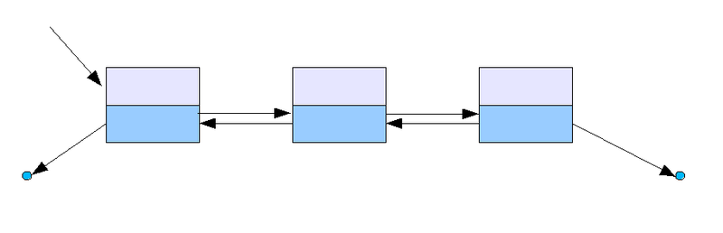

---
jupyter:
  jupytext:
    text_representation:
      extension: .md
      format_name: markdown
      format_version: '1.3'
      jupytext_version: 1.16.4
  kernelspec:
    display_name: Python 3 (ipykernel)
    language: python
    name: python3
---

<!-- #region editable=true slideshow={"slide_type": "slide"} -->
# Лекция 7. Связные списки

Алгоритмы и структуры данных

МГТУ им. Н.Э. Баумана

Красников Александр Сергеевич

2024 год
<!-- #endregion -->

```python editable=true slideshow={"slide_type": ""}
from typing import Any, Self

import doctest
```

<!-- #region editable=true slideshow={"slide_type": "slide"} -->
## Список
В информатике, список (list) &mdash; это абстрактный тип данных, представляющий собой упорядоченный набор значений, в котором некоторое значение может встречаться более одного раза.

Экземпляр списка является компьютерной реализацией математического понятия конечной последовательности.

Экземпляры значений, находящихся в списке, называются элементами списка (item, entry, element); если значение встречается несколько раз, каждое вхождение считается отдельным элементом.
<!-- #endregion -->

<!-- #region editable=true slideshow={"slide_type": "slide"} -->
## Связный список

**Связный список** &mdash; базовая динамическая структура данных в информатике, состоящая из узлов, содержащих данные и ссылки (&laquo;связки&raquo;) на следующий и/или предыдущий узел списка.


Принципиальным преимуществом перед массивом является структурная гибкость: порядок элементов связного списка может не совпадать с порядком расположения элементов данных в памяти компьютера, а порядок обхода списка всегда явно задаётся его внутренними связями.
<!-- #endregion -->

<!-- #region editable=true slideshow={"slide_type": "subslide"} -->
## Линейный односвязный (однонаправленный) список

- элементов одного типа
- элементы связаны между собой последовательно посредством указателей
- каждый элемент списка имеет указатель на следующий элемент
- последний элемент списка указывает на NULL
- элемент, на который нет указателя, является первым (головным) элементом списка
- ссылка в каждом узле указывает на следующий узел в списке
- в односвязном списке можно передвигаться только в сторону конца списка
- узнать адрес предыдущего элемента, опираясь на содержимое текущего узла, невозможно
- пространство, занимаемое однонаправленным связным списписком, содержащим $n$ элементов &mdash; $O(n)$,
<!-- #endregion -->

<!-- #region editable=true slideshow={"slide_type": "subslide"} -->
Связный список относится к рекурсивным структурам данных, поскольку его определение рекурсивно.

Связный список представляет собой либо

- пустой список, представленный значением None, либо
- узел, содержащий данные и ссылку на связный список.

Рекурсивные структуры данных могут обрабатываться рекурсивными методами.
<!-- #endregion -->

<!-- #region editable=true slideshow={"slide_type": ""} -->
## Класс Node
<!-- #endregion -->

```python editable=true slideshow={"slide_type": ""}
class Node:
    '''Узел списка

    >>> Node()
    Node(data=None, next=None)

    >>> node3 = Node(3)
    >>> node3
    Node(data=3, next=None)

    >>> node2 = Node(data=2, next=node3)
    >>> node2
    Node(data=2, next=Node(data=3, next=None))

    >>> node1 = Node(None, None)
    >>> node1
    Node(data=None, next=None)

    >>> node1.data = 1
    >>> node1
    Node(data=1, next=None)
    >>> node1.next = node2
    >>> node1
    Node(data=1, next=Node(data=2, next=Node(data=3, next=None)))

    >>> def print_list(node):
    ...   while node:
    ...       print(node)
    ...       node = node.next
    ...
    >>> print_list(node1)
    Node(data=1, next=Node(data=2, next=Node(data=3, next=None)))
    Node(data=2, next=Node(data=3, next=None))
    Node(data=3, next=None)

    '''

    def __init__(self, data:Any=None, next:'Node'=None):
        self.data = data
        self.next = next

    def __repr__(self):
         return f'{self.__class__.__name__}(data={self.data}, next={self.next})'

doctest.testmod()
```

```python editable=true slideshow={"slide_type": ""}
node3 = Node(3)
node3
```

```python editable=true slideshow={"slide_type": ""}
node2 = Node(data=2, next=node3)
node2
```

```python editable=true slideshow={"slide_type": ""}
node1 = Node(None, None)
node1
```

```python editable=true slideshow={"slide_type": ""}
node1.data = 1
node1
```

```python editable=true slideshow={"slide_type": ""}
node1.next = node2
node1
```

```python editable=true slideshow={"slide_type": ""}
def print_list(node):
    while node:
        print(node)
        node = node.next

print_list(node1)
```

<!-- #region editable=true slideshow={"slide_type": "slide"} -->
## Линейный односвязный список (Версия 1)

Линейный односвязный список &mdash; абстрактный тип данных, который поддерживает следующие операции:

- **`init() -> SingleLinkedList`**
<br>Возвращает пустой односвязный список.

- **`insert_first_node(ValueType value) -> None`**
<br>Добавить узел в начало списка.
- **`remove_first_node() -> ValueType`**
<br>Удалить первый узел списка и вернуть его значение.

- **`insert_last_node(ValueType value) -> None`**
<br>Добавить узел в конец списка.
- **`remove_last_node() -> ValueType`**
<br>Удалить последний элемент списка.
<!-- #endregion -->

```python editable=true slideshow={"slide_type": ""}
class SingleLinkedList_v1:
    '''Реализация АТД Односвязный линейный список  (SingleLinkedList_v1)

    >>> SingleLinkedList_v1()
    SingleLinkedList_v1(None)

    >>> list1 = SingleLinkedList_v1()
    >>> list1
    SingleLinkedList_v1(None)

    >>> list1.insert_first_node(2)
    >>> list1
    SingleLinkedList_v1(Node(data=2, next=None))

    >>> list1.insert_first_node(1)
    >>> list1
    SingleLinkedList_v1(Node(data=1, next=Node(data=2, next=None)))

    >>> list1.insert_first_node(0)
    >>> print(list1)
    LinkedList.head -> 0 -> 1 -> 2 -> None

    >>> list1.insert_last_node(3)
    >>> print(list1)
    LinkedList.head -> 0 -> 1 -> 2 -> 3 -> None

    >>> list1.remove_first_node()
    0
    >>> print(list1)
    LinkedList.head -> 1 -> 2 -> 3 -> None

    >>> list1.remove_last_node()
    3
    >>> print(list1)
    LinkedList.head -> 1 -> 2 -> None
    '''

    def __init__(self) -> Self:
        '''Возвращает пустой список'''
        self._head = None

    def insert_first_node(self, value:Any) -> None:
        '''Добавить элемент в начало списка'''
        self._head = Node(value, self._head)

    def remove_first_node(self) -> Any:
        '''Удалить первый элемент списка'''
        temp = self._head.data
        self._head = self._head.next
        return temp

    def insert_last_node(self, value:Any) -> None:
        '''Добавить элемент в конец списка'''
        if self._head is None:
            self.insert_first_node(value)
        else:
            current_node = self._head
            while current_node.next is not None:
                current_node = current_node.next
            current_node.next = Node(value)

    def remove_last_node(self) -> Any:
        '''Удалить последний элемент списка'''
        if self._head.next is None:
            return self.remove_first_node()
        else:
            current_node = self._head
            while current_node.next.next is not None:
                current_node = current_node.next
            temp = current_node.next.data
            current_node.next = None
            return temp

    def __repr__(self) -> str:
        return f'{self.__class__.__name__}({self._head})'

    def __str__(self):
        node = self._head
        l = []
        while node:
            l.append(str(node.data))
            node = node.next
        return 'LinkedList.head -> ' + ' -> '.join(l) + ' -> None'


doctest.testmod()
```

```python editable=true slideshow={"slide_type": ""}
SingleLinkedList_v1()
```

```python editable=true slideshow={"slide_type": ""}
list1 = SingleLinkedList_v1()
list1
```

```python editable=true slideshow={"slide_type": ""}
list1.insert_first_node(2)
list1
```

```python editable=true slideshow={"slide_type": ""}
list1.insert_first_node(1)
print(list1)
```

```python editable=true slideshow={"slide_type": ""}
list1.insert_first_node(0)
print(list1)
```

```python editable=true slideshow={"slide_type": ""}
list1.insert_last_node(3)
print(list1)
```

```python editable=true slideshow={"slide_type": ""}
list1.remove_first_node()
print(list1)
```

```python editable=true slideshow={"slide_type": ""}
list1.remove_last_node()
print(list1)
```

<!-- #region editable=true slideshow={"slide_type": ""} -->
| Операция | Сложность |
|----------|-----------|
|`insert_first_node`   | $O(1)$ |
|`remove_first_element`| $O(1)$ |
|`insert_last_node`    | $O(n)$ |
|`remove_last_element` | $O(n)$ |


<!-- #endregion -->

<!-- #region editable=true slideshow={"slide_type": "slide"} -->
## Линейный односвязный список (Версия 2). Наследуется от версии 1

- **`get_size() -> Integer`**
<br> Вернуть длину списка

- **`find_node(ValueType value) -> ValueType`**
<br>Найти (первый) узел по его значению и вернуть значение (связанные элементы).

- **`replace_node(ValueType old_value, ValueType new_value) -> None`**
<br>Найти (первый) узел по его значению и заменить его значение новым.

- **`remove_node(ValueType value) -> ValueType`**
<br>Найти (первый) узел по его значению и удалить его.


<!-- #endregion -->

<!-- #region editable=true slideshow={"slide_type": ""} -->
**Сложность**

| Операция     | 1й узел | $k$й узел | $n$й узел |
|--------------|---------|-----------|-----------|
|`get_size`    | $O(1)$  | $O(n)$    | $O(n)$    |
|`find_node`   | $O(1)$  | $O(n)$    | $O(n)$    |
|`replace_node`| $O(1)$  | $O(1)^*$  | $O(n)$    |
|`remove_node` | $O(1)$  | $O(n)$    | $O(n)$    |

При условии, что уже получен доступ к $k$—й записи &mdash; операции сложностью $O(n)$


<!-- #endregion -->

<!-- #region editable=true slideshow={"slide_type": ""} -->
## Линейный односвязный список (Версия 3). Наследуется от версии 2

Если сохранять значения длины и обновлять его при выполнении каждой операции, то

| Операция     | 1й узел | $k$й узел | $n$й узел |
|--------------|---------|-----------|-----------|
|`get_size`    | $O(1)$  | $O(1)$    | $O(1)$    |


<!-- #endregion -->

<!-- #region editable=true slideshow={"slide_type": ""} -->
## Линейный односвязный список (Версия 4). Наследуется от версии 3

- **`find_previos_node(ValueType value) -> ValueType`**
<br>Найти (первый) узел по его значению и вернуть значение из предудущего узла (если такой есть).

- **`find_next_node(ValueType value) -> ValueType`**
<br>Найти (первый) узел по его значению и вернуть значение из следующего узла (если такой есть).


- **`insert_before_node(ValueType value) -> None`**
<br>Найти (первый) узел по его значению и добавить узел перед ним. (Если узел не найден, ничего не делать)

- **`insert_after_node(ValueType value) -> None`**
<br>Найти (первый) узел по его значению и добавить узел после него. (Если узел не найден, ничего не делать)


- **`replace_previos_node(ValueType old_value, ValueType new_value) -> None`**
<br>Найти (первый) узел по его значению и заменить значение в предыдущем узле на новое.

- **`replace_next_node(ValueType old_value, ValueType new_value) -> None`**
<br>Найти (первый) узел по его значению и заменить значение в следующем узле на новое.


- **`remove_previos_node(ValueType value) -> ValueType`**
<br>Найти (первый) узел по его значению и удалить предыдущий узел (если такой есть).

- **`remove_next_node(ValueType value) -> ValueType`**
<br>Найти (первый) узел по его значению и удалить следующий узел (если такой есть).
<!-- #endregion -->

<!-- #region editable=true slideshow={"slide_type": ""} -->
**Сложность**

| Операция     | 1й узел | $k$й узел | $n$й узел |
|--------------|---------|-----------|-----------|
| `find_previos_node`     | $O(1)$/ NA | $O(n)$   | $O(n)$      |
| `find_next_node`        | $O(1)$     | $O(1)^*$ | $O(n)$ / NA |
| `insert_before_node`   | $O(1)$     | $O(n)$   | $O(n)$      |
| `insert_after_node`      | $O(1)$     | $O(1)^*$ | $O(n)$      |
| `replace_previos_node`  | $O(1)$/ NA | $O(n)$   | $O(n)$      |
| `replace_next_node`     | $O(1)$     | $O(1)^*$ | $O(n)$ / NA |
| `remove_previos_node`   | $O(1)$/ NA | $O(n)$   | $O(n)$      |
| `remove_next_node`      | $O(1)$     | $O(1)^*$ | $O(n)$ / NA |

При условии, что уже получен доступ к $k$—й записи &mdash; операции сложностью $O(n)$

$O(n)$ / NA &mdash; операция не определена, но для проверки требуется $O(n)$


<!-- #endregion -->

<!-- #region editable=true slideshow={"slide_type": ""} -->
## Линейный односвязный список (Версия 5). Наследуется от версии 4

Если дополнительно хранить ссылку на последний элемент списка, то

| Операция     | 1й узел | $k$й узел | $n$й узел |
|--------------|---------|-----------|-----------|
| `find_previos_node`     | $O(1)$/ NA | $O(n)$   | $O(n)$      |
| `find_node`   | $O(1)$  | $O(n)$    | $O(1)$    |
| `find_next_node`        | $O(1)$     | $O(1)^*$ | $O(1)$ / NA |
| `insert_before_node`   | $O(1)$     | $O(n)$   | $O(n)$      |
| `insert_after_node`      | $O(1)$     | $O(1)^*$ | $O(1)$      |
| `replace_previos_node`  | $O(1)$/ NA | $O(n)$   | $O(n)$      |
| `replace_node`| $O(1)$  | $O(1)^*$  | $O(1)$    |
| `replace_next_node`     | $O(1)$     | $O(1)^*$ | $O(1)$ / NA |
| `remove_previos_node`   | $O(1)$/ NA | $O(n)$   | $O(n)$      |
| `remove_node` | $O(1)$  | $O(n)$    | $O(1)$    |
| `remove_next_node`      | $O(1)$     | $O(1)^*$ | $O(1)$ / NA |


При условии, что уже получен доступ к $k$—й записи &mdash; операции сложностью $O(n)$

$O(1)$ / NA &mdash; операция не определена, но для проверки требуется $O(1)$


<!-- #endregion -->

<!-- #region editable=true slideshow={"slide_type": ""} -->

<!-- #endregion -->

<!-- #region editable=true slideshow={"slide_type": ""} -->
## Линейный односвязный список (Версия 6). Наследуется от версии 5

Если при необходимости модифицировать (вставить) узел перед текущим, менять значение в текущем узле, то можно дополнительно увеличить производительность

| Операция     | 1й узел | $k$й узел | $n$й узел |
|--------------|---------|-----------|-----------|
| `find_previos_node`     | $O(1)$/ NA | $O(n)$   | $O(n)$      |
| `find_node`   | $O(1)$  | $O(n)$    | $O(1)$    |
| `find_next_node`        | $O(1)$     | $O(1)^*$ | $O(1)$ / NA |
| `insert_before_node`   | $O(1)$     | $O(1)^*$   | $O(1)$      |
| `insert_after_node`      | $O(1)$     | $O(1)^*$ | $O(1)$      |
| `replace_previos_node`  | $O(1)$/ NA | $O(n)$   | $O(n)$      |
| `replace_node`| $O(1)$  | $O(1)^*$  | $O(1)$    |
| `replace_next_node`     | $O(1)$     | $O(1)^*$ | $O(1)$ / NA |
| `remove_previos_node`   | $O(1)$/ NA | $O(1)^*$   | $O(1)$      |
| `remove_node` | $O(1)$  | $O(1)^*$   | $O(1)$    |
| `remove_next_node`      | $O(1)$     | $O(1)^*$ | $O(1)$ / NA |

При условии, что уже получен доступ к $k$—й записи &mdash; операции сложностью $O(n)$

$O(n)$ / NA &mdash; операция не определена, но для проверки требуется $O(n)$


<!-- #endregion -->

<!-- #region editable=true slideshow={"slide_type": "slide"} -->
# Двусвязные (двунаправленные) линейные списки (Doubly linked lists)

- ссылки в каждом узле указывают на предыдущий и на последующий узел в списке
- допускает только последовательный доступ к элементам, но при этом дает возможность перемещения в обе стороны
- проще производить удаление и перестановку элементов, так как легко доступны адреса тех элементов списка, указатели которых направлены на изменяемый элемент 


<!-- #endregion -->

<!-- #region editable=true slideshow={"slide_type": "slide"} -->

Задание:
Реализовать двусвязный список и построить таблицу сложности выполнения операций.


<!-- #endregion -->

<!-- #region editable=true slideshow={"slide_type": "slide"} -->
## Кольцевой связный список

- может быть односвязным или двусвязным
- последний элемент кольцевого списка содержит указатель на первый
- первый (в случае двусвязного списка) содержит указатель на последний
- как правило, реализуется на базе линейного списка
- с каждым кольцевым списком дополнительно хранится указатель на первый элемент
- в этом списке ссылки на NULL не встречается
- cуществуют циклические списки с выделенным головным элементом, облегчающие полный проход через список 


<!-- #endregion -->

<!-- #region editable=true slideshow={"slide_type": "slide"} -->
## Развёрнутый связный список

- каждый физический элемент содержит несколько логических элементов (обычно в виде массива, что позволяет ускорить доступ к отдельным элементам)
- позволяет значительно уменьшить расход памяти и увеличить производительность по сравнению с обычным списком
- большая экономия памяти достигается при малом размере логических элементов и большом их количестве
- прирост производительности достигается за счёт того, что большая часть операций проводится над относительно небольшими массивами, которые обычно целиком помещаются в кэш-памяти
- в развёрнутый список легко добавлять новые элементы — без необходимости переписывать весь массив, что является большой проблемой при работе с обычными массивами

Необходимо тщательно выбирать размер &laquo;блока&raquo; (количество элементов в массивах):
- при слишком большом размере блока список начинает страдать от тех же проблем, что и обыкновенный массив: долгая вставка элементов в начало или середину, долгое удаление элементов оттуда же, и т. п.
- при слишком маленьком — увеличивается расход памяти. 


<!-- #endregion -->

<!-- #region editable=true slideshow={"slide_type": ""} -->
## XOR-связный список

- похожи на обычный двусвязный список, однако в каждом элементе хранится только один составной адрес &mdash; результат выполнения операции XOR над адресами предыдущего и следующего элементов списка
- чтобы перемещаться по списку, необходимо иметь адреса двух последовательных элементов
- выполнение операции XOR над адресом первого элемента и составным адресом, хранящимся во втором элементе, даёт адрес элемента, следующего за этими двумя элементами
- выполнение операции XOR над составным адресом, хранящимся в первом элементе, и адресом второго элемента даёт адрес элемента, предшествующего этим двум элементам
- накладные расходы XOR-связного списка в два раза меньше, так как в нём хранится только один &laquo;адрес&raquo; &mdash; XOR указателей на предыдущий и следующий элементы
- имеют более сложную реализацию,
- невозможно использовать стандартный сборщик мусора
- затруднения при отладке программы
- используется довольно редко
<!-- #endregion -->
