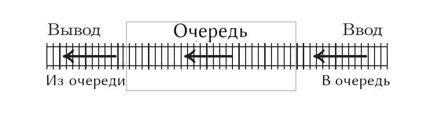

---
jupyter:
  jupytext:
    text_representation:
      extension: .md
      format_name: markdown
      format_version: '1.3'
      jupytext_version: 1.16.4
  kernelspec:
    display_name: Python 3 (ipykernel)
    language: python
    name: python3
---

<!-- #region editable=true slideshow={"slide_type": "slide"} -->
# Лекция 8. Стек, очередь, дек

Алгоритмы и структуры данных

МГТУ им. Н.Э. Баумана

Красников Александр Сергеевич

2024 год
<!-- #endregion -->

<!-- #region editable=true slideshow={"slide_type": "slide"} -->
## Стек (Stack)

Стек представляет собой объект, работа с которым &mdash; добавление и удаление &mdash; осуществляется по принципу LIFO (last-in first-out &mdash; последним пришел &mdash; первым ушел). 

- добавление объектов в стек может осуществляться в любой момент
- удаляется же лишь объект, добавленный последним.

Название &laquo;стек&raquo; происходит от английского названия загрузагруженной в специальный распределитель стопки тарелок, используемой в кафетериях.

В данном случае основными операциями являются &laquo;вдавливание&raquo; и &laquo;выталкивание&raquo; тарелок из стопки. 

Когда нужна новая тарелка из распределителя, ее &laquo;выталкивают&raquo; из стопки, а при добавлении в стопку еще одной тарелки ее &laquo;вдавливают&raquo; в стопку, и она становится верхней в стопке. 

Стеки относятся к базовым структурам данных, используемым во многих приложениях.
<!-- #endregion -->

<!-- #region editable=true slideshow={"slide_type": "slide"} -->
### Пример 1

В интернет-браузерах адреса посещаемых сайтов хранятся в виде стеков. 

При открытии пользователем нового Web-сайта его адрес добавляется (&laquo;вдавливается&raquo;) в стек адресов. 

После этого пользователь может вернуться к открытым ранее сайтам с помощью кнопки &laquo;Назад&raquo;.
<!-- #endregion -->

<!-- #region editable=true slideshow={"slide_type": "slide"} -->
### Пример 2

В большинстве текстовых редакторов существует механизм отмены действий &laquo;Undo&raquo;, c помощью которого можно отменить последние операции редактирования и вернуться к предыдущему виду документа. 

Такой механизм отмены действий реализуется благодаря хранению проводимых изменений в виде стека.
<!-- #endregion -->

<!-- #region editable=true slideshow={"slide_type": "slide"} -->
### Альтернативные названия стеков

- магазинные списки (push-down lists)
- реверсивные хранилища (reversion storages)
- магазины (cellars)
- вложенные хранилища (nesting stores)
- кучи (piles)
- дисциплины обслуживания в обратном порядке (last-in-first-out lists — LIFO lists)
- флюгерные списки (yo-yo lists) 
<!-- #endregion -->

<!-- #region editable=true slideshow={"slide_type": "slide"} -->
### Стек как абстрактный тип данных

Стек является абстрактным типом данных (АТД), который поддерживает следующие основные методы:

**Основные методы**

- **`init() -> Stack`**
 Возвращает пустой стек.

- **`push(ValueType value) -> None`**
 Помещает объект на вершину стека.
- **`pop() -> ValueType`**
 Удаляет объект из стека и возвращает новый верхний объект стека. Если стек пуст, выдается сообщение об ошибке.

**Дополнительные методы**

- **`size() -> Integer`**
 Возвращает число объектов в стеке.
- **`is_empty() -> Boolean`**
 Возвращает логическое значение, подтверждающее, что стек пуст.
- **`top() -> ValueType`**
 Возвращает верхний объект в стеке, не удаляя его. Если стек пуст, выдается сообщение об ошибке.
<!-- #endregion -->

<!-- #region editable=true slideshow={"slide_type": "slide"} -->
## Схема операций со стеком

<!-- #endregion -->

<!-- #region editable=true slideshow={"slide_type": "slide"} -->
## Схема стека в виде железнодорожной станции

<!-- #endregion -->

<!-- #region editable=true slideshow={"slide_type": "slide"} -->
### Реализация стека
- на основе массива
- на основе связного списка
- на основе дека
<!-- #endregion -->

<!-- #region editable=true slideshow={"slide_type": "slide"} -->
## Очередь (Queue)

Очередь &mdash; это структура данных работа с которыми  &mdash; добавление и удаление  &mdash; осуществляется по принципу FIFO (first-in first-out) (первым пришел &mdash; первым ушел). 

Добавление объектов в очередь может осуществляться в любое время, однако удаленным может быть лишь объект, который был добавлен первым. 

Говорят, что элементы добавляются в очередь с конца, а удаляются с начала. 
<!-- #endregion -->

<!-- #region editable=true slideshow={"slide_type": "slide"} -->
### Пример 1

Очередь людей в парке аттракционов.
Люди встают в очередь с конца, а те, кто был первым в очереди, катаются на аттракционе.
<!-- #endregion -->

<!-- #region editable=true slideshow={"slide_type": "slide"} -->
### Пример 2

Очередь документов отправленных на печать.
Документ отправленный первым, напечатается первым.
<!-- #endregion -->

<!-- #region editable=true slideshow={"slide_type": "slide"} -->
### Альтернативные названия очереди

-  циклические хранилища (circular stores)
-  дисциплины обслуживания в порядке поступления (first-in-first-out lists — FIFO lists)
<!-- #endregion -->

<!-- #region editable=true slideshow={"slide_type": "slide"} -->
### Очередь как абстрактный тип данных

Очередь является абстрактным типом данных (АТД), который поддерживает следующие основные методы:

**Основные методы**

- **`init() -> Queue`**
 Возвращает пустую очередь.

- **`enqueue(ValueType value) -> None`**
 Помещает объект в конец очереди.
- **`dequeue() -> ValueType`**
 Удаляет объект из начала очереди и возвращает его. Если очередь пуста, выдается сообщение об ошибке.

**Дополнительные методы**

- **`size() -> Integer`**
 Возвращает число объектов в очереди.
- **`is_empty() -> Boolean`**
 Возвращает логическое значение, подтверждающее, что очередь пуста.
- **`front() -> ValueType`**
 Возвращает первый объект в очереди не удаляя его. Если очередь пуста, выдается сообщение об ошибке.
<!-- #endregion -->

<!-- #region editable=true slideshow={"slide_type": "slide"} -->
## Схема операций с очередью

<!-- #endregion -->

<!-- #region editable=true slideshow={"slide_type": "slide"} -->
## Схема очереди в виде железнодорожной станции

<!-- #endregion -->

<!-- #region editable=true slideshow={"slide_type": "slide"} -->
### Реализация очереди
- на основе массива
- на основе связного списка
- на основе дека
<!-- #endregion -->

<!-- #region editable=true slideshow={"slide_type": "slide"} -->
## Дек 

Дек &mdash; это структура данных в которой все операции вставки и удаления (и, как правило, операции доступа к данным) выполняются с обоих концов.

Дек является более общим вариантом стека или очереди. 

Он обладает некоторыми общими свойствами с колодой карт. 

Выделяют **деки с ограниченным выводом** (**output-restricted deque**) и с **ограниченным вводом** (**input-restricted deque**), в которых операции удаления и вставки элементов соответственно выполняются только на одном из концов.
<!-- #endregion -->

<!-- #region editable=true slideshow={"slide_type": "slide"} -->
### Альтернативные названия дека

- двусторонняя очередь (double-ended queue)
- стеллаж (shelf) для деков с ограниченным выводом
- свиток (scroll или roll) для деков с ограниченным вводом

Термины &laquo;LIFO&raquo; и &laquo;FIFO&raquo; многие годы употреблялись бухгалтерами для обозначения метода оценки и продажи товаров. 
<!-- #endregion -->

<!-- #region editable=true slideshow={"slide_type": "slide"} -->
### Дек как абстрактный тип данных

Дек является абстрактным типом данных (АТД), который поддерживает следующие основные методы:

**Основные методы**

- **`init() -> Queue`**
 Возвращает пустую очередь.

- **`insert_left(ValueType value) -> None`**
 Помещает объект на левый конец дека.
- **`insert_right(ValueType value) -> None`**
 Помещает объект на правый конец дека.

- **`remove_left() -> ValueType`**
 Удаляет первый объект с левого конца дека и возвращает его. Если дек пуст, выдается сообщение об ошибке.
- **`remove_right() -> ValueType`**
 Удаляет первый объект с правого конца дека и возвращает его. Если дек пуст, выдается сообщение об ошибке.

**Дополнительные методы**

- **`size() -> Integer`**
 Возвращает число объектов в деке.
- **`is_empty() -> Boolean`**
 Возвращает логическое значение, подтверждающее, что дек пуст.

- **`get_left() -> ValueType`**
 Возвращает первый объект с левого конца дека не удаляя его. Если дек пуст, выдается сообщение об ошибке.
- **`get_right() -> ValueType`**
 Возвращает первый объект с правого конца дека не удаляя его. Если дек пуст, выдается сообщение об ошибке.
<!-- #endregion -->

<!-- #region editable=true slideshow={"slide_type": "slide"} -->
## Схема операций с деком

<!-- #endregion -->

<!-- #region editable=true slideshow={"slide_type": "slide"} -->
## Схема дека в виде железнодорожной станции

<!-- #endregion -->

<!-- #region editable=true slideshow={"slide_type": ""} -->
### Реализация дека
- на основе массива
- на основе двусвязного списка
<!-- #endregion -->
