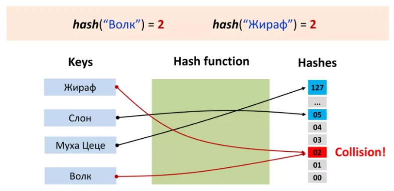

---
jupyter:
  jupytext:
    text_representation:
      extension: .md
      format_name: markdown
      format_version: '1.3'
      jupytext_version: 1.16.4
  kernelspec:
    display_name: Python 3 (ipykernel)
    language: python
    name: python3
---

<!-- #region editable=true slideshow={"slide_type": "slide"} -->
# Лекция 9. Хеш-функции и хеш-таблицы

Алгоритмы и структуры данных

МГТУ им. Н.Э. Баумана

Красников Александр Сергеевич

2024 год
<!-- #endregion -->

<!-- #region editable=true slideshow={"slide_type": "slide"} -->
## Хеш-функция (hash function)

**Хеш-функция** &mdash; это функция, которая принимает входные данные (или ключ) и возвращает фиксированный размер битов, обычно называемый хешем или хеш-значением. 

Основное назначение хеш-функции &mdash; эффективное распределение данных по хеш-таблице для обеспечения быстрого доступа к элементам.


<!-- #endregion -->

<!-- #region editable=true slideshow={"slide_type": "slide"} -->
## Хеш-функции и остатки от деления (деление по модулю)

Почти любая хеш-функция использует остаток от деления нацело &mdash; это очень просто и позволяет регулировать количество групп, на которые нужно разбить элементы.

Например, если взять 4 последних цифры номера телефона (это будет 10 000 вариантов), а затем поделить это число нацело на 30, то получится 30 возможных остатков от деления: 0, 1, 2, ..., 29. 

Эти значения можно использовать в качестве хешей.
<!-- #endregion -->

<!-- #region editable=true slideshow={"slide_type": "slide"} -->
## Применение хеш-функций


- **Хеш-таблицы**: Используются для реализации ассоциативных массивов (словари в Python), обеспечивая быстрый доступ к данным по ключу.
- **Контроль целостности данных**: Хеш-функции применяются для проверки целостности файлов и данных (например, алгоритмы MD5, SHA-1, SHA-256).
- **Криптография**: Хеш-функции используются в криптографических алгоритмах для шифрования и создания цифровых подписей.
- **Поисковые системы**: Применяются для индексации данных и быстрого поиска информации.
- **Управление кэшем**: Используются для организации кэшей, чтобы быстро находить данные.

<!-- #endregion -->

<!-- #region editable=true slideshow={"slide_type": "slide"} -->
### Пример применения хеш-функции в Python:
<!-- #endregion -->

```python editable=true slideshow={"slide_type": "slide"}
# Пример использования хеш-функции в Python для хеш-таблицы (словаря)
data = {'apple': 1, 'banana': 2, 'cherry': 3}

# Получение хеш-значения ключа
key = 'banana'
hash_value = hash(key)

print(f"Хеш-значение для ключа '{key}': {hash_value}")
```

<!-- #region editable=true slideshow={"slide_type": "slide"} -->
## Основные свойства хеш-функции
<!-- #endregion -->

<!-- #region editable=true slideshow={"slide_type": "subslide"} -->
**Детерминированность**: Одна и та же хеш-функция всегда должна возвращать одно и то же хеш-значение для одного и того же входного значения.
<!-- #endregion -->

```python editable=true slideshow={"slide_type": "subslide"}
import random
keys = ['apple', 'banana', 'cherry', 'pear', 'raspberry',
'strawberry']

for i in range(100):
    key = random.choice(keys)
    assert hash(key) == hash(key)
```

<!-- #region editable=true slideshow={"slide_type": "subslide"} -->
**Равномерность**: Хорошая хеш-функция должна равномерно распределять значения по всему диапазону возможных хеш-значений, чтобы избежать коллизий.


<!-- #endregion -->

<!-- #region editable=true slideshow={"slide_type": "subslide"} -->
**Эффективность вычисления**: Хеш-функция должна быть быстрой и эффективной, чтобы не замедлять операции вставки и поиска.
<!-- #endregion -->

<!-- #region editable=true slideshow={"slide_type": "subslide"} -->
**Минимизация коллизий**: Коллизия происходит, когда два разных ключа имеют одинаковое хеш-значение.

Хорошая хеш-функция должна минимизировать вероятность коллизий.
<!-- #endregion -->

<!-- #region editable=true slideshow={"slide_type": "slide"} -->
## Примеры хеш-функций и их реализация
<!-- #endregion -->

```python editable=true slideshow={"slide_type": "subslide"}
def simple_hash(key):
    '''Хеш как сумма кодов символов строки'''

    hash_value = 0
    for char in key:
        hash_value += ord(char)
         # Предположим, что таблица имеет размер 1000
    return hash_value % 1000 

# Пример использования:
key = 'example'
print(f'Хеш-значение для ключа "{key}": {simple_hash(key)}')
```

<!-- #region editable=true slideshow={"slide_type": "subslide"} -->

<!-- #endregion -->

```python editable=true slideshow={"slide_type": ""}
def polynomial_hash(key, a=33, m=1000):
    '''Полиномиальное хеширование является более сложной, 
    но эффективной техникой:'''

    hash_value = 0
    for char in key:
        hash_value = (hash_value * a + ord(char)) % m
    return hash_value

# Пример использования:
key = 'example'
print(f'Хеш-значение для ключа "{key}": {polynomial_hash(key)}')
```

```python editable=true slideshow={"slide_type": "subslide"}
# Встроенная хеш-функция в Python для получения хеш-значения для различных типов данных:

# Пример использования:
key = 'example'
print(f'Хеш-значение для ключа "{key}": {hash(key)}')
```

```python editable=true slideshow={"slide_type": ""}
# Криптографические хеш-функции, такие как SHA-256,
# используются для обеспечения безопасности данных:

import hashlib

def sha256_hash(key):
    return hashlib.sha256(key.encode()).hexdigest()

# Пример использования:
key = 'example'
print(f'Хеш-значение для ключа "{key}": {sha256_hash(key)}')
```

<!-- #region editable=true slideshow={"slide_type": "slide"} -->
## Хеширование

**Хеширование** &mdash; это процесс преобразования входных данных произвольного размера в фиксированный размер хеш-значения с использованием хеш-функции. 

Хеширование широко используется в компьютерных науках и программировании для оптимизации и обеспечения безопасности.
<!-- #endregion -->

<!-- #region editable=true slideshow={"slide_type": "slide"} -->
## Основные применения хеширования
<!-- #endregion -->

<!-- #region editable=true slideshow={"slide_type": "slide"} -->
### Хеш-таблицы (словари)
Хеш-таблицы используют хеш-функции для организации и быстрого доступа к данным.
<!-- #endregion -->

```python editable=true slideshow={"slide_type": "fragment"}
data = {'apple': 1, 'banana': 2,
        'cherry': 3, 'pear': 4,
        'raspberry': 5, 'strawberry': 6}

key = 'banana'
hash_value = hash(key)
print(f'Хеш-значение для ключа "{key}": {hash_value}')
```

<!-- #region editable=true slideshow={"slide_type": "slide"} -->
### Контроль целостности данных
Хеш-функции используются для проверки целостности файлов и данных.
<!-- #endregion -->

```python editable=true slideshow={"slide_type": "fragment"}
import hashlib

def get_file_hash(file_path):
    '''Проверка целостности файла с использованием SHA-256'''
    hasher = hashlib.sha256()
    with open(file_path, 'rb') as file:
        buf = file.read()
        hasher.update(buf)
    return hasher.hexdigest()

# Алиса вычислила 20 знаков после зарятой в числе pi
pi_true = 3.14159265358979323846

# Алиса сохранила число pi в файл и собирается отправить его Борису
with open('example.txt', 'w') as file:
    file.write(str(pi_true))

# Алиса вычислила хеш файла и 
# передала его Борису по другому каналу связи
file_hash_true = get_file_hash('example.txt')
print(f"SHA-256 хеш исходного файла:\n{file_hash_true}")

# По дороге файл был изменен Виктором
with open('example.txt', 'r+') as file:
    pi = float(file.read())
    if pi_true == pi:
        print('\nВиктор получил исходное значение числа')
    pi_attack = pi + 1e-7 # Виктор подменил всего один символ
    if pi_true != pi_attack:
        print('Виктор изменил значение числа')
    file.write(str(pi_attack))

# Борис получил письмо, вычислил его хеш
# и сравнил с хешем, который прислала Алиса
file_hash = get_file_hash('example.txt')
if file_hash_true == file_hash:
    print('\nБорис получил исходный файл')
else:
    print('\nБорис понял, что данные скомпромитированы')
file_hash_true = get_file_hash('example.txt')


print(f'\nSHA-256 хеш полученного Борисом файла:\n{file_hash}')
```

<!-- #region editable=true slideshow={"slide_type": "subslide"} -->
### Криптография и безопасность
Хеш-функции используются для создания криптографических примитивов, таких как цифровые подписи и хеши паролей.
<!-- #endregion -->

```python editable=true slideshow={"slide_type": "fragment"}
import hashlib

def hash_password(password):
    '''Хеширование пароля с использованием SHA-256'''
    return hashlib.sha256(password.encode()).hexdigest()

# Пример использования:
password = 'securepassword'
hashed_password = hash_password(password)
print(f'Хеш пароля:\n{hashed_password}')
```

<!-- #region editable=true slideshow={"slide_type": "fragment"} -->
### Поисковые системы и индексация
Хеширование применяется для создания индексов и быстрого поиска данных.
<!-- #endregion -->

```python editable=true slideshow={"slide_type": "fragment"}
def create_index(text):
    '''Создание индекса для текстового поиска'''
    index = {}
    for word in text.split():
        word_hash = hash(word)
        if word_hash not in index:
            index[word_hash] = []
        index[word_hash].append(word)
    return index

# Пример использования:
text = 'Пример текста для создания индекса'
index = create_index(text)
print(f'Индекс: {index}')
```

<!-- #region editable=true slideshow={"slide_type": ""} -->
### Управление кэшем
Хеширование используется для организации кэшей, чтобы быстро находить данные.
<!-- #endregion -->

```python editable=true slideshow={"slide_type": "fragment"}
# Простой кэш с использованием хеш-функции
cache = {}

def get_from_cache(key):
    hash_key = hash(key)
    return cache.get(hash_key, None)

def add_to_cache(key, value):
    hash_key = hash(key)
    cache[hash_key] = value

# Добавление и получение данных из кэша
add_to_cache('test_key', 'test_value')
print(get_from_cache("test_key"))  # Вывод: test_value
```

<!-- #region editable=true slideshow={"slide_type": "slide"} -->
## Хеш-таблицы

**Хеш-таблица** &mdash; это структура данных, которая предоставляет возможность быстро находить, вставлять и удалять элементы с использованием хеш-функции для вычисления индексов в массиве или списке.

Хеш-таблицы обычно используются для реализации ассоциативных массивов, также известных как словари.
<!-- #endregion -->

<!-- #region editable=true slideshow={"slide_type": "slide"} -->
### Важные аспекты хеш-таблицы

**Массив**: основной компонент хеш-таблицы, он хранит указатели на элементы или списки элементов.

**Хеш-функция**: Функция, которая преобразует ключи словаря в индексы массива.

**Коллизии**: Ситуация, когда два разных ключа имеют одинаковое хеш-значение. Для разрешения коллизий используются различные методы, такие как цепочки (chaining) или открытая адресация (open addressing).
<!-- #endregion -->

```python editable=true slideshow={"slide_type": "fragment"}
# Пример словаря
{
   'apple': 101,
   'banana': 102,
   'cherry': 103
}
```

<!-- #region editable=true slideshow={"slide_type": "subslide"} -->
### Пример структуры хеш-таблицы:

| Индекс | Значение|
|:-------|:--------|
| 0      | None    |
| 1      | [('apple', 101)] |
| 2      | None    |
| 3      | [('banana', 102)] |
| 4      | None    |
| 5      | None    |
| 6      | None    |
| 7      | [('cherry', 103)] |
| 8      | None    |
| 9      | None    |

<!-- #endregion -->

<!-- #region editable=true slideshow={"slide_type": "slide"} -->
## Основные операции в хеш-таблице

Основные операции в хеш-таблице: вставка, поиск, удаление
<!-- #endregion -->

<!-- #region editable=true slideshow={"slide_type": "slide"} -->
### Вставка (Insertion)
Процесс добавления нового элемента (пары ключ-значение) в хеш-таблицу.

Шаги вставки:

1. Вычислить хеш-значение ключа с помощью хеш-функции.
2. Найти индекс в массиве на основе хеш-значения.
3. Если в массиве по этому индексу уже есть элемент (коллизия), добавить элемент в список (в случае цепочек) или найти следующий доступный индекс (в случае открытой адресации).
<!-- #endregion -->

```python editable=true slideshow={"slide_type": "subslide"}
# Пример вставки в хеш-таблицу с использованием цепочек:

class HashTable1:
    def __init__(self, size):
        self.size = size
        self.table = [None] * size

    def hash_function(self, key):
        return hash(key) % self.size

    def insert(self, key, value):
        index = self.hash_function(key)
        if self.table[index] is None:
            self.table[index] = [(key, value)]
        else:
            for i, kv in enumerate(self.table[index]):
                k, v = kv
                if k == key:
                    self.table[index][i] = (key, value)
                    return
            self.table[index].append((key, value))

# Пример использования:
hash_table = HashTable1(10)
hash_table.insert('apple', 1)
hash_table.insert('banana', 2)
hash_table.insert('cherry', 3)
print(hash_table.table)
```

<!-- #region editable=true slideshow={"slide_type": "slide"} -->
### Поиск (Search)
Процесс нахождения значения по заданному ключу в хеш-таблице.

Шаги поиска:

1. Вычислить хеш-значение ключа с помощью хеш-функции.
2. Найти индекс в массиве на основе хеш-значения.
3. Проверить наличие ключа в списке элементов (в случае цепочек) или по индексу (в случае открытой адресации).
<!-- #endregion -->

```python editable=true slideshow={"slide_type": "subslide"}
# Пример поиска в хеш-таблице с использованием цепочек

class HashTable2(HashTable1):

    def search(self, key):
        index = self.hash_function(key)
        if self.table[index] is None:
            return None
        for k, v in self.table[index]:
            if k == key:
                return v
        return None

# Пример использования:
hash_table = HashTable2(10)
hash_table.insert("apple", 1)
hash_table.insert("banana", 2)
hash_table.insert("cherry", 3)
print(hash_table.search("banana"))  # Вывод: 2
print(hash_table.search("grape"))   # Вывод: None
```

<!-- #region editable=true slideshow={"slide_type": "slide"} -->
### Удаление (Deletion)
Процесс удаления элемента (пары ключ-значение) из хеш-таблицы.

Шаги удаления:

1. Вычислить хеш-значение ключа с помощью хеш-функции.
2. Найти индекс в массиве на основе хеш-значения.
3. Удалить элемент из списка (в случае цепочек) или установить значение по индексу в None (в случае открытой адресации).
<!-- #endregion -->

```python editable=true slideshow={"slide_type": "subslide"}
# Пример удаления из хеш-таблицы с использованием цепочек

class HashTable3(HashTable2):
    def delete(self, key):
        index = self.hash_function(key)
        if self.table[index] is None:
            return
        for i, kv in enumerate(self.table[index]):
            k, v = kv
            if k == key:
                del self.table[index][i]
                return

# Пример использования:
hash_table = HashTable3(10)
hash_table.insert("apple", 1)
hash_table.insert("banana", 2)
hash_table.insert("cherry", 3)
print(hash_table.table)
hash_table.delete("banana")
print(hash_table.table)
print(hash_table.search("banana"))  # Вывод: None
```

<!-- #region editable=true slideshow={"slide_type": "slide"} -->
## Временная сложность хеш-таблицы

Пояснение:
Средний случай: В среднем случае хеш-функция равномерно распределяет элементы по таблице, и каждый элемент находится в своей уникальной ячейке, что обеспечивает постоянное время доступа O(1).

Худший случай: В худшем случае все элементы попадают в одну ячейку из-за плохой хеш-функции или большого количества коллизий. Тогда хеш-таблица превращается в связный список, и временная сложность операций становится O(n).
<!-- #endregion -->

<!-- #region editable=true slideshow={"slide_type": "slide"} -->
## Временная сложность операций в хеш-таблице

- Вставка (Insertion):
  - Средний случай: O(1)
  - Худший случай: O(n) (в случае большого количества коллизий или если все элементы попадают в одно и то же место)
- Поиск (Search):
  - Средний случай: O(1)
  - Худший случай: O(n) (в случае большого количества коллизий или если все элементы попадают в одно и то же место)
- Удаление (Deletion):
  - Средний случай: O(1)
  - Худший случай: O(n) (в случае большого количества коллизий или если все элементы попадают в одно и то же место)
<!-- #endregion -->

<!-- #region editable=true slideshow={"slide_type": "slide"} -->
## Использование хеш-таблиц
<!-- #endregion -->

<!-- #region editable=true slideshow={"slide_type": "subslide"} -->
### Реализация словаря (ассоциативного массива)

Хеш-таблицы часто используются для реализации словарей, которые позволяют хранить пары ключ-значение и обеспечивают быстрый доступ по ключу.
<!-- #endregion -->

```python editable=true slideshow={"slide_type": "fragment"}
# Создание словаря
dictionary = {}

# Вставка элементов
dictionary["apple"] = 1
dictionary["banana"] = 2
dictionary["cherry"] = 3

# Поиск элемента
print(dictionary["banana"])

# Удаление элемента
del dictionary["cherry"]

# Проверка существования ключа
if "apple" in dictionary:
    print("Ключ 'apple' существует в словаре")
```

<!-- #region editable=true slideshow={"slide_type": "subslide"} -->
### Кэширование результатов вычислений

Хеш-таблицы используются для кэширования результатов дорогостоящих вычислений для ускорения последующих запросов.
<!-- #endregion -->

```python editable=true slideshow={"slide_type": "fragment"}
# Кэш для хранения результатов
cache = {}

def expensive_computation(x):
    if x in cache:
        return cache[x]
    result = x * x  # Пример дорогостоящего вычисления
    cache[x] = result
    return result

# Использование кэша
print(expensive_computation(10))  # Вывод: 100 (вычисление и кэширование)
print(expensive_computation(10))  # Вывод: 100 (из кэша)
```

<!-- #region editable=true slideshow={"slide_type": "subslide"} -->
## Подсчёт частоты слов в тексте

Хеш-таблицы используются для подсчёта количества вхождений каждого слова в тексте.
<!-- #endregion -->

```python editable=true slideshow={"slide_type": "fragment"}
from collections import defaultdict

text = '''
Посадил дед репку. Выросла репка большая-пребольшая. Стал дед репку из земли тащить: тянет-потянет, вытянуть не может.
Позвал дед бабку. Бабка за дедку, дедка за репку — тянут-потянут, вытянуть не могут.
Позвала бабка внучку. Внучка за бабку, бабка за дедку, дедка за репку — тянут-потянут, вытянуть не могут.
Кликнула внучка Жучку. Жучка за внучку, внучка за бабку, бабка за дедку, дедка за репку — тянут-потянут, вытянуть не могут.
Кликнула Жучка кошку. Кошка за Жучку, Жучка за внучку, внучка за бабку, бабка за дедку, дедка за репку — тянут-потянут, вытянуть не могут.
Позвала кошка мышку. Мышка за кошку, кошка за Жучку, Жучка за внучку, внучка за бабку, бабка за дедку, дедка за репку — тянут-потянут, вытащили репку!
'''
word_count = defaultdict(int)

for word in text.split():
    word_count[word.lower()] += 1

# Вывод результатов
for word, count in word_count.items():
    print(f"Слово '{word}' встречается {count} раз(а)")
```

<!-- #region editable=true slideshow={"slide_type": ""} -->
### Поиск дубликатов в списке

Хеш-таблицы используются для эффективного поиска дубликатов в списке.
<!-- #endregion -->

```python editable=true slideshow={"slide_type": ""}
def find_duplicates(arr):
    seen = set()
    duplicates = []
    for item in arr:
        if item in seen:
            duplicates.append(item)
        else:
            seen.add(item)
    return duplicates

# Пример использования
arr = [1, 2, 3, 2, 4, 5, 6, 4, 7]
print(find_duplicates(arr))  # Вывод: [2, 4]
```

<!-- #region editable=true slideshow={"slide_type": "slide"} -->
## Проблемы коллизий и методы их решения

**Коллизия** &mdash; совпадение значений хеш-функции для двух разных ключей.

 Это приводит к тому, что более одного элемента пытаются занять одну и ту же ячейку в хеш-таблице.

Существуют хеш-функции без коллизий &mdash; совершенные хеш-функции (perfect hash function)


<!-- #endregion -->

<!-- #region editable=true slideshow={"slide_type": "subslide"} -->
#### Пример коллизии 1

Предположим, у нас есть простая хеш-функция, которая возвращает остаток от деления ключа на размер таблицы.
Для ключей 5 и 15 при размере таблицы 10 оба ключа дадут одинаковый индекс: 5 % 10 = 5 и 15 % 10 = 5. Это коллизия.
<!-- #endregion -->

<!-- #region editable=true slideshow={"slide_type": "subslide"} -->
#### Пример коллизии 2

Допустим, вы составляете словарь имён, и у вас есть простая хеш-функция, которая возвращает первую букву имени. 

Но оказывается, что 80% имён начинаются на букву «А». Это не просто коллизия, это проблема.
<!-- #endregion -->

<!-- #region editable=true slideshow={"slide_type": "slide"} -->
## Методы разрешения коллизий

Существует несколько методов разрешения коллизий в хеш-таблицах.

Два наиболее распространённых метода — это цепочки (chaining) и открытая адресация (open addressing).
<!-- #endregion -->

<!-- #region editable=true slideshow={"slide_type": "slide"} -->
### Метод цепочек (Chaining) - закрытая адресация

Элементы с одинаковым значением хеш-функции объединяются в связный список. Указатель на список хранится в соответствующей ячейке хеш-таблицы.

- При коллизии элемент добавляется в начало списка
- Поиск и удаление элемента требуют просмотра всего списка

<!-- #endregion -->

<!-- #region editable=true slideshow={"slide_type": "subslide"} -->
### Цепочки (Chaining)
- Преимущества
  - Простота реализации.
  - Эффективность при небольшом количестве коллизий.
  - Меньшая зависимость от плотности заполнения хеш-таблицы.
- Недостатки
  - Требует дополнительной памяти для указателей в связном списке.
  - Производительность может падать при большом количестве коллизий из-за длинных цепочек.

<!-- #endregion -->

<!-- #region editable=true slideshow={"slide_type": "slide"} -->
### Метод открытой адресации

Метод открытой адресации заключается в поиске следующей доступной ячейки в массиве, если происходит коллизия. 

Существуют разные стратегии для поиска новой ячейки: линейное пробирование, квадратичное пробирование и двойное хеширование.
<!-- #endregion -->

<!-- #region editable=true slideshow={"slide_type": "subslide"} -->
### Принцип работы

В каждой ячейке хранится один элемент (ключ, значение).

Если ячейка с индексом hash(key) занята, то осуществляется поиск свободной ячейки в следующих позициях таблицы
<!-- #endregion -->

<!-- #region editable=true slideshow={"slide_type": "subslide"} -->
### Кластеризация 

В методе открытой адресации (особенно при линейном пробировании) происходит кластеризация, когда несколько последовательных ячеек становятся занятыми, что увеличивает вероятность коллизий и ухудшает производительность.
<!-- #endregion -->

<!-- #region editable=true slideshow={"slide_type": "subslide"} -->
### Примеры стратегий открытой адресации

- **Линейное пробирование (Linear Probing)**:
  - Пробирование с шагом 1: index = (index + 1) % size.
  - Простое, но может привести к "кластеризации".
- **Квадратичное пробирование (Quadratic Probing)**:
  - Пробирование с шагом, увеличивающимся по квадрату: index = (index + i^2) % size.
  - Снижает проблему кластеризации, но сложнее в реализации.
- **Двойное хеширование (Double Hashing)**:
  - Использование второй хеш-функции для вычисления шага: index = (index + i * hash2(key)) % size.
  - Меньше проблем с кластеризацией, но сложнее в реализации.
<!-- #endregion -->

<!-- #region editable=true slideshow={"slide_type": "subslide"} -->
### Открытая адресация

- Преимущества
  - Не требует дополнительной памяти для хранения указателей.
  - Более компактное представление данных.
  - Меньшая зависимость от плотности заполнения хеш-таблицы.
- Недостатки
  - Производительность может значительно падать при высокой плотности заполнения таблицы.
  - Требует больше вычислительных ресурсов для разрешения коллизий.
  - Кластеризация данных


<!-- #endregion -->

<!-- #region editable=true slideshow={"slide_type": "slide"} -->
### Влияние коллизий на производительность хеш-таблиц

- **Среднее время доступа**:
  - В идеальных условиях (при отсутствии коллизий) среднее время доступа к элементам в хеш-таблице составляет O(1).
  - Коллизии увеличивают время доступа, так как требуется обработка цепочек или пробирование ячеек, что увеличивает количество операций.
- **Увеличение длины цепочек**:
  - В методе цепочек увеличение длины цепочек при большом количестве коллизий может привести к линейному времени доступа O(n) для операций поиска, вставки и удаления.
  - Длинные цепочки увеличивают количество сравнений, необходимых для поиска или вставки элемента.
- **Пространственная сложность**:
  - В методе цепочек требуется дополнительная память для хранения указателей в связных списках.
  - В методе открытой адресации заполнение таблицы выше определенного уровня (обычно около 70-80%) значительно увеличивает количество коллизий и, следовательно, время доступа.
<!-- #endregion -->

<!-- #region editable=true slideshow={"slide_type": ""} -->

<!-- #endregion -->
