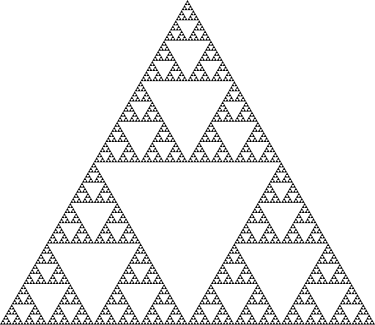
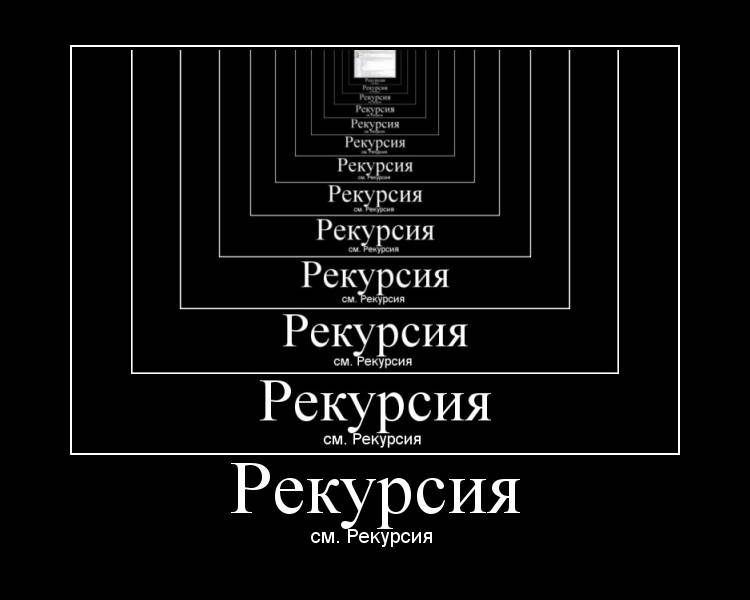
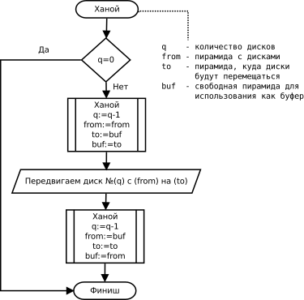
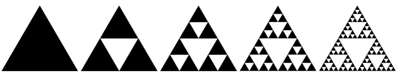
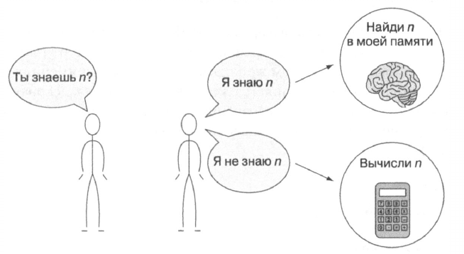

---
jupyter:
  jupytext:
    text_representation:
      extension: .md
      format_name: markdown
      format_version: '1.3'
      jupytext_version: 1.16.4
  kernelspec:
    display_name: Python 3 (ipykernel)
    language: python
    name: python3
---

<!-- #region editable=true slideshow={"slide_type": "slide"} -->
# Лекция 10. Рекурсия

Алгоритмы и структуры данных

МГТУ им. Н.Э. Баумана

Красников Александр Сергеевич

2024 год
<!-- #endregion -->

```python editable=true slideshow={"slide_type": "skip"}
%load_ext nb_js_diagrammers
```

<!-- #region editable=true slideshow={"slide_type": "slide"} -->
## Понятие рекурсии

**Рекурсия** &mdash; определение, описание, изображение какого-либо объекта или процесса внутри самого этого объекта или процесса, то есть ситуация, когда объект является частью самого себя. 


<!-- #endregion -->

<!-- #region editable=true slideshow={"slide_type": "slide"} -->
### Рекурсия в математике



В математике рекурсия имеет отношение к методу определения функций и числовых рядов: рекурсивно заданная функция определяет своё значение через обращение к себе самой с другими аргументами. 

При этом возможно два варианта: 
1. Конечная рекурсивная функция
2. Бесконечная рекурсивная функция
<!-- #endregion -->

<!-- #region editable=true slideshow={"slide_type": "subslide"} -->
#### Конечная рекурсивная функция
Конечная рекурсивная функция задаётся таким образом, чтобы для любого конечного аргумента за конечное число рекурсивных обращений привести к одному из отдельно определённых частных случаев, вычисляемых без рекурсии неотрицательного числа.

**Факториал целого неотрицательного числа**:
$$n!={\begin{cases}n\cdot (n-1)!,&n>0\\1,&n=0\end{cases}}$$

#### Бесконечная рекурсивная функция
Бесконечная рекурсивная функция задаётся в виде обращения к самой себе во всех случаях (по крайней мере, для некоторых из аргументов). Подобным образом могут задаваться бесконечные ряды, бесконечные непрерывные дроби и так далее.

**Разложение в непрерывную дробь числа $e$**:
$$ e=2+{\cfrac {2}{2+{\cfrac {3}{3+{\cfrac {4}{4+\ldots }}}}}}\;=2+f(2),$$
где
$$ f(n)=\cfrac {n}{n+f(n+1)} $$
<!-- #endregion -->

<!-- #region editable=true slideshow={"slide_type": "subslide"} -->
#### Примеры рекурсии в математике

- **Метод Гаусса — Жордана** для решения систем линейных алгебраических уравнений является рекурсивным.
- Факториал целого неотрицательного числа.
- Числа Фибоначчи.
- Практически все геометрические фракталы задаются в форме бесконечной рекурсии (например, треугольник Серпинского).
- Функция Аккермана: для неотрицательных целых чисел m и n следующим образом:
$$A(m,\;n)={\begin{cases}n+1,&m=0;\\A(m-1,\;1),&m>0,\;n=0;\\A(m-1,\;A(m,\;n-1)),&m>0,\;n>0.\end{cases}}$$
<!-- #endregion -->

<!-- #region editable=true slideshow={"slide_type": "subslide"} -->
### Рекурсия в физике

1. Два поставленные друг напротив друга зеркала: в них образуются два коридора из уменьшающихся отражений зеркал.


2. Эффект самовозбуждения (положительной обратной связи) у электронных схем усиления, когда сигнал с выхода попадает на вход, усиливается, снова попадает на вход схемы и снова усиливается.
<!-- #endregion -->

<!-- #region editable=true slideshow={"slide_type": "subslide"} -->
### Рекурсия в лингвистике


В лингвистике рекурсией называют способность языка порождать вложенные предложения и конструкции. Рекурсия считается одной из лингвистических универсалий, то есть свойственна любому естественному языку. 

&laquo;
У попа была собака, он её любил, <br>
она съела кусок мяса, он её убил, <br>
в землю закопал, и надпись написал, что... <br>
У попа была собака, он её любил, <br>
она съела кусок мяса, он её убил, <br>
в землю закопал, и надпись написал, что... 
&raquo;<br>


<!-- #endregion -->

<!-- #region editable=true slideshow={"slide_type": "subslide"} -->
### Рекурсия в культуре

Рекурсия в культуре проявляется во множестве форм и контекстов, позволяя передать сложные идеи и эмоции, создавая многослойные и богатые произведения искусства. 
<!-- #endregion -->

<!-- #region editable=true slideshow={"slide_type": "subslide"} -->
#### Герб Российской Федерации


<!-- #endregion -->

<!-- #region editable=true slideshow={"slide_type": "subslide"} -->
#### Шутки о рекурсии

Чтобы понять рекурсию, нужно сначала понять рекурсию


<!-- #endregion -->

<!-- #region editable=true slideshow={"slide_type": "subslide"} -->
#### Рекурсивные акронимы

- GNU (GNU's Not Unix),
- PHP (PHP: Hypertext Preprocessor),
- WINE (Wine Is Not an Emulator)

<!-- #endregion -->

<!-- #region editable=true slideshow={"slide_type": "subslide"} -->
#### Рекурсия в литературе

- Лем С. «Звёздные дневники Ийона Тихого. Путешествие четырнадцатое.»
> Нашёл следующие краткие сведения:
«СЕПУЛЬКИ — важный элемент цивилизации ардритов (см.) с планеты Энтеропия (см.). См. СЕПУЛЬКАРИИ».
Я последовал этому совету и прочёл:
«СЕПУЛЬКАРИИ — устройства для сепуления (см.)».
Я поискал «Сепуление»; там значилось:
«СЕПУЛЕНИЕ — занятие ардритов (см.) с планеты Энтеропия (см.). См. СЕПУЛЬКИ».
<!-- #endregion -->

<!-- #region editable=true slideshow={"slide_type": "subslide"} -->
#### Рекурсия в изобразительном искусстве (Эффект Дросте)


<!-- #endregion -->

<!-- #region editable=true slideshow={"slide_type": "subslide"} -->
### Рекурсия в программировании

1. **Рекурсивные алгоритмы**. 
В программировании рекурсия &mdash; вызов функции (процедуры) из неё же самой, непосредственно (простая рекурсия) или через другие функции (сложная или косвенная рекурсия), например, функция A вызывает функцию B, а функция B &mdash; функцию A. 


2. **Рекурсивные струкруры данных**.
Рекурсивное определение данных возникает тогда, когда структура данных (запись, объект) содержит вложенный объект, структурно аналогичный самому себе или (что бывает чаще) ссылку на такой же объект. Преимущество рекурсивного определения объекта заключается в том, что такое конечное определение способно описать потенциально бесконечную структуру данных.
```python
Node(data=1, next=Node(data=2, next=Node(data=3, next=None)))
```
<!-- #endregion -->

<!-- #region editable=true slideshow={"slide_type": "slide"} -->
## Основные понятия рекурсии

Рекурсия – это не бесконечное повторение команды, тут речь скорее о том, что при делении сложной задачи на части, подход к решению частей задачи аналогичен решению всей задачи. 

Рекурсия помогает решить сложные задачи, разбивая их на более простые части. Вместо того чтобы решать всю задачу сразу, можно решать ее по кусочкам. 
<!-- #endregion -->

<!-- #region editable=true slideshow={"slide_type": "subslide"} -->
### Базовый случай

**Базовый случай**: это условие, при котором рекурсия прекращается.
1. Рекурсивный треугольник Серпинского - невозможно нарисовать более мелкий треугольник


2. Матрешки - достижение самой маленькой матрешки

<!-- #endregion -->

<!-- #region editable=true slideshow={"slide_type": "subslide"} -->
### Рекурсивный случай
**Рекурсивный случай**: это часть функции, которая решает задачу путём вызова самой себя с новыми параметрами, которые приближают решение к базовому случаю. Каждый рекурсивный вызов уменьшает или модифицирует задачу, чтобы в конечном итоге достичь базового случая.

1. Разрезание пиццы: сначала она разрезается пополам затем половинка снова делится пополам и т.д.


<!-- #endregion -->

<!-- #region editable=true slideshow={"slide_type": "slide"} -->
## Примеры рекурсивных алгоритмов

1. Факториал числа
2. Числа Фибоначчи
3. Обход бинарного дерева
4. Поиск максимального элемента в списке
5. Рекурсивный бинарный поиск
6. Снежинка Коха
<!-- #endregion -->

<!-- #region editable=true slideshow={"slide_type": "subslide"} -->
### Факториал числа
Факториал натурального числа $n$ определяется как произведение всех натуральных чисел от 1 до $n$ включительно:
$$F(n) = n!=1\cdot 2\cdot \ldots \cdot n=\prod _{k=1}^{n}k.$$
Очевидно, что $$F(n) = n \cdot F(n-1)$$

**Базовый случай**: факториал числа 0 или 1 равен 1. $F(0) = F(1)=1$.

**Рекурсивный случай**: факториал числа n равен n умножить на факториал числа $n-1$. 
<!-- #endregion -->

```python editable=true slideshow={"slide_type": "fragment"}
def factorial(n):
    if n == 0 or n == 1:
        return 1  # Базовый случай
    else:
        return n * factorial(n - 1)  # Рекурсивный случай

for n in range(11):
    print(f'{n}! = {factorial(n)}')
```

<!-- #region editable=true slideshow={"slide_type": "subslide"} -->
### Числа Фибоначчи
Числа Фибоначчи – это последовательность: 1, 1, 2, 3, 5, 8, 13, ... Где каждое следующее число является суммой двух предыдущих. 
Т.е. $$F(n) = F(n-1) + F(n-2).$$

**Базовый случай**: «Нулевое» число Фибоначчи равно 0, первое равно 1. 
Или $F(0) = 0$ и $F(1) = 1$. 

**Рекурсивный случай**: $F(n)$ равен сумме $F(n-1)$ и $F(n-2)$. 
<!-- #endregion -->

```python editable=true slideshow={"slide_type": "fragment"}
def fibonacci(n):
    if n == 0:
        return 0  # Базовый случай
    elif n == 1:
        return 1  # Базовый случай
    else:
        return fibonacci(n - 1) + fibonacci(n - 2)

for n in range(11):
    print(f'F({n}) = {fibonacci(n)}')
```

<!-- #region editable=true slideshow={"slide_type": "subslide"} -->
#### Пример обхода в порядке "in-order"
<!-- #endregion -->

```python editable=true slideshow={"slide_type": "fragment"}
%%mermaid_magic -h 300

flowchart TD
    1 --> 2;
    1 --> 3;
    2 --> 4;
    2 --> 5;
    3 --> 6;
    3 --> 7;
```

```python editable=true slideshow={"slide_type": "fragment"}
class Node:
    def __init__(self, value):
        self.value = value
        self.left = None
        self.right = None

def inorder_traversal(node):
    if node: # Базовый случай
        inorder_traversal(node.left) # Рекурсивный случай
        print(node.value)
        inorder_traversal(node.right) # Рекурсивный случай

# Пример использования:
root = Node(1)
root.left = Node(2)
root.right = Node(3)
root.left.left = Node(4)
root.left.right = Node(5)
root.right.left = Node(6)
root.right.right = Node(7)

inorder_traversal(root)
```

<!-- #region editable=true slideshow={"slide_type": "subslide"} -->
### Поиск максимального элемента в списке
<!-- #endregion -->

```python editable=true slideshow={"slide_type": "fragment"}
def find_max(lst):
    if len(lst) == 1:
        return lst[0]  # Базовый случай
    else:
        max_of_rest = find_max(lst[1:])  # Рекурсивный случай
        return max(lst[0], max_of_rest)

# Пример использования:
print(find_max([1, 5, 3, 9, 2]))
```

<!-- #region editable=true slideshow={"slide_type": "subslide"} -->
### Рекурсивный бинарный поиск
<!-- #endregion -->

```python editable=true slideshow={"slide_type": "fragment"}
def binary_search(arr, target, left, right):
    if left > right:
        return -1  # Базовый случай: элемент не найден
    mid = (left + right) // 2
    if arr[mid] == target:
        return mid  # Базовый случай: элемент найден
    elif arr[mid] < target:
        return binary_search(arr, target, mid + 1, right)  # Рекурсивный случай
    else:
        return binary_search(arr, target, left, mid - 1)  # Рекурсивный случай

# Пример использования:
arr = [1, 2, 3, 4, 5, 6, 7]
print(binary_search(arr, 5, 0, len(arr) - 1))
```

<!-- #region editable=true slideshow={"slide_type": "subslide"} -->
#### Снежинка Коха
<!-- #endregion -->

```python editable=true slideshow={"slide_type": "fragment"}
import turtle

def draw_koch_curve(t, length, depth):
    if depth == 0:
        t.forward(length)
    else:
        length /= 3.0
        draw_koch_curve(t, length, depth - 1)
        t.left(60)
        draw_koch_curve(t, length, depth - 1)
        t.right(120)
        draw_koch_curve(t, length, depth - 1)
        t.left(60)
        draw_koch_curve(t, length, depth - 1)

def draw_snowflake(t, length, depth):
    for _ in range(3):
        draw_koch_curve(t, length, depth)
        t.right(120)

# Настройка экрана
screen = turtle.Screen()
screen.bgcolor("sky blue")

# Настройка черепашки
t = turtle.Turtle()
t.speed(0)
t.color("white")

# Рисуем снежинку
t.penup()
t.goto(-100, 50)
t.pendown()
draw_snowflake(t, 300, 4)

# Завершение рисования
turtle.exitonclick()
```

<!-- #region editable=true slideshow={"slide_type": "slide"} -->
## Доказательство корректности программ

В отличие от явно-циклических программ, для доказательства корректности рекурсивных нет необходимости искусственно вводить инвариант. Аналитическое доказательство корректности рекурсивной функции сводится к методу математической индукции, то есть к доказательству следующих утверждений:
- **Корректность рекурсивного обращения**. Доказывается, что результат, вычисляемый в любой рекурсивной ветви функции, будет верным при условии, что параметры функции заданы корректно и соответствующие рекурсивные вызовы вернут верный результат.
- **Корректность всех терминальных ветвей**. Доказывается, что все терминальные ветви возвращают верные значения. Как правило, это доказательство тривиально, так как терминальные ветви обычно никаких вычислений не содержат.
- **Достижимость терминальной ветви** для любого корректного набора параметров после конечного числа рекурсивных вызовов. Доказывается, что изменение параметров вызова функции, которое производится при рекурсивном обращении, через конечное число рекурсивных вызовов приведёт к одному из наборов параметров, для которых существует терминальная ветвь.

Из суммы первого и второго утверждений следует, что в случае достижения терминальной ветви (а это значит — во всех случаях, когда вычисление функции окажется конечным) функция вернёт правильный результат. Третье положение доказывает, что конечным будет любое вычисление. Следовательно, любой вызов функции с корректными параметрами вернёт правильный результат (с очевидной «технической» оговоркой — если глубина рекурсии не окажется настолько большой, что вызовет переполнение памяти). 
<!-- #endregion -->

<!-- #region editable=true slideshow={"slide_type": "slide"} -->
## Вызов функций

Типовой механизм реализации вызова функции основан на сохранении адреса возврата, параметров и локальных переменных функции в стеке и выглядит следующим образом:

1. В точке вызова в стек помещаются параметры, передаваемые функции, и адрес возврата.
2. Вызываемая функция в ходе работы размещает в стеке собственные локальные переменные.
3. По завершении вычислений функция очищает стек от своих локальных переменных, записывает результат (обычно — в один из регистров процессора).
4. Команда возврата из функции считывает из стека адрес возврата и выполняет переход по этому адресу. Либо непосредственно перед, либо сразу после возврата из функции стек очищается от параметров.

Таким образом, при каждом рекурсивном вызове функции создаётся новый набор её параметров и локальных переменных, который вместе с адресом возврата размещается в стеке, что ограничивает максимальную глубину рекурсии объёмом стека.

В чисто функциональных или декларативных (типа Пролога) языках, где рекурсия является единственным возможным способом организации повторяющихся вычислений, это ограничение становится крайне существенным, поскольку, фактически, превращается в ограничение на число итераций в любых циклических вычислениях, при превышении которого будет происходить переполнение стека.
<!-- #endregion -->

<!-- #region editable=true slideshow={"slide_type": "slide"} -->
## Сравнение рекурсивных и итеративных алгоритмов
<!-- #endregion -->

<!-- #region editable=true slideshow={"slide_type": "subslide"} -->
### Бинарный поиск

**Бинарный поиск** — это алгоритм для нахождения элемента в отсортированном массиве, который работает по принципу &laquo;разделяй и властвуй&raquo;. Он сравнивает искомый элемент с элементом в середине массива и решает, в какой половине массива искать дальше. Рекурсивный бинарный поиск повторяет этот процесс, вызывая сам себя с обновлёнными границами массива. 

**Шаги алгоритма**:

1. Сравниваем искомый элемент с элементом в середине массива.
2. Если элемент в середине совпадает с искомым, возвращаем его индекс.
3. Если искомый элемент меньше, повторяем поиск в левой половине массива.
4. Если искомый элемент больше, повторяем поиск в правой половине массива.
5. Повторяем процесс, пока не найдём элемент или не исчерпаем массив.
<!-- #endregion -->

```python editable=true slideshow={"slide_type": "subslide"}
def binary_search_recursive(arr, target, left, right):
    """Рекурсивная реализация бинарного поиска"""
    
    if left > right:
        return -1  # Базовый случай: элемент не найден

    mid = (left + right) // 2  # Находим середину массива

    if arr[mid] == target:
        return mid  # Базовый случай: элемент найден
    elif arr[mid] < target:
        return binary_search_recursive(arr, target, mid + 1, right)  # Ищем в правой половине
    else:
        return binary_search_recursive(arr, target, left, mid - 1)  # Ищем в левой половине

# Пример использования:
arr = [1, 2, 3, 4, 5, 6, 7, 8, 9, 10]
target = 4
result = binary_search_recursive(arr, target, 0, len(arr) - 1)
print(f"Элемент найден на позиции: {result}")
```

```python editable=true slideshow={"slide_type": "subslide"}
def binary_search_iterative(arr, target):
    """Итеративная реализация бинарного поиска"""
    left, right = 0, len(arr) - 1

    while left <= right:
        mid = (left + right) // 2

        if arr[mid] == target:
            return mid
        elif arr[mid] < target:
            left = mid + 1
        else:
            right = mid - 1

    return -1  # Элемент не найден

# Пример использования:
arr = [1, 2, 3, 4, 5, 6, 7, 8, 9, 10]
target = 7
result = binary_search_iterative(arr, target)
print(f"Элемент найден на позиции: {result}")  # Выведет: Элемент найден на позиции: 6
```

<!-- #region editable=true slideshow={"slide_type": "subslide"} -->
### Сравнение реализаций бинарного поиска:

- Простота реализации:
  - Рекурсивный алгоритм обычно проще и короче, но требует понимания рекурсивных вызовов.
  - Итеративный алгоритм использует цикл, что может быть проще для начинающих программистов.
- Память:
  -Рекурсивный алгоритм использует стек вызовов, что может привести к увеличению использования памяти при больших массивах.
  - Итеративный алгоритм использует постоянное количество памяти, что делает его более эффективным с точки зрения использования памяти.
- Производительность:
  - Оба алгоритма имеют временную сложность O(log n).
  - Рекурсивный алгоритм может быть медленнее из-за накладных расходов на рекурсивные вызовы, особенно если глубина рекурсии велика.

Сравнение рекурсивного и итеративного подходов показывает, что каждый из них имеет свои преимущества и недостатки в зависимости от конкретной задачи. Понимание этих алгоритмов и их применения позволяет эффективно решать задачи поиска в программировании.
<!-- #endregion -->

<!-- #region editable=true slideshow={"slide_type": "subslide"} -->
### Примеры задач для рекурсивного бинарного поиска

**Поиск элемента в отсортированном массиве**. 
Поиск конкретного элемента в массиве чисел, например, оценка тестов, поиск в базе данных по отсортированным ключам и так далее.

**Проверка присутствия элемента**.
Проверка, присутствует ли определённое значение в списке разрешённых пользователей, идентификаторов и так далее.

**Поиск ближайшего значения**.
Поиск элемента, наиболее близкого к заданному значению в массиве, например, при поиске ближайшего магазина, станции и так далее.

**Оптимизация**.
Решение задач, требующих поиска оптимального значения в отсортированном массиве, например, нахождение точки минимума или максимума в функциях.
<!-- #endregion -->

<!-- #region editable=true slideshow={"slide_type": "slide"} -->
## Лавинообразное увеличение глубины рекурсии
<!-- #endregion -->

```python editable=true slideshow={"slide_type": "fragment"}
def fibonacci_v1(n):
    """Рекурсивная реализация расчета чисел Фибоначчи"""
    print(f' Вызов fibonacci_v1({n})')
    if n == 0:
        return 0  # Базовый случай
    elif n == 1:
        return 1  # Базовый случай
    else:
        return fibonacci_v1(n - 1) + fibonacci_v1(n - 2)

fibonacci_v1(10)
```

```python editable=true slideshow={"slide_type": "fragment"}
%%mermaid_magic -h 440

flowchart TD
    1[fib 5] --> 2[fib 4] --> 3[fib 3]--> 4[fib 2] --> 5[fib 1] --> 6[1];
    4 --> 7[fib 0] --> 8[0];
    3 --> 9[fib 1] --> 10[1];
    2 --> 11[fib 2] --> 12[fib 1] --> 13[1];
    11 --> 14[fib 0] --> 15[0];
    1 --> 16[fib 3] --> 17[fib 2] --> 18[fib 1] --> 19[1];
    17 --> 20[fib 0] --> 21[0];
    16 --> 22[fib 1] --> 23[1];
```

<!-- #region editable=true slideshow={"slide_type": "slide"} -->
## Мемоизация

Мемоизация — это техника оптимизации, при которой результаты дорогостоящих функций сохраняются, чтобы их можно было повторно использовать при последующих вызовах с теми же аргументами. Это уменьшает количество повторных вычислений, тем самым увеличивая производительность.


<!-- #endregion -->

<!-- #region editable=true slideshow={"slide_type": "subslide"} -->
Основные концепции:

1. **Кэширование**.
Сохранение результатов функции в некоторой структуре данных (например, в словаре или массиве), чтобы при повторном вызове с теми же аргументами вернуть уже сохранённый результат, а не вычислять его заново.

2. **Таблица поиска (Lookup Table)**.
Структура данных, используемая для хранения результатов предыдущих вызовов функции. Это может быть хеш-таблица (словарь) или массив.

4. **Рекурсивные вызовы**.
Мемоизация особенно полезна для рекурсивных функций, где одни и те же подзадачи могут выполняться несколько раз с одинаковыми параметрами.
<!-- #endregion -->

<!-- #region editable=true slideshow={"slide_type": "subslide"} -->
### Количество рекурсивных вызовов

Каждый вызов `fibonacci(n)`, не являющийся базовым случаем, приводит к еще двум вызовам `fibonacci(n-1)` и `fibonacci(n-2)`.

Для вычисления пятого элемента требуется 15 вызовов, десятого - 177, двадцатого - 21 891.

<!-- #endregion -->

```python editable=true slideshow={"slide_type": "subslide"}
def fibonacci_v2(n, memo=None):
    """Рекурсивная реализация расчета чисел Фибоначчи с локальной мемоизацией"""
    print(f'Вызов fibonacci_v2({n})')
    if memo is None:
        memo = {}
    if n in memo:
        return memo[n]
    if n <= 1:
        return n
    memo[n] = fibonacci_v2(n - 1, memo) + fibonacci_v2(n - 2, memo)
    return memo[n]

fibonacci_v2(10)
```

```python editable=true slideshow={"slide_type": "subslide"}
memo = {0: 0, 1: 1} # Базовые случаи

def fibonacci_v3(n):
    """Рекурсивная реализация расчета чисел Фибоначчи с глобальной мемоизацией"""
    print(f' Вызов fibonacci_v3({n})')
    if n not in memo:
        memo[n] = fibonacci_v3(n - 1) + fibonacci_v3(n - 2)
    return memo[n]

fibonacci_v3(5)
```

```python editable=true slideshow={"slide_type": "subslide"}
%%mermaid_magic -h 640

flowchart TD
    1[fib 5] --> 2[fib 4] --> 3[fib 3]--> 4[fib 2] --> 5[fib 1] --> 6[1];
    4 --> 7[fib 0] --> 8[0];
    3 --> 9[fib 1] --> 10[1];
    2 --> 11[fib 2] --> 12[2];
    1 --> 13[fib 3] --> 14[3];
```

<!-- #region editable=true slideshow={"slide_type": "subslide"} -->
### Количество рекурсивных вызовов с мемоизацией

Для вычисления пятого элемента требуется 9 вызовов вместо 15, десятого - 19 вместо 177, двадцатого - 39 вместо 21 891.
<!-- #endregion -->

<!-- #region editable=true slideshow={"slide_type": "subslide"} -->
### Автоматическая мемоизация

В Python есть встроенный декоратор для автоматической мемоизации любой функции `@functools.lru_cache()`.
Каждый раз, когда функция выполняется для нового аргумента, декоратор выполняет кэширование возвращаемого значения. 
При последующих вызовах для того же аргумента сохраненное значение извлекается из кэша и возвращается.
<!-- #endregion -->

```python editable=true slideshow={"slide_type": "fragment"}
from functools import lru_cache

@lru_cache(maxsize=None)
def fibonacci_v4(n):
    """Рекурсивная реализация расчета чисел Фибоначчи с автоматической мемоизацией"""
    print(f' Вызов fibonacci_v3({n})')
    if n == 0:
        return 0  # Базовый случай
    elif n == 1:
        return 1  # Базовый случай
    else:
        return fibonacci_v4(n - 1) + fibonacci_v4(n - 2)

fibonacci_v4(5)
```

<!-- #region editable=true slideshow={"slide_type": "subslide"} -->
### Итеративная реализация 
<!-- #endregion -->

```python editable=true slideshow={"slide_type": "fragment"}
def fibonacci_v5(n):
    iter_ = 0 # счетчик итераций
    if n == 0: return n # специальный случай
    last = 0 # начальное значение fib(0)
    next_ = 1 # начальное значение fib(1)
    for _ in range(1, n):
        print(f'Итерация: {(iter_ := iter_ + 1)}')
        last, next_ = next_, last + next_
    return next_

fibonacci_v5(125)
```

<!-- #region editable=true slideshow={"slide_type": "subslide"} -->
### Сравнение эффективности реализаций

Тело цикла `for` будет выполняться максимум n-1 раз.

Это самая эффективная версия.

Сравните. Для расчета 20 числа Фибоначчи:abs
1. Итеративный алгоритм: 19 итераций
2. Рекурсивный алгоритм: 21 891 рекурсивный вызов
3. Рекурсивный алгоритм с мемоизацией: 39 рекурсивных вызовов

В реальных приложениях это может серьезно изменить ситуацию!
<!-- #endregion -->

<!-- #region editable=true slideshow={"slide_type": "subslide"} -->
####  Генерация чисел Фибоначчи с помощью генератора

<!-- #endregion -->

```python editable=true slideshow={"slide_type": "fragment"}
from typing import Generator

def fibonacci_v6(n):
    yield 0 # специальный случай
    if n > 0: yield 1 # специальный случай
    last = 0 #начальное значение fib(0)
    next_ = 1 #начальное значение fib(1)
    for _ in range(1, n):
        last, next_ = next_, last + next_
        yield next_ # главный этап генерации


for i in fibonacci_v6(50):
    print(i)
```

<!-- #region editable=true slideshow={"slide_type": "slide"} -->
## Хвостовая рекурсия

**Хвостовая рекурсия** — частный случай рекурсии, при котором любой рекурсивный вызов является последней операцией перед возвратом из функции.

Подобный вид рекурсии примечателен тем, что может быть легко заменён на итерацию путём формальной и гарантированно корректной перестройки кода функции.

**Оптимизация хвостовой рекурсии** путём преобразования её в плоскую итерацию реализована во многих оптимизирующих компиляторах (в python нет). В некоторых функциональных языках программирования спецификация гарантирует обязательную оптимизацию хвостовой рекурсии.
<!-- #endregion -->

```python editable=true slideshow={"slide_type": "fragment"}
def not_tail_recursive_factorial(n):
    if n == 0 or n == 1:
        return 1
    else:
        return n * factorial(n - 1)

# Пример использования
result = not_tail_recursive_factorial(5)
print(result)
```

<!-- #region editable=true slideshow={"slide_type": "fragment"} -->
В этом примере, несмотря на то, что рекурсивный вызов в тексте функции стоит на последнем месте, автоматической оптимизации рекурсии не получится, так как фактически последней выполняемой операцией является операция умножения на n, а значит условие хвостовой рекурсии не выполняется.
<!-- #endregion -->

```python editable=true slideshow={"slide_type": "subslide"}
def tail_recursive_factorial(n, accumulator=1):
    if n == 0:
        return accumulator
    else:
        return tail_recursive_factorial(n - 1, n * accumulator)

# Пример использования
result = tail_recursive_factorial(5)
print(result)
```

<!-- #region editable=true slideshow={"slide_type": "fragment"} -->
- Функция `tail_recursive_factorial` принимает два аргумента: `n` (число, факториал которого нужно вычислить) и `accumulator` (накопитель, который по умолчанию равен 1).
- Базовый случай: Если `n` равно 0, функция возвращает значение накопителя.
- Рекурсивный случай: Если `n` больше 0, функция вызывает саму себя с `n - 1` и `n * accumulator` в качестве новых аргументов.

В Python такая реализация не приведет к оптимизации благодаря хвостовой рекурсии, поскольку Python не оптимизирует хвостовые вызовы.

При больших значениях `n` можно столкнуться с ошибкой переполнения стека.
<!-- #endregion -->

```python editable=true slideshow={"slide_type": "subslide"}
def iterative_factorial(n):
    result = 1
    for i in range(2, n + 1):
        result *= i
    return result

# Пример использования
result = iterative_factorial(5)
print(result)
```

```python editable=true slideshow={"slide_type": "subslide"}
import math

result = math.factorial(5)
print(result)
```

<!-- #region editable=true slideshow={"slide_type": "subslide"} -->
#### Приведение к хвостовой рекурсии

Приведённый выше хвостово-рекурсивный вариант вычисления факториала является модификацией очевидного способа расчета факториала, которая как раз и направлена на перенос операции умножения. 

Применённый для этого метод, является одним из типовых способов приведения рекурсии к хвостово-рекурсивному виду. Он заключается в том, что набор локальных данных, который нуждается в сохранении при рекурсивном вызове, переносится в параметры вызова функции.

Вообще подобные модификации могут быть достаточно нетривиальными.
В частности, возможен вариант, когда хвостово-рекурсивной делается только одна, наиболее «проблемная» ветвь исполнения функции, тогда как остальные остаются рекурсивными.

<!-- #endregion -->

<!-- #region editable=true slideshow={"slide_type": "slide"} -->
### Выводы

В рекурсивных решениях обычно приступают к решению задачи с конца.
В итеративном &mdash; с начала.

Иногда рекурсия янляется наиболее интуитивно понятным способом решения задачи.
Например, рекурсивная реализация расчета чисел Фибоначчи &mdash;  это, в сущности, просто механический перевод исхоююй формулы Фибоначчи.

Однако наивные рекурсивные решения могут значителыю ухудшить производительность.

Следует помнить, что любую задачу, которая может быть, решена рекурсивно, можно решить и итеративным способом.
<!-- #endregion -->
