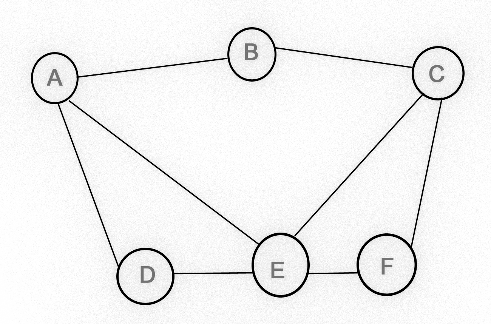

---
jupyter:
  jupytext:
    text_representation:
      extension: .md
      format_name: markdown
      format_version: '1.3'
      jupytext_version: 1.16.4
  kernelspec:
    display_name: Python 3 (ipykernel)
    language: python
    name: python3
---

<!-- #region editable=true slideshow={"slide_type": "slide"} -->
# Лекция 11. Графы

Алгоритмы и структуры данных

МГТУ им. Н.Э. Баумана

Красников Александр Сергеевич

2024 год
<!-- #endregion -->

```python editable=true slideshow={"slide_type": "skip"}
%load_ext nb_js_diagrammers
```

<!-- #region editable=true slideshow={"slide_type": "slide"} -->
## Определение графа и его компонентов

**Граф** &mdash; это структура данных, состоящая из множества вершин (или узлов) и множества рёбер (или дуг), соединяющих эти вершины. Графы широко используются для моделирования и представления различных объектов и их взаимосвязей. 


<!-- #endregion -->

<!-- #region editable=true slideshow={"slide_type": "slide"} -->
## Основные компоненты графа

- Вершины (Vertex):
  -Элементы графа, представляющие объекты.
  - Обозначаются как V (множество вершин).
  - Например, V = {A, B, C, D, E, F}.
- Рёбра (Edge):
  - Соединения между вершинами, представляющие отношения или связи.
  -  Обозначаются как E (множество рёбер).
  - Например, E = {(A, B), (A, D), (A, E), (B, C), (C, E), (C, F), (D, E), (E, F)}.

<!-- #endregion -->

<!-- #region editable=true slideshow={"slide_type": "slide"} -->
## Основные характеристики графа:

- Инцидентность
  - это когда вершина V является началом или концом ребра E.
- Степень вершины:
  - Количество рёбер, инцидентных данной вершине.
  - В неориентированном графе степень вершины — это количество рёбер, соединяющих эту вершину с другими.
  - В ориентированном графе различают входящую и исходящую степень вершины.
- Путь в графе:
  - Последовательность рёбер, соединяющих последовательность вершин.
  - Может существовать несколько путей для перехода.
  - Например, путь из A в F: A → D → E → F или A → E → F.
  - Кратчайший путь - это один из всевозможных путей от одной вершины до другой с минимальным количеством (весом) ребер, т.е. с минимальной длиной.
- Связность вершин.
  - Если все вершины графа имеют между собой хотя бы один путь, то мы можем называть его связным.
  - Напротив, вершины несвязного графа могут быть разделены по группам, которые называются компонентами связности.
- Цикл в графе:
  - Путь, который начинается и заканчивается в одной и той же вершине.
  - Например, цикл: A → D → E → A или E → C → F → E.
- Вес цикла характерен только для взвешенного графа. Вес цикла — это сумма всех весов ребер цикла. Если это значение отрицательно, то можно говорить об отрицательном весе всего цикла.
<!-- #endregion -->

<!-- #region editable=true slideshow={"slide_type": "slide"} -->
## Виды графов


<!-- #endregion -->

<!-- #region editable=true slideshow={"slide_type": "subslide"} -->
### Неориентированный граф:

Рёбра этого графа не имеют направления, т.е. соединение между двумя вершинами может быть пройдено в обе стороны.

Пример: Социальные сети, где узлы представляют людей, а рёбра — их дружеские связи.
<!-- #endregion -->

<!-- #region editable=true slideshow={"slide_type": "subslide"} -->
### Ориентированный граф:

Рёбра графа имеют направление (и обычно обозначаются стрелками), т.е. соединение между двумя вершинами может быть пройдено только в одном направлении.

Пример: Граф ссылок на веб-страницах, где узлы — это страницы, а рёбра — ссылки между ними.
<!-- #endregion -->

<!-- #region editable=true slideshow={"slide_type": "subslide"} -->
### Взвешенный граф:

Рёбра имеют веса (числа), которые могут представлять расстояния, стоимости или другие меры.

Пример: Граф дорог, где узлы — это города, а рёбра — дороги с их длиной или стоимостью проезда.

### Смешанный граф:

Содержит как ориентированные, так и неориентированные рёбра.

Пример: Системы транспортировки, где одни дороги двусторонние, а другие — односторонние.
<!-- #endregion -->

<!-- #region editable=true slideshow={"slide_type": "subslide"} -->
### Планарный граф:

Граф, который можно нарисовать на плоскости так, чтобы его рёбра не пересекались.

Пример: Граф дорог в городе (без тоннелей).
<!-- #endregion -->

<!-- #region editable=true slideshow={"slide_type": "subslide"} -->
### Связный граф:

Граф, в котором существует путь между любой парой вершин.

Пример:  Граф, представляющий сеть городов, в которой каждая пара городов соединена дорогой.
<!-- #endregion -->

<!-- #region editable=true slideshow={"slide_type": "subslide"} -->
### Ациклический граф:

Граф, не содержащий циклов.

Пример: Дерево, представляющее структуру файловой системы.
<!-- #endregion -->

<!-- #region editable=true slideshow={"slide_type": "slide"} -->
## Примеры применения графов
<!-- #endregion -->

<!-- #region editable=true slideshow={"slide_type": "subslide"} -->
### Социальные сети:
Узлы представляют людей, а рёбра — дружеские связи между ними.

Используется для анализа связей, нахождения сообществ, влияния пользователей и т.д.
<!-- #endregion -->

<!-- #region editable=true slideshow={"slide_type": "subslide"} -->
### Интернет и маршрутизация:

Узлы представляют роутеры или компьютеры, а рёбра — соединения между ними.
Используется для нахождения оптимальных маршрутов передачи данных.
<!-- #endregion -->

<!-- #region editable=true slideshow={"slide_type": "subslide"} -->
### Геномика:

Узлы представляют гены или белки, а рёбра — взаимодействия между ними.
Используется для анализа геномных данных, поиска паттернов и т.д.
<!-- #endregion -->

<!-- #region editable=true slideshow={"slide_type": "subslide"} -->
### Логистика и транспорт:

Узлы представляют города или транспортные узлы, а рёбра — дороги или пути.
Используется для оптимизации маршрутов доставки, минимизации затрат и т.д.
<!-- #endregion -->

<!-- #region editable=true slideshow={"slide_type": "subslide"} -->
### Компьютерные сети:

Узлы представляют устройства или серверы, а рёбра — соединения между ними.
Используется для проектирования и управления сетями.
<!-- #endregion -->

<!-- #region editable=true slideshow={"slide_type": "subslide"} -->
### Анализ данных и машинное обучение:

Графы используются для представления и анализа данных, поиска кластеров, создания рекомендательных систем и так далее.
<!-- #endregion -->

<!-- #region editable=true slideshow={"slide_type": "slide"} -->
## Представление графов

- Матрица смежности
- Список смежности
- Список ребер
- Матрица инцендентности


<!-- #endregion -->

<!-- #region editable=true slideshow={"slide_type": "subslide"} -->
### Матрица смежности: принцип работы

**Матрица смежности** (Adjacency Matrix) — это способ представления графа в виде квадратной матрицы размером $n \times n$, где $n$ — количество вершин в графе. 
Элементы матрицы указывают на наличие или отсутствие рёбер между вершинами:

- Если существует ребро между вершинами i и j, то элемент $A_{ij} = 1$ (или вес ребра, если граф взвешенный).
- Если рёбра нет, то  $A_{ij} = 0$.


<!-- #endregion -->

<!-- #region editable=true slideshow={"slide_type": "subslide"} -->
### Матрица смежности: плюсы и минусы.

- Плюсы:
  - Простота: легко понять и реализовать.
  - Быстрый доступ: проверка наличия ребра между двумя вершинами выполняется за $O(1)$.
  - Подходит для плотных графов: эффективен для графов с большим количеством рёбер.
- Минусы:
  - Высокие затраты памяти: требует $O(n^2)$ памяти, даже если граф содержит мало рёбер (разреженный граф).
  - Неэффективность для разреженных графов: при большом количестве вершин и малом количестве рёбер большинство элементов матрицы будут нулями, что приводит к неэффективному использованию памяти.
<!-- #endregion -->

```python editable=true slideshow={"slide_type": ""}
class AdjacencyMatrixGraph:
    """Пример реализации графа с помощью матрицы смежности"""

    def __init__(self):
        """Создать пустой граф"""
        self.adjacency_matrix = [[0]] # Пустой граф
        self.num_vertices = len(self.adjacency_matrix)

    def add_edge(self, vertex1, vertex2, oriented=True):
        """Добавить ребро в граф"""
        self.adjacency_matrix[vertex1-1][vertex2-1] = 1
        if not oriented:
            self.adjacency_matrix[vertex2-1][vertex1-1] = 1  # для ненаправленного ребра

    def add_vertex(self, vertex):
        """Добавить вершину в граф"""
        tmp_adjacency_matrix = [[0 for _ in range(vertex)] for _ in range(vertex)]
        for i in range(self.num_vertices):
            for j in range(self.num_vertices):
                tmp_adjacency_matrix[i][j] = self.adjacency_matrix[i][j]
        self.adjacency_matrix = tmp_adjacency_matrix
        self.num_vertices = len(self.adjacency_matrix)

    def __str__(self):
        result = ''
        for i in range(self.num_vertices):
            for j in range(self.num_vertices):
                result += f'{str(self.adjacency_matrix[i][j])}, '
            result += '\n'
        return result


# Пример добавления рёбер
graph =  AdjacencyMatrixGraph()

graph.add_vertex(1)
graph.add_vertex(2)
graph.add_vertex(3)
graph.add_vertex(4)
graph.add_vertex(5)

graph.add_edge(1, 2)
graph.add_edge(1, 3)
graph.add_edge(1, 4)
graph.add_edge(2, 3, oriented=False)
graph.add_edge(4, 4)
graph.add_edge(5, 2)

print(graph)
```

<!-- #region editable=true slideshow={"slide_type": "subslide"} -->
### Списки смежности: принцип работы

**Списки смежности** — это способ представления графа в виде массива списков. Каждый элемент массива соответствует вершине графа и содержит список всех смежных с ней вершин. 


<!-- #endregion -->

<!-- #region editable=true slideshow={"slide_type": "subslide"} -->
### Списки смежности: плюсы и минусы

- Плюсы:
  - Эффективное использование памяти: требует $O(V + E)$ памяти, где $V$ — количество вершин, $E$ — количество рёбер, что делает его более подходящим для разреженных графов.
  - Лёгкость обхода: удобен для выполнения операций обхода графа (например, поиск в ширину или в глубину).
- Минусы:
  - Более сложный доступ: проверка наличия ребра между двумя вершинами требует O(k) времени, где k — количество соседей вершины.
  - Менее очевидная структура: более сложен в реализации и понимании по сравнению с матрицей смежности.
<!-- #endregion -->

```python editable=true slideshow={"slide_type": ""}
class AdjacencyListGraph:
    """Пример реализации графа с помощью списка смежности"""

    def __init__(self):
        """Создать пустой граф"""
        self.adjacency_list = {} # Пустой граф

    def add_edge(self, vertex1, vertex2, oriented=True):
        """Добавить ребро в граф"""
        self.adjacency_list[vertex1].append(vertex2)
        if not oriented:
            self.adjacency_list[vertex2].append(vertex1)  # для ненаправленного ребра

    def add_vertex(self, vertex):
        """Добавить ребро в граф"""
        self.adjacency_list[vertex] = []

    def __str__(self):
        result = ''
        for vertex, edges in self.adjacency_list.items():
             result += f'{vertex}: {edges},\n'
        return result


# Пример добавления рёбер
graph =  AdjacencyListGraph()

graph.add_vertex(1)
graph.add_vertex(2)
graph.add_vertex(3)
graph.add_vertex(4)
graph.add_vertex(5)

graph.add_edge(1, 2)
graph.add_edge(1, 3)
graph.add_edge(1, 4)
graph.add_edge(2, 3, oriented=False)
graph.add_edge(4, 4)
graph.add_edge(5, 2)

print(graph)
```

<!-- #region editable=true slideshow={"slide_type": "subslide"} -->
### Списки ребер: принцип работы

**Список рёбер** представляется в виде пары вершин (или кортежа), которые обозначают соединение между ними.


<!-- #endregion -->

<!-- #region editable=true slideshow={"slide_type": "subslide"} -->
### Списки ребер: плюсы и минусы

- Плюсы:
  - Простота реализации и интуитивная понятность.
  - Эффективное хранение рёбер в разреженных графах (где количество рёбер значительно меньше максимального количества возможных рёбер).
  - Легкость в работе с алгоритмами, которые требуют обработки рёбер.
- Минусы:
  - Для поиска информации о соседях конкретной вершины требуется больше времени по сравнению с представлением списком смежности ($O(n)$ для всех рёбер).
  - Необходимость дополнительной обработки для выполнения некоторых операций, таких как проверка наличия рёбер между вершинами.
<!-- #endregion -->

```python editable=true slideshow={"slide_type": "subslide"}
class ListEdgesGraph:
    """Пример реализации графа с помощью списка ребер"""

    def __init__(self):
        """Создать пустой граф"""
        self.list_of_edges = [] # Пустой граф

    def add_edge(self, vertex1, vertex2, oriented=True):
        """Добавить ребро в граф"""
        self.list_of_edges.append((vertex1, vertex2))
        if not oriented:
            self.list_of_edges.append((vertex2, vertex1))  # для ненаправленного ребра

    def __str__(self):
        result = '['
        for vertex1, vertex2 in self.list_of_edges:
             result += f'({vertex1}, {vertex2}), '
        result += ']'
        return result


# Пример добавления рёбер
graph = ListEdgesGraph()

graph.add_edge(1, 2)
graph.add_edge(1, 3)
graph.add_edge(1, 4)
graph.add_edge(2, 3, oriented=False)
graph.add_edge(4, 4)
graph.add_edge(5, 2)

print(graph)
```

<!-- #region editable=true slideshow={"slide_type": "subslide"} -->
### Матрица инцидентности: принцип работы

**Матрица инцидентности** — это способ представления графов, который показывает связь между вершинами и рёбрами графа. 

В этой матрице строки соответствуют вершинам, а столбцы — рёбрам. 

Элементы матрицы указывают на инцидентность, то есть, существуют ли рёбра, инцидентные конкретным вершинам.

- Для графа с $n$ вершинами и $m$ рёбрами создаётся матрица размером $n \times m$.
- Если ребро направлено от вершины $v_i$ к вершине $v_j$, то в матрице будет значение -1 в строке, соответствующей $v_i$ (начальная вершина), и 1 в строке, соответствующей $v_j$ (конечная вершина).
- Для ненаправленного графа в строках, соответствующих двум вершинам, связанным рёбером, будет стоять 1, а в остальных — 0.


- Используется для любых графов, даже если есть петля.
- В каждом столбце обязательно должны стоять не более двух единиц (если это ребро представляет собой петлю, то единица ставится напротив вершины, которой инцидентна петля). В случае ориентированного графа в столбце должны стоять 1 и -1.
- Может использоваться для представления гиперграфов (в этом случае столбец может содержать больше двух единиц)
<!-- #endregion -->

<!-- #region editable=true slideshow={"slide_type": "subslide"} -->
### Матрица инцидентности: плюсы и минусы

- Плюсы:
  - Удобно для представления направленных графов, поскольку можно легко отслеживать направление рёбер.
  - Легкость в обработке и добавлении рёбер.
- Минусы:
  - Требуется больше памяти по сравнению со списком рёбер и списком смежности, особенно для разреженных графов.
  - Проверка наличия рёбер может быть медленнее, чем в случае с другими представлениями.
<!-- #endregion -->

```python editable=true slideshow={"slide_type": "subslide"}
class IncidenceMatrixGraph:
    """Пример реализации графа с помощью матрицы инцендентности"""

    def __init__(self):
        """Создать пустой граф"""
        self.incidence_matrix = [[]] # Пустой граф
        self.num_vertices = len(self.incidence_matrix)
        self.num_edges = len(self.incidence_matrix[0])

    def add_edge(self, vertex1, vertex2, oriented=True):
        """Добавить ребро в граф"""
        for vertex in range(self.num_vertices):
            self.incidence_matrix[vertex].append(0)
        self.num_edges += 1
        if vertex1 == vertex2:
            self.incidence_matrix[vertex1-1][-1] = 1
        elif oriented:
            self.incidence_matrix[vertex1-1][-1] = -1
            self.incidence_matrix[vertex2-1][-1] = 1
        elif not oriented:
            self.incidence_matrix[vertex1-1][-1] = 1
            self.incidence_matrix[vertex2-1][-1] = 1

    def add_vertex(self, vertex):
        """Добавить вершину в граф"""
        tmp_incidence_matrix = [[0 for _ in range(self.num_edges)] for _ in range(max(vertex, self.num_vertices))]
        for i in range(self.num_vertices):
            for j in range(self.num_edges):
                tmp_incidence_matrix[i][j] = self.incidence_matrix[i][j]
        self.incidence_matrix = tmp_incidence_matrix
        self.num_vertices = len(self.incidence_matrix)
        self.num_edges = len(self.incidence_matrix[0])

    def __str__(self):
        result = ''
        for i in range(self.num_vertices):
            for j in range(self.num_edges):
                result += f'{str(self.incidence_matrix[i][j]):>3}, '
            result += '\n'
        return result


# Пример добавления рёбер
graph = IncidenceMatrixGraph()

graph.add_vertex(1)
graph.add_vertex(2)
graph.add_vertex(3)
graph.add_vertex(4)
graph.add_vertex(5)

graph.add_edge(1, 2)
graph.add_edge(1, 3)
graph.add_edge(1, 4)
graph.add_edge(2, 3, oriented=False)
graph.add_edge(4, 4)
graph.add_edge(5, 2)

print(graph)
```

```python editable=true slideshow={"slide_type": ""}
l = [[1,2,3,4]]
len(l[0])
```

<!-- #region editable=true slideshow={"slide_type": "subslide"} -->
### Сравнение различных методов представления графов.


**Матрица смежности** лучше подходит для плотных графов, где большинство вершин соединены рёбрами, так как обеспечивает быстрый доступ к информации о рёбрах и проста в реализации.

**Списки смежности** предпочтительнее для разреженных графов, где количество рёбер значительно меньше, чем количество возможных пар вершин. Они обеспечивают эффективное использование памяти и удобны для выполнения операций обхода графа. 

**Список ребер** особенно полезен для простых задач, таких как обход графа или алгоритмы, работающие напрямую с рёбрами.

**Матрица инцидентности** — это полезный способ представить графы, особенно когда важна информация о направлении рёбер. Она предоставляет возможность эффективно управлять рёбрами и легко добавлять или удалять их. Однако следует учитывать, что этот способ требует больше памяти по сравнению с другими представлениями, такими как списки смежности или списки рёбер, особенно для разреженных графов.
<!-- #endregion -->

<!-- #region editable=true slideshow={"slide_type": "slide"} -->
## Основные задачи с графами 

Работа с графами охватывает широкий спектр задач в теории графов и различных областях применения, таких как компьютерные науки, операционные исследования, социология и др. Вот основные задачи, связанные с графами.

Задачи, связанные с графами, играют ключевую роль в различных областях и применениях. Понимание этих задач и алгоритмов позволяет эффективно решать сложные проблемы и оптимизировать системы.
<!-- #endregion -->

<!-- #region editable=true slideshow={"slide_type": "subslide"} -->
### Поиск в графах:
- Поиск в глубину (DFS): Алгоритм для обхода графа, начиная с одной вершины и исследуя максимально возможные пути перед возвратом.
- Поиск в ширину (BFS): Алгоритм, который исследует все соседние вершины текущей вершины перед переходом к следующей.
<!-- #endregion -->

<!-- #region editable=true slideshow={"slide_type": "subslide"} -->
### Кратчайший путь:

- Алгоритм Дейкстры: Нахождение кратчайшего пути от одной вершины до всех других в графе с неотрицательными весами рёбер.
- Алгоритм Беллмана-Форда: Нахождение кратчайших путей, который работает даже для графов с отрицательными весами рёбер, но без отрицательных циклов.
- Алгоритм Флойда-Уоршелла: Находит кратчайшие пути между всеми парами вершин в графе.
<!-- #endregion -->

<!-- #region editable=true slideshow={"slide_type": "subslide"} -->
### Минимальное остовное дерево:

- Алгоритм Краскала и Алгоритм Прима: Алгоритмы для нахождения минимального остовного дерева в графе, которые соединяют все вершины с минимальной общей суммой весов рёбер.
<!-- #endregion -->

<!-- #region editable=true slideshow={"slide_type": "subslide"} -->
### Поиск циклов (Циклы в графе):

- Нахождение цикла: Определение наличия циклов в направленных и ненаправленных графах.
- Топологическая сортировка: Упорядочение направленного ациклического графа (DAG) в линейном порядке.
<!-- #endregion -->

<!-- #region editable=true slideshow={"slide_type": "subslide"} -->
### Поиск компонентов связности:

- Определение связных компонентов: Нахождение всех связных компонентов в ненаправленном графе.
<!-- #endregion -->

<!-- #region editable=true slideshow={"slide_type": "subslide"} -->
### Поток в сети:

- Алгоритм Форда-Фалкерсона: Нахождение максимального потока в сети с заданными источником и стоком.
- Алгоритм Эдмондса-Карпа: Специальный случай алгоритма Форда-Фалкерсона, использующий BFS для поиска увеличивающих путей.
<!-- #endregion -->

<!-- #region editable=true slideshow={"slide_type": "subslide"} -->
### Раскраска графа:

- Задача раскраски: Задача о назначении цветов вершинам графа так, чтобы никакие две соседние вершины не имели одинаковый цвет, минимизируя количество использованных цветов.
<!-- #endregion -->

<!-- #region editable=true slideshow={"slide_type": "subslide"} -->
### Подграфы и изоморфизм:

- Поиск подграфа: Найти, содержит ли граф заданный подграф.
- Изоморфизм графов: Определение, эквивалентны ли два графа по структуре.
<!-- #endregion -->

<!-- #region editable=true slideshow={"slide_type": "subslide"} -->
### Проблемы маршрутизации:

- Проблемы, связанные с кратчайшими путями: Оптимизация маршрутов на транспортных сетях, включая задачи из логистики и планирования.
<!-- #endregion -->

<!-- #region editable=true slideshow={"slide_type": "slide"} -->
## Алгоритмы поиска в глубину (DFS)

**Поиск в глубину** (Depth-First Search, DFS) — это алгоритм обхода или поиска в графе. Он начинает с начальной вершины и идёт вглубь графа, пока не достигнет вершины без непосещённых соседей, затем возвращается назад и продолжает процесс с другими вершинами.
<!-- #endregion -->

<!-- #region editable=true slideshow={"slide_type": "subslide"} -->
### Шаги алгоритма:

1. Начинаем с выбранной начальной вершины и помечаем её как посещённую.
2. Исследуем первую непосещённую соседнюю вершину.
3. Повторяем шаги 1 и 2 для этой соседней вершины.
4. Если все соседи текущей вершины посещены, возвращаемся назад (backtrack) к предыдущей вершине и продолжаем процесс.
5. Процесс повторяется до тех пор, пока не будут посещены все вершины, достижимые из начальной вершины.


<!-- #endregion -->

<!-- #region editable=true slideshow={"slide_type": "subslide"} -->
### Сложность DFS

**Временная сложность O(V + E)**, так как каждый узел и каждое ребро графа посещаются один раз.

**Пространственная сложность O(V)**, так как используется стек вызовов или явный стек для хранения вершин, а также массивы для хранения состояния (посещённые вершины).

V — количество вершин,

E — количество рёбер.
<!-- #endregion -->

<!-- #region editable=true slideshow={"slide_type": "subslide"} -->
### Реализация DFS

1. Рекурсивная реализация DFS

2. Итеративная реализация DFS (Реализация DFS с использованием стека)
<!-- #endregion -->

```python editable=true slideshow={"slide_type": "subslide"}
%%mermaid_magic -h 400

flowchart TD
    A <--> B;
    A <--> C;
    B <--> D;
    B <--> E;
    D <--> E;
    C <--> F;


```

```python editable=true slideshow={"slide_type": "subslide"}
def dfs_recursive(graph, start, visited=None):
    """Рекурсивная реализация DFS"""
    if visited is None:
        visited = set()
    visited.add(start)
    print(start)  # Обработка узла

    for neighbor in graph[start]:
        if neighbor not in visited:
            dfs_recursive(graph, neighbor, visited)

# Пример использования:
graph = {
    'A': ['B', 'C'],
    'B': ['A', 'D', 'E'],
    'C': ['A', 'F'],
    'D': ['B'],
    'E': ['B'],
    'F': ['C']
}
dfs_recursive(graph, 'A')
```

```python editable=true slideshow={"slide_type": "subslide"}
def dfs_iterative(graph, start):
    """Итеративная реализация DFS (Реализация DFS с использованием стека)"""
    visited = set()
    stack = [start]

    while stack:
        vertex = stack.pop()
        if vertex not in visited:
            visited.add(vertex)
            print(vertex)  # Обработка узла

            for neighbor in reversed(graph[vertex]):  # Обратный порядок для правильного порядка обхода
                if neighbor not in visited:
                    stack.append(neighbor)

# Пример использования:
graph = {
    'A': ['B', 'C'],
    'B': ['A', 'D', 'E'],
    'C': ['A', 'F'],
    'D': ['B'],
    'E': ['B'],
    'F': ['C']
}
dfs_iterative(graph, 'A')
```

<!-- #region editable=true slideshow={"slide_type": ""} -->
### Примеры задач, решаемых с использованием DFS

- **Поиск пути в лабиринте:** Используется для нахождения пути в лабиринте от начальной до конечной точки.
  - В видеоиграх и робототехнике для навигации по лабиринтам и сложным пространствам.
- **Проверка связности графа:** Проверка, является ли граф связным (есть ли путь между любыми двумя вершинами).
  - В сетевом анализе для проверки связности сети.
- **Топологическая сортировка:** Используется для упорядочивания вершин ориентированного ациклического графа (DAG) таким образом, что для любого ребра (u, v) вершина u предшествует вершине v.
  - В компиляторах для упорядочивания зависимостей и задач.
- **Обнаружение циклов в графе:** Проверка, содержит ли граф циклы.
  - В анализе зависимостей для обнаружения циклических зависимостей.
- **Генерация лабиринтов:** Использование DFS для генерации случайных лабиринтов.
  - В игровых и развлекательных приложениях для создания лабиринтов.
<!-- #endregion -->

<!-- #region editable=true slideshow={"slide_type": "slide"} -->
## Алгоритмы поиска в ширину (BFS)

**Поиск в ширину** (Breadth-First Search, BFS) — это алгоритм обхода или поиска в графе, который начинает с начальной вершины и исследует все её соседние вершины на текущем уровне перед переходом к вершинам следующего уровня. 
<!-- #endregion -->

<!-- #region editable=true slideshow={"slide_type": "subslide"} -->
### Шаги алгоритма:

1. Начинаем с выбранной начальной вершины и помещаем её в очередь.
2. Пока очередь не пуста, выполняем следующие действия:
  - Извлекаем вершину из головы очереди и помечаем её как посещённую.
  - Для каждой непосещённой соседней вершины добавляем её в очередь.
3. Повторяем шаг 2, пока не будут посещены все вершины, достижимые из начальной вершины.


<!-- #endregion -->

<!-- #region editable=true slideshow={"slide_type": "subslide"} -->
### Сложность BFS

**Временная сложность O(V + E)**, так как каждый узел и каждое ребро графа посещаются один раз.

**Пространственная сложность O(V)**, так как используется стек вызовов или явный стек для хранения вершин, а также массивы для хранения состояния (посещённые вершины).

V — количество вершин,

E — количество рёбер.
<!-- #endregion -->

<!-- #region editable=true slideshow={"slide_type": "subslide"} -->
### Реализация BFS

1. Реализация BFS с использованием очереди
<!-- #endregion -->

```python editable=true slideshow={"slide_type": "subslide"}
from collections import deque

def bfs(graph, start):
    visited = set()
    queue = deque([start])

    while queue:
        vertex = queue.popleft()
        if vertex not in visited:
            visited.add(vertex)
            print(vertex)  # Обработка узла

            for neighbor in graph[vertex]:
                if neighbor not in visited:
                    queue.append(neighbor)

# Пример использования:
graph = {
    'A': ['B', 'C'],
    'B': ['A', 'D', 'E'],
    'C': ['A', 'F'],
    'D': ['B'],
    'E': ['B'],
    'F': ['C']
}
bfs(graph, 'A')
```

<!-- #region editable=true slideshow={"slide_type": "subslide"} -->
### Примеры задач, решаемых с использованием BFS

- **Поиск кратчайшего пути в неориентированном графе:** BFS используется для нахождения кратчайшего пути (минимального количества рёбер) от начальной вершины до целевой в неориентированном графе.
  - В навигационных системах для нахождения кратчайшего пути между точками.
  - В сетевом анализе для нахождения кратчайшего пути передачи данных.
- **Проверка связности графа:** Проверка, является ли граф связным, то есть существует ли путь между любыми двумя вершинами.
  - В сетевом анализе для проверки связности сети.
  - В анализе социальных сетей для проверки связности группы пользователей.
- **Генерация лабиринтов:** Использование BFS для генерации случайных лабиринтов с заданными свойствами.
  - В игровых приложениях для создания лабиринтов.
  - В робототехнике для тестирования алгоритмов навигации.
- **Поиск в ширину в деревьях:** BFS используется для обхода деревьев, чтобы выполнять действия на каждом уровне дерева (например, печать всех узлов на каждом уровне).
  - В задачах визуализации данных, где требуется отображать данные по уровням.
  - В задачах планирования, где требуется выполнение действий на каждом уровне иерархии.
- **Проверка двудольности графа:** Проверка, является ли граф двудольным, то есть можно ли его вершины разбить на два множества так, что рёбра существуют только между вершинами из разных множеств.
  - В теории графов для проверки двудольности графа.
  - В задачах раскраски графов, где необходимо проверить, можно ли раскрасить граф двумя цветами.
<!-- #endregion -->

<!-- #region editable=true slideshow={"slide_type": "slide"} -->
## Двунаправленный поиск в ширину

BFS часто используется в играх, когда нужно найти кратчайший путь между двумя точками в сложном ландшафте. Такая задача легко превращается в задачу поиска пути в графе между двумя вершинами. Рёбра такого графа — это все проходимые пути на карте.

Но чтобы найти путь быстрее, его обычно ищут с двух концов. Для этого применяется двунаправленный BFS. 

**Двунаправленный поиск в ширину** (Bidirectional BFS) — это оптимизированный вариант алгоритма BFS, который выполняет два параллельных обхода графа: один от начальной вершины и другой от целевой вершины. Обходы продолжаются до тех пор, пока два обхода не пересекутся, что значительно сокращает количество проверяемых вершин и рёбер по сравнению с классическим BFS.
<!-- #endregion -->

<!-- #region editable=true slideshow={"slide_type": "slide"} -->
### Шаги алгоритма:

1. Инициализация двух очередей: одна для обхода от начальной вершины, другая — от целевой.
2. Инициализация двух множеств посещённых вершин для отслеживания посещённых вершин в обоих направлениях.
3. Выполнение попеременного обхода графа из двух очередей.
4. При каждом шаге проверяется, пересекаются ли множества посещённых вершин. Если пересечение найдено, путь существует.
5. Процесс продолжается до тех пор, пока не будет найден пересекающийся узел или очереди не опустеют.
<!-- #endregion -->

<!-- #region editable=true slideshow={"slide_type": "subslide"} -->
### Сложность двунаправленного BFS 

**Временная сложность**
В лучшем случае: O(2 * (V + E)) = O(V + E)

Двунаправленный BFS обычно выполняет обход меньшего числа вершин по сравнению с однопроходным BFS, особенно в больших графах.

**Пространственная сложность:**
O(V) для хранения двух очередей и двух множеств посещённых вершин.

V — количество вершин,

E — количество рёбер.
<!-- #endregion -->

<!-- #region editable=true slideshow={"slide_type": "slide"} -->
## Алгоритмы поиска кратчайшего пути

1. Алгоритм Дейкстры
<!-- #endregion -->

<!-- #region editable=true slideshow={"slide_type": "subslide"} -->
## Алгоритм Дейкстры

Алгоритм Дейкстры — это алгоритм для нахождения кратчайших путей от начальной вершины до всех остальных вершин в графе с неотрицательными весами рёбер. Алгоритм использует жадный подход, выбирая на каждом шаге вершину с наименьшим известным расстоянием от начальной вершины и обновляя расстояния до соседних вершин. 


<!-- #endregion -->

<!-- #region editable=true slideshow={"slide_type": "subslide"} -->
### Шаги алгоритма:

1. Инициализация:
  - Устанавливаем расстояние до начальной вершины равным 0.
  - Устанавливаем расстояние до всех остальных вершин равным бесконечности.
  - Создаём множество непосещённых вершин.
2. Выбор текущей вершины:
  - Выбираем непосещённую вершину с наименьшим расстоянием (начальная вершина на первом шаге).
3. Обновление расстояний:
  - Для каждой соседней вершины текущей вершины, если новый путь через текущую вершину короче известного пути, обновляем расстояние до этой вершины.
4. Помечаем текущую вершину как посещённую:
  - Удаляем текущую вершину из множества непосещённых вершин.
5. Повторяем шаги 2-4, пока не будут посещены все вершины или не достигнем целевой вершины. 
<!-- #endregion -->

<!-- #region editable=true slideshow={"slide_type": "subslide"} -->
### Сложность алгоритма Дейкстры

**Временная сложность**
  **O((V + E) log V)** при использовании очереди с приоритетом (например, куча Фибоначчи)
- **O(V^2)** при использовании простого списка для хранения расстояний.
- 
**Пространственная сложность O(V)**, для хранения расстояний и предков (для восстановления пути).

V — количество вершин,

E — количество рёбер.
<!-- #endregion -->

```python editable=true slideshow={"slide_type": "subslide"}
%%mermaid_magic -h 200

flowchart LR
    A<-->|1|B;
    A<-->|4|C;
    B<-->|2|C;
    C<-->|1|D;
    B<-->|5|D;
```

```python editable=true slideshow={"slide_type": "subslide"}
import heapq

def dijkstra(graph, start):
    """реализации алгоритма Дейкстры с использованием очереди с приоритетом (куча):"""

    # Инициализация
    distances = {vertex: float('infinity') for vertex in graph}
    distances[start] = 0
    priority_queue = [(0, start)]
    parents = {vertex: None for vertex in graph}

    while priority_queue:
        current_distance, current_vertex = heapq.heappop(priority_queue)

        # Если текущее расстояние больше записанного, пропускаем вершину
        if current_distance > distances[current_vertex]:
            continue

        # Обновление расстояний до соседних вершин
        for neighbor, weight in graph[current_vertex].items():
            distance = current_distance + weight

            # Если найден более короткий путь к соседней вершине
            if distance < distances[neighbor]:
                distances[neighbor] = distance
                parents[neighbor] = current_vertex
                heapq.heappush(priority_queue, (distance, neighbor))

    return distances, parents

# Пример использования:
graph = {
    'A': {'B': 1, 'C': 4},
    'B': {'A': 1, 'C': 2, 'D': 5},
    'C': {'A': 4, 'B': 2, 'D': 1},
    'D': {'B': 5, 'C': 1}
}
start_vertex = 'A'
distances, parents = dijkstra(graph, start_vertex)
print("Кратчайшие расстояния от начальной вершины:", distances)
print("Предки для восстановления пути:", parents)
```

<!-- #region editable=true slideshow={"slide_type": "subslide"} -->
### Примеры задач, решаемых с использованием алгоритма Дейкстры

- Оптимизация маршрутов в транспортных сетях
  -Нахождение кратчайшего пути между точками в транспортной сети (например, между городами).
  -Навигационные системы, такие как Yandex Карты, используют алгоритм Дейкстры для расчёта оптимальных маршрутов.
- Планирование маршрутов доставки
  - Оптимизация маршрутов для служб доставки товаров, чтобы минимизировать затраты и время доставки.
  - Логистические компании используют алгоритм Дейкстры для планирования маршрутов доставки и снижения операционных затрат.
- Управление сетями
  - Оптимизация маршрутизации пакетов данных в компьютерных сетях для минимизации задержек и увеличения пропускной способности.
  - Протоколы маршрутизации, такие как OSPF (Open Shortest Path First), используют алгоритм Дейкстры для нахождения кратчайших путей в сетях.
- Анализ социальных сетей
  - Нахождение кратчайших путей и измерение центральности в социальных графах (например, для нахождения наиболее влиятельных пользователей).
  -Социальные платформы анализируют связи между пользователями для предоставления рекомендаций и анализа сетевой активности.
- Игры и виртуальные миры
  - Нахождение пути для персонажей в игровых мирах с препятствиями и различными уровнями сложности.
  - Игровые движки используют алгоритм Дейкстры для расчёта движения персонажей и объектов в виртуальных мирах.
- Системы управления энергией
  - Оптимизация распределения энергии в электросетях для минимизации потерь и обеспечения надёжности поставок.
-- Электроэнергетические компании используют алгоритм Дейкстры для оптимизации маршрутов передачи энергии в сетях, чтобы минимизировать потери энергии и избегать перегрузок.
  - В электросетях каждый узел представляет подстанцию, а рёбра — линии электропередачи с различными уровнями сопротивления. Алгоритм Дейкстры помогает найти путь с наименьшим сопротивлением от источника энергии к потребителю.
- Системы эвакуации и планирования пути
  - Оптимизация маршрутов эвакуации в зданиях или городах для быстрого и безопасного вывода людей в случае чрезвычайных ситуаций.
  - Архитекторы и инженеры используют алгоритм Дейкстры для планирования маршрутов эвакуации, чтобы гарантировать безопасное и быстрое удаление людей из опасных зон.
  - В многоквартирном доме или офисном здании узлы графа представляют комнаты и коридоры, а рёбра — пути между ними. Алгоритм Дейкстры может использоваться для нахождения кратчайшего пути от любой точки в здании к ближайшему выходу. 
<!-- #endregion -->

<!-- #region editable=true slideshow={"slide_type": "slide"} -->
## Топологическая сортировка

Топологическая сортировка — это линейное упорядочение вершин ориентированного ациклического графа (Directed Acyclic Graph (DAG)) такое, что для каждого ребра (u, v) вершина u предшествует вершине v. 

Это упорядочение возможно только для DAG и не может быть выполнено на графах, содержащих циклы.

Пример: имеется список задач (вершины графа) и список зависимостей между ними (стрелки в графе). Необходимо расположите задачи (вершины) так, чтобы все задачи, от которых зависит «задача А», выполнялись до неё. 
<!-- #endregion -->

<!-- #region editable=true slideshow={"slide_type": "subslide"} -->
### Реализация топологической сортировки

1. Реализация через поиск в глубину (DFS)
2. Реализация: алгоритм Кана
<!-- #endregion -->

```python editable=true slideshow={"slide_type": "subslide"}
%%mermaid_magic -h 200

flowchart LR
    A-->C;
    B-->C;
    B-->D;
    C-->E;
    D-->F;
    E-->H;
    E-->F;
    F-->G;
```

```python editable=true slideshow={"slide_type": "subslide"}
def topological_sort_dfs(graph):
    """Реализация через поиск в глубину (DFS)"""
    def dfs(vertex, visited, stack):
        visited.add(vertex)
        for neighbor in graph[vertex]:
            if neighbor not in visited:
                dfs(neighbor, visited, stack)
        stack.append(vertex)

    visited = set()
    stack = []
    for vertex in graph:
        if vertex not in visited:
            dfs(vertex, visited, stack)

    return stack[::-1]  # Результат в обратном порядке

# Пример использования:
graph = {
    'A': ['C'],
    'B': ['C', 'D'],
    'C': ['E'],
    'D': ['F'],
    'E': ['H', 'F'],
    'F': ['G'],
    'G': [],
    'H': []
}
result = topological_sort_dfs(graph)
print("Топологическая сортировка:", result)
```

```python editable=true slideshow={"slide_type": "subslide"}
from collections import deque, defaultdict

def topological_sort_kahn(graph):
    """Реализация топологической сортировки: алгоритм Кана"""
    in_degree = {u: 0 for u in graph}
    for u in graph:
        for v in graph[u]:
            in_degree[v] += 1

    queue = deque([u for u in graph if in_degree[u] == 0])
    top_order = []

    while queue:
        u = queue.popleft()
        top_order.append(u)

        for v in graph[u]:
            in_degree[v] -= 1
            if in_degree[v] == 0:
                queue.append(v)

    if len(top_order) == len(in_degree):
        return top_order
    else:
        raise ValueError("Граф содержит цикл")

# Пример использования:
graph = {
    'A': ['C'],
    'B': ['C', 'D'],
    'C': ['E'],
    'D': ['F'],
    'E': ['H', 'F'],
    'F': ['G'],
    'G': [],
    'H': []
}
result = topological_sort_kahn(graph)
print("Топологическая сортировка:", result)
```

<!-- #region editable=true slideshow={"slide_type": "subslide"} -->
### Сложность алгоритмов топологической сортировки

**Временная сложность**
Оба основных алгоритма топологической сортировки (DFS и алгоритм Кана) имеют временную сложность O(V + E)

**Пространственная сложность O(V+E)**, так как требуется хранение графа, а также массивов для отслеживания посещённых вершин и предшественников. 


V — количество вершин,

E — количество рёбер.

<!-- #endregion -->

<!-- #region editable=true slideshow={"slide_type": "subslide"} -->
### Примеры задач, решаемых с использованием топологической сортировки

- **Планирование задач (Task Scheduling):**
  - Определение порядка выполнения зависимых задач так, чтобы каждая задача выполнялась после всех её зависимостей.
  - Планирование проектов в системе управления проектами.
- **Компиляция кода:**
  - Определение порядка компиляции модулей или файлов исходного кода, которые зависят друг от друга.
  - Оптимизация сборки программного обеспечения в системах сборки (например, Makefile).
- **Разрешение зависимостей в пакетных менеджерах:**
  - Упорядочение пакетов так, чтобы все зависимости были установлены перед установкой самого пакета.
  - Упрощение процесса установки программного обеспечения в пакетных менеджерах (например, npm, pip, apt).
- **Оптимизация маршрутов:**
  -Определение порядка посещения точек или выполнения действий, учитывая зависимости между ними.
  -Логистика и планирование маршрутов доставки товаров.
<!-- #endregion -->


