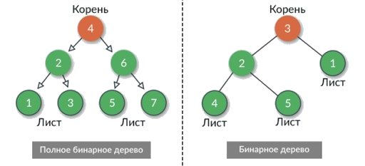
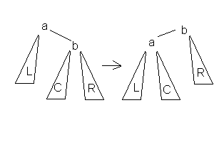

---
jupyter:
  jupytext:
    text_representation:
      extension: .md
      format_name: markdown
      format_version: '1.3'
      jupytext_version: 1.16.4
  kernelspec:
    display_name: Python 3 (ipykernel)
    language: python
    name: python3
---

<!-- #region editable=true slideshow={"slide_type": "slide"} -->
# Лекция 12. Деревья

Алгоритмы и структуры данных

МГТУ им. Н.Э. Баумана

Красников Александр Сергеевич

2024 год
<!-- #endregion -->

```python editable=true slideshow={"slide_type": "skip"}
%load_ext nb_js_diagrammers
```

<!-- #region editable=true slideshow={"slide_type": "slide"} -->
## Основные компоненты дерева

**Дерево** — это специальный вид графа, который является *ациклическим* и *связным*. 

В дереве существует единственный путь между любой парой узлов, что делает его структуру *иерархической*. 


<!-- #endregion -->

<!-- #region editable=true slideshow={"slide_type": "slide"} -->
## Основные компоненты дерева

- **Узлы**: основные элементы дерева, которые содержат данные.
- **Корень**: узел, который не имеет родительских узлов. Он является начальной точкой дерева.
- **Листья**: узлы, которые не имеют дочерних узлов. Они находятся на "концах" дерева.
- **Рёбра**: связи между узлами. Определяют родительско-дочерние отношения между узлами.
- **Поддеревья**: любое подмножество дерева, состоящее из узла и всех его потомков.
<!-- #endregion -->

<!-- #region editable=true slideshow={"slide_type": "slide"} -->
## Основные характеристики дерева

- **Высота дерева**: длина пути от корня до самого дальнего листа.
- **Глубина узла**: длина пути от корня до данного узла.
<!-- #endregion -->

<!-- #region editable=true slideshow={"slide_type": "slide"} -->
## Виды деревьев
<!-- #endregion -->

<!-- #region editable=true slideshow={"slide_type": "subslide"} -->
### Бинарные деревья

- **Бинарное дерево**: дерево, в котором каждый узел имеет не более двух дочерних узлов, называемых левым и правым потомками.
- **Полное бинарное дерево**: все уровни дерева, кроме последнего, полностью заполнены, и все узлы последнего уровня расположены как можно левее.
- **Совершенное бинарное дерево**: все внутренние узлы имеют ровно два дочерних узла, и все листья находятся на одном уровне.
- **Сбалансированное бинарное дерево**: разница высот поддеревьев любого узла не превышает 1.
- **Бинарное дерево поиска**: для любого узла его левое поддерево содержит только узлы с меньшими значениями, а правое поддерево – только узлы с большими значениями.



<!-- #endregion -->

<!-- #region editable=true slideshow={"slide_type": "subslide"} -->
### n-арные деревья

**n-арное дерево** – это дерево, в котором каждый узел может иметь не более n дочерних узлов. 

- **Тернарное дерево** (Ternary Tree): каждый узел имеет не более трёх дочерних узлов.
- **К-арное дерево** (k-ary Tree): каждый узел имеет не более k дочерних узлов.
<!-- #endregion -->

<!-- #region editable=true slideshow={"slide_type": "slide"} -->
## Примеры использования деревьев

- **Файловая система**
  - Представление иерархической структуры файлов и папок в операционной системе.
  - Корневой узел представляет корневую директорию, внутренние узлы — папки, а листья — файлы.
  - Операции включают создание, удаление и перемещение файлов и папок.
- **Дерево решений**
  - Аналитика и машинное обучение для принятия решений, например, диагностика заболеваний в медицине на основе симптомов.
  - Внутренние узлы представляют вопросы или условия, ветви — возможные ответы, а листья — конечные решения или действия.
- **XML/HTML документ**
  - Структурированное представление данных в формате XML или HTML.
  - Корневой узел представляет весь документ, внутренние узлы — теги и элементы, а листья — текстовые узлы и атрибуты.
  - Это помогает в парсинге и манипулировании содержимым документов.
- Организационная структура
  - Представление иерархии в организациях и компаниях.
  - Корневой узел представляет генерального директора, внутренние узлы — менеджеров и отделы, а листья — сотрудников.
  - Это помогает визуализировать и управлять организационной структурой.
- Игра в шахматы
  - Представление возможных ходов в игре.
  - Корневой узел представляет начальное состояние игры, внутренние узлы — возможные ходы, а листья — конечные состояния игры.
  - Это помогает в планировании стратегий и принятии решений в шахматных программах. 
<!-- #endregion -->

<!-- #region editable=true slideshow={"slide_type": "slide"} -->
## Обход дерева (traversal tree)

Задача обхода — определённым образом сформировать список узлов (или данных из узлов, вопрос терминологии и имеет значение на практике).

Порядок действий при **прямом обходе**:
1. Обработка данных узла.
2. Прохождение левого поддерева.
3. Прохождение правого поддерева.

Порядок действий при **обратном обходе**:
1. Прохождение левого поддерева.
2. Прохождение правого поддерева.
3. Обработка данных узла.

Порядок действий при **симметричном обходе**:
1. Прохождение левого поддерева.
2. Обработка данных узла.
3. Прохождение правого поддерева.

<!-- #endregion -->

<!-- #region editable=true slideshow={"slide_type": "slide"} -->
## Бинарные деревья поиска

**Бинарное дерево поиска** (Binary Search Tree, BST) — это бинарное дерево, обладающее следующими свойствами:

- Для любого узла его левое поддерево содержит только узлы с ключами меньшими, чем ключ данного узла.
- Для любого узла его правое поддерево содержит только узлы с ключами большими, чем ключ данного узла.
- Оба поддерева каждого узла также являются бинарными деревьями поиска.


Фактически BST это организация данных в виде «дерева», по которому можно очень быстро искать. 

Структура дерева – это скрытая/хитрая сортировка элементов. 

<!-- #endregion -->

<!-- #region editable=true slideshow={"slide_type": "subslide"} -->
### Симметричный обход (in-order traversal) бинарного дерева поиска

Симметричный обход — обход, при котором корень дерева занимает место между результатами соответствующих обходов левого и правого поддеревьев.

Симметричный обход бинарного дерева поиска сформирует отсортированный список узлов!


<!-- #endregion -->

<!-- #region editable=true slideshow={"slide_type": "subslide"} -->
### Принципы работы BST

- **Организация данных**: BST организует данные так, чтобы обеспечивать эффективный поиск, вставку и удаление элементов.
- **Рекурсивная структура**: Каждый узел в BST подчиняется тем же правилам, что и корень дерева, что делает структуру рекурсивной.
- **Сбалансированность**: Для обеспечения оптимальной производительности BST должно быть сбалансированным, то есть высота левого и правого поддеревьев должна быть примерно одинаковой.
<!-- #endregion -->

<!-- #region editable=true slideshow={"slide_type": "subslide"} -->
### Свойства BST:

- **Упорядоченность**: В любой момент можно обойти дерево в порядке &laquo;in-order&raquo;, чтобы получить все элементы в отсортированном порядке.
- **Время операций**:
  - В среднем время выполнения операций поиска, вставки и удаления составляет $O(log n)$, где $n$ — количество узлов.
  - В худшем случае (если дерево не сбалансировано) время выполнения операций может достигать $O(n)$.
- **Уникальные ключи**: Все ключи в BST должны быть уникальными, чтобы сохранить упорядоченность.

<!-- #endregion -->

<!-- #region editable=true slideshow={"slide_type": "subslide"} -->
### Основные операции c BST

- Вставка (Insertion)
- Удаление (Deletion)
- Поиск (Search)
<!-- #endregion -->

<!-- #region editable=true slideshow={"slide_type": "subslide"} -->
#### Вставка (Insertion)
- Если дерево пустое, новый узел становится корневым узлом.
- Иначе рекурсивно находим правильное место и добавляем новый узел.
  - Начинаем с корневого узла.
  - Сравниваем ключ нового узла с ключом текущего узла.
  - Если новый ключ меньше, переходим к левому поддереву, если больше — к правому.
  - Повторяем процесс до тех пор, пока не найдём подходящее место для вставки нового узла (либо левый, либо правый потомок отсутствует).
<!-- #endregion -->

<!-- #region editable=true slideshow={"slide_type": "subslide"} -->
#### Удаление (Deletion)

Принцип работы:
- Найти узел с заданным ключом для удаления.
- В зависимости от случая выполнить соответствующее удаление и перераспределение узлов, рассмотрев три случая:
  -Узел является листом (не имеет детей): просто удаляем узел.
  - Узел имеет одного ребёнка: заменяем узел его ребёнком.
  - Узел имеет двух детей: находим наименьший узел в правом поддереве (или наибольший в левом), копируем его значение в удаляемый узел и рекурсивно удаляем наименьший узел в правом поддереве (наибольший в левом).
<!-- #endregion -->

<!-- #region editable=true slideshow={"slide_type": "subslide"} -->
#### Поиск (Search):

- Если дерево пустое или ключ узла совпадает с искомым, возвращаем узел.
- Если ключ искомого узла меньше, рекурсивно ищем в левом поддереве.
- Если ключ искомого узла больше, рекурсивно ищем в правом поддереве.

<!-- #endregion -->

<!-- #region editable=true slideshow={"slide_type": "subslide"} -->
### Примеры задач, решаемых с использованием BST
<!-- #endregion -->

<!-- #region editable=true slideshow={"slide_type": "subslide"} -->
#### Поиск элемента в динамическом множестве

Необходимо поддерживать множество чисел, в которое можно добавлять новые элементы, удалять существующие и быстро искать, находится ли заданное число в множестве.

- Решение с использованием BST:
  - Вставка новых элементов в дерево.
  - Удаление существующих элементов.
  - Поиск элементов в дереве.
- Пример использования:
  - Поддержка списка зарегистрированных пользователей в системе, где пользователи могут добавляться и удаляться, а система должна быстро проверять, зарегистрирован ли пользователь.
<!-- #endregion -->

<!-- #region editable=true slideshow={"slide_type": "subslide"} -->
#### Нахождение минимального и максимального элемента

Необходимо быстро находить минимальное и максимальное значения в наборе данных.

- Решение с использованием BST:
  - Минимальный элемент находится в самом левом узле дерева.
  - Максимальный элемент находится в самом правом узле дерева.
- Пример использования:
  - Поддержка системы, отслеживающей цены акций, где необходимо быстро находить минимальную и максимальную цену в текущий момент времени.
<!-- #endregion -->

<!-- #region editable=true slideshow={"slide_type": "subslide"} -->
#### Проверка баланса выражения

Дано математическое выражение, необходимо проверить его балансировку по количеству открывающих и закрывающих скобок.

- Решение с использованием BST:
  - Используем BST для хранения промежуточных состояний проверки баланса скобок.
- Пример использования:
  - Парсинг и компиляция кода, где необходимо проверять правильность расстановки скобок в выражениях.
<!-- #endregion -->

<!-- #region editable=true slideshow={"slide_type": "subslide"} -->
#### Построение словаря

Необходимо создать структуру данных для хранения словаря, в котором слова могут быть добавлены, удалены и быстро найдены.

- Решение с использованием BST:
  - Слова добавляются в дерево в алфавитном порядке.
  -Поиск слов осуществляется по ключам.

- Пример использования:
  - Система автокоррекции текста, где необходимо быстро находить и исправлять слова.
<!-- #endregion -->

<!-- #region editable=true slideshow={"slide_type": "slide"} -->
## Балансировка деревьев

**Проблемы несбалансированных деревьев**

У обычных (несбалансированных) деревьев при добавлении элементов могут наблюдаться неприятные эффекты.

В этом примере дерево фактически превращается в связный список, и время выполнения операций становится линейным списком.

- **Увеличение высоты дерева**: 
  - В несбалансированных деревьях высота может достигать n (где n — количество узлов), что приводит к деградации производительности.
  - Время выполнения основных операций (поиск, вставка, удаление) в худшем случае становится O(n).
- **Неравномерное распределение узлов**:
  -В несбалансированных деревьях некоторые поддеревья могут содержать значительно больше узлов, чем другие, что приводит к неэффективному использованию памяти и увеличению времени обработки.
- **Ухудшение времени выполнения операций**:
  - В несбалансированных деревьях операции поиска, вставки и удаления требуют большего времени из-за увеличенной высоты дерева.

<!-- #endregion -->

<!-- #region editable=true slideshow={"slide_type": "slide"} -->
## AVL-деревья (Adelson-Velsky and Landis Tree)

AVL-дерево  — это тип сбалансированного бинарного дерева поиска, в котором для любого узла разница высот его левого и правого поддеревьев не превышает 1.
<!-- #endregion -->

<!-- #region editable=true slideshow={"slide_type": "slide"} -->
### Свойства AVL-дерева

- **Сбалансированность**:
  - Разница высот левого и правого поддеревьев любого узла не превышает 1.
  - Это обеспечивает высоту дерева $O(log n)$, где n — количество узлов, что гарантирует эффективное выполнение операций поиска, вставки и удаления.
- **Бинарное дерево поиска**:
- AVL-дерево обладает всеми свойствами бинарного дерева поиска: для любого узла все ключи в левом поддереве меньше ключа узла, а все ключи в правом поддереве больше ключа узла.
- **Автоматическая балансировка**:
- После каждой операции вставки или удаления выполняется балансировка дерева, чтобы сохранить его свойства.
<!-- #endregion -->

<!-- #region editable=true slideshow={"slide_type": "subslide"} -->
### Вращения 

Относительно АВЛ-дерева балансировкой вершины называется операция, которая в случае разницы высот левого и правого поддеревьев = 2, изменяет связи предок-потомок в поддереве данной вершины так, что разница становится <= 1, иначе ничего не меняет. Указанный результат получается вращениями поддерева данной вершины. 

Существуют четыре типа вращений: 
- Малое левое вращение
- Большое левое вращение
- Малое правое вращение
- Большое правое вращение
https://habr.com/ru/articles/150732/
<!-- #endregion -->

<!-- #region editable=true slideshow={"slide_type": "subslide"} -->
#### Малое левое вращение



Используется тогда, когда разница высот L-поддерева и b-поддерева равна 2 и высота С <= высота R. 
<!-- #endregion -->

<!-- #region editable=true slideshow={"slide_type": "subslide"} -->
#### Большое левое вращение


Используется тогда,  когда разница высот L-поддерева и b-поддерева равна 2 и высота C-поддерева > высота R.
<!-- #endregion -->

<!-- #region editable=true slideshow={"slide_type": "subslide"} -->
#### Малое правое вращение


Используется тогда, когда разница высот R-поддерева и b-поддерева равна 2 и высота С <= высота L.
<!-- #endregion -->

<!-- #region editable=true slideshow={"slide_type": "subslide"} -->
#### Большое правое вращение


Используется тогда, когда когда разница высот R-поддерева и b-поддерева равна 2 и высота c-поддерева > высота L. 
<!-- #endregion -->

<!-- #region editable=true slideshow={"slide_type": "subslide"} -->
### Основные операции с AVL-деревом

- Вставка (Insertion)
- Удаление (Deletion)
- Поиск (Search)
<!-- #endregion -->

<!-- #region editable=true slideshow={"slide_type": "subslide"} -->
#### Вставка (Insertion)

- **Вставка узла**:
  - Начинаем с корня дерева и рекурсивно находим правильное место для нового узла, сравнивая его значение с текущими узлами.
  - Вставляем новый узел в найденное место, как в обычном бинарном дереве поиска.
- **Обновление высот**:
  - После вставки обновляем высоты всех узлов по пути от нового узла до корня.
- **Балансировка дерева**:
  - Проверяем баланс каждого узла по пути от нового узла до корня.
  - Если баланс какого-либо узла нарушен (разница высот левого и правого поддеревьев больше 1), выполняем соответствующее вращение для восстановления баланса.
<!-- #endregion -->

```python editable=true slideshow={"slide_type": "subslide"}
%%mermaid_magic -h 300

flowchart LR
    subgraph До
    A((20)) --> B((10)) & C((40));
    C --> D((50))
    end
    subgraph После
    P((20)) --> Q((10)) & R((40));
    R --> T((30)) & U((50))
    end
    До -->|Вставка узла 30| После
```

<!-- #region editable=true slideshow={"slide_type": "subslide"} -->
#### Удаление (Deletion)

- **Поиск и удаление узла**:
  - Начинаем с корня дерева и рекурсивно находим узел для удаления.
  - Удаляем узел как в обычном бинарном дереве поиска:
    * Если узел является листом, просто удаляем его.
    * Если у узла один потомок, заменяем узел его потомком.
    * Если у узла два потомка, находим наименьший узел в правом поддереве (или наибольший в левом), копируем его значение в удаляемый узел и рекурсивно удаляем наименьший узел в правом поддереве.
- **Обновление высот**:
  - После удаления обновляем высоты всех узлов по пути от удалённого узла до корня.
- **Балансировка дерева**:
  - Проверяем баланс каждого узла по пути от удалённого узла до корня.
  - Если баланс какого-либо узла нарушен, выполняем соответствующее вращение для восстановления баланса.
<!-- #endregion -->

```python editable=true slideshow={"slide_type": "subslide"}
%%mermaid_magic -h 300

flowchart LR
    subgraph До
    A((20)) --> B((10)) & C((40));
    C --> D((30)) & E((50))
    end
    subgraph После
    P((20)) --> Q((10)) & R((50));
    R --> T((30));
    end
    До -->|Удаление узла 40| После
```

<!-- #region editable=true slideshow={"slide_type": "subslide"} -->
#### Поиск (Search)

- **Рекурсивный поиск**:
  - Начинаем с корня дерева и рекурсивно сравниваем искомое значение с текущими узлами.
  - Если значение меньше текущего узла, переходим к левому поддереву.
  - Если значение больше текущего узла, переходим к правому поддереву.
  - Если значение совпадает с текущим узлом, возвращаем этот узел.

<!-- #endregion -->

```python
import random

class BinaryTree:
    def __init__(self, key):
        self.key = key
        self.right = None
        self.left = None

    def insert(self, key):
        if self.key == key:
            return
        elif self.key < key:
            if self.right is None:
                self.right = BinaryTree(key)
            else:
                self.right.insert(key)
        else:  # self.key > key
            if self.left is None:
                self.left = BinaryTree(key)
            else:
                self.left.insert(key)

    def __str__(self):
        lines, *_ = self._display()
        return '\n'.join(lines)

    def _display(self):
        """Вернуть список строк, ширину, высоту и горизонтальную координату корня"""
        # No child.
        if self.right is None and self.left is None:
            line = str(self.key)
            width = len(line)
            height = 1
            middle = width // 2
            return [line], width, height, middle
        # Only left child.
        if self.right is None:
            lines, n, p, x = self.left._display()
            s = str(self.key)
            u = len(s)
            first_line = (x + 1) * " " + (n - x - 1) * "_" + s
            second_line = x * " " + "/" + (n - x - 1 + u) * " "
            shifted_lines = [line + u * " " for line in lines]
            return [first_line, second_line] + shifted_lines, n + u, p + 2, n + u // 2
        # Only right child.
        if self.left is None:
            lines, n, p, x = self.right._display()
            s = str(self.key)
            u = len(s)
            first_line = s + x * "_" + (n - x) * " "
            second_line = (u + x) * " " + "\\" + (n - x - 1) * " "
            shifted_lines = [u * " " + line for line in lines]
            return [first_line, second_line] + shifted_lines, n + u, p + 2, u // 2
        # Two children.
        left, n, p, x = self.left._display()
        right, m, q, y = self.right._display()
        s = str(self.key)
        u = len(s)
        first_line = (x + 1) * " " + (n - x - 1) * "_" + s + y * "_" + (m - y) * " "
        second_line = (
            x * " " + "/" + (n - x - 1 + u + y) * " " + "\\" + (m - y - 1) * " "
        )
        if p < q:
            left += [n * " "] * (q - p)
        elif q < p:
            right += [m * " "] * (p - q)
        zipped_lines = zip(left, right)
        lines = [first_line, second_line] + [a + u * " " + b for a, b in zipped_lines]
        return lines, n + m + u, max(p, q) + 2, n + u // 2
```
```python
from time import sleep

# Импортировать модуль os
import os
from IPython.display import clear_output

# Очистить терминал
def clear_terminal():
    try:
        clear_output(wait=True)
    except:
        os.system('cls' if os.name == 'nt' else 'clear')

tree = BinaryTree(100)
for _ in range(1,10):
    #b.insert(random.randint(50, 150))
    tree.insert(random.randint(50, 150))
    sleep(2)
    clear_terminal()
    print(tree)
```

