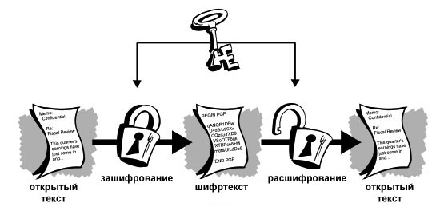
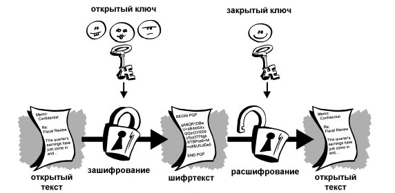
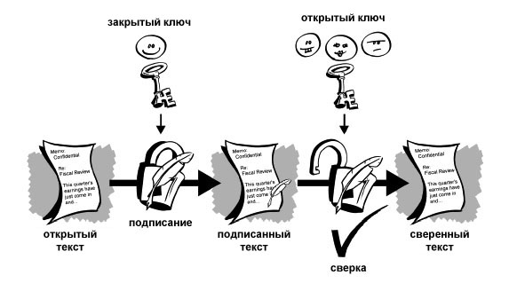
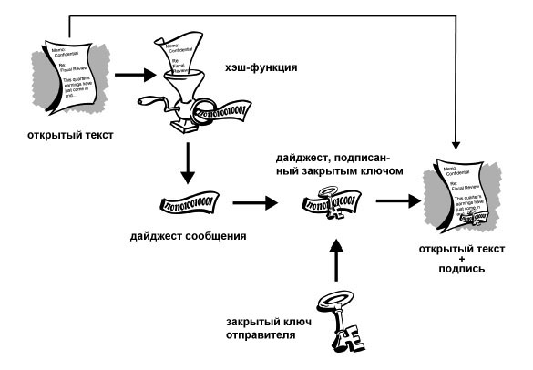
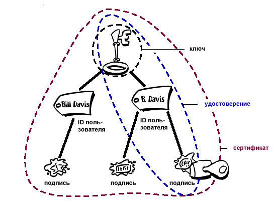
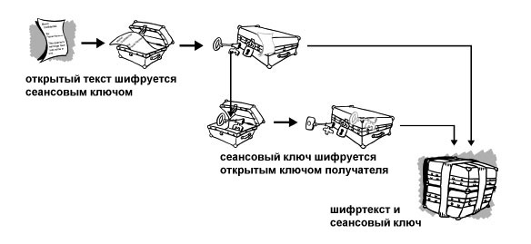
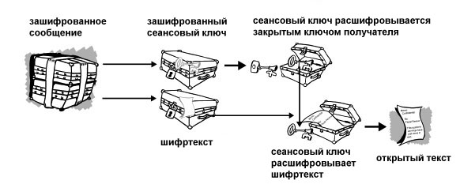

---
jupyter:
  jupytext:
    text_representation:
      extension: .md
      format_name: markdown
      format_version: '1.3'
      jupytext_version: 1.16.4
  kernelspec:
    display_name: Python 3 (ipykernel)
    language: python
    name: python3
---

<!-- #region editable=true slideshow={"slide_type": "slide"} -->
# Лекция 13. Криптографические алгоритмы

Алгоритмы и структуры данных

МГТУ им. Н.Э. Баумана

Красников Александр Сергеевич

2024 год
<!-- #endregion -->

```python editable=true slideshow={"slide_type": "skip"}
%load_ext nb_js_diagrammers
```

<!-- #region editable=true slideshow={"slide_type": "slide"} -->
## Три возможности передать нужную информацию нужному адресату в тайне от других

1. Создать абсолютно надежный, недоступный для других канал связи между абонентами.

2. Использовать общедоступный канал связи, но скрыть сам факт передачи информации.

3. Использовать общедоступный канал связи, но передавать по нему нужную информацию в таком преобразованном виде, чтобы восстановить ее мог только адресат.
<!-- #endregion -->

<!-- #region editable=true slideshow={"slide_type": "slide"} -->
## Понятие шифрования

**Шифрование** - это метод защиты любой информации от несанкционированного доступа, просмотра, а также использования, основанный на преобразовании данных в зашифрованный формат.

Расшифровать, восстановить данную информацию или сообщение, обычно можно только при помощи ключа, который применялся при
его зашифровании.

Шифрование состоит из двух взаимообратимых процессов шифрования и расшифрования.
<!-- #endregion -->

<!-- #region editable=true slideshow={"slide_type": "slide"} -->
## Три состояния безопасности информации

- **Конфиденциальность:** шифрование используется для скрытия информации от неавторизованных пользователей при передаче или при хранении.
- **Целостность:** шифрование используется для предотвращения изменения информации при передаче или хранении.
- **Идентифицируемость:** шифрование используется для аутентификации источника информации и предотвращения отказа отправителя информации от того факта, что данные были отправлены именно им.
<!-- #endregion -->

<!-- #region editable=true slideshow={"slide_type": "slide"} -->
## Шифр

- **Шифром** называется пара алгоритмов, реализующих шифрование и расшифровку.
- Эти алгоритмы применяются к данным с использованием **ключа**.
- Ключи для шифрования и для расшифровки могут различаться, а могут быть одинаковыми.
- Секретность второго (расшифровывающего) ключа делает данные недоступными для несанкционированного ознакомления
- Секретность первого (шифрующего) делает невозможным внесение ложных правок в данные.
- В первых методах шифрования использовались одинаковые ключи
- В 1976 году были разработаны алгоритмы с применением разных ключей
- Сохранение этих ключей в секретности и правильное их разделение между адресатами является очень важной задачей для сохранения конфиденциальности передаваемой информации (задача разделения секрета)
<!-- #endregion -->

<!-- #region editable=true slideshow={"slide_type": "slide"} -->
## Расшифрование и дешифрование

**Расшифрование** -  легитимная процедура, быстро выполняемая с помощью известного ключа

**Дешифрование** - попытка &laquo;взломать шифр&raquo;, то есть восстановить без знания ключа открытый текст зашифрованного сообщения.
<!-- #endregion -->

<!-- #region editable=true slideshow={"slide_type": "slide"} -->
## Криптология

- **Криптология** — наука, занимающаяся методами шифрования и дешифрования. 
  - **Криптография** занимается разработкой методов шифрования данных.
  - **Криптоанализ** занимается оценкой сильных и слабых сторон методов шифрования, а также разработкой методов, позволяющих взламывать криптосистемы
<!-- #endregion -->

<!-- #region editable=true slideshow={"slide_type": "slide"} -->
## Криптографическая стойкость шифра

**Криптографическая стойкость** — свойство криптографического шифра противостоять криптоанализу, то есть анализу, направленному на изучение шифра с целью его дешифрования. 

Для изучения криптоустойчивости различных алгоритмов была создана специальная теория, рассматривающая типы шифров и их ключи, а также их стойкость. 

Основателем этой теории является Клод Шеннон. 

Криптостойкость шифра есть его важнейшая характеристика, которая отражает то, насколько успешно алгоритм решает задачу шифрования
<!-- #endregion -->

<!-- #region editable=true slideshow={"slide_type": "slide"} -->
## Способы взлома шифров
- Простой перебор всех возможных ключей
  - может взломать любой шифр, кроме абсолютно криптостойких
  - очень медленная процедура
  - проблема идентификации правильно дешифрованного текста
- Анализ перехваченных сообщений
  - получение дополнительной информации из прехваченных сообщений
<!-- #endregion -->

<!-- #region editable=true slideshow={"slide_type": "slide"} -->
## Критерий Шеннона

- Пусть возможна отправка любого из сообщений $m_{1}, m_{2}, \ldots, m_{n}$, то есть любого подмножества множества $M$. 
- Эти сообщения могут быть отправлены с вероятностями $p_{1}, p_{2}, \ldots, p_{n}$ соответственно. 
- Тогда мерой неопределенности сообщения может служить величина информационной энтропии:
$$H(M) = -\sum\limits_{i=1}^{n} p_i \log_2{p_i}$$
- Пусть отправлено сообщение $m_{k}$, тогда его шифротекст $c_{k}$.
- После перехвата зашифрованного $c_{k}$ эта величина становится условной неопределенностью
$$H(M|c_{k})=-\sum\limits_{i=1}^{n} p(m_{i}|c_{k}) \log_{2} {p(m_{i}|c_{k})},$$
где  $p(m_{i}|c_{k})$ вероятность того, что исходное сообщение есть $m_{i}$ при условии, что результат его зашифрования есть $c_{k}$
- Это позволяет ввести такую характеристику шифрующей функции (алгоритма) $E$, как количество информации об исходном тексте, которое злоумышленник может извлечь из перехваченного шифротекста (взаимная информация)
$$I=H(M)- H(M|c_{k})$$
- Взаимная информация всегда неотрицательлна
- Величина взаимной информации является показателем криптостойкости алгоримта
- Взаимная информация показывает, насколько уменьшится неопределённость при получении соответствующего шифротекста и не станет ли она таковой, что при перехвате некоторого количества шифротекстов станет возможной расшифровка исходного сообщения
<!-- #endregion -->

<!-- #region editable=true slideshow={"slide_type": "slide"} -->
## Абсолютно стойкие системы

Для наиболее криптоустойчивого шифра неопределённости (условная и безусловная) при перехвате сообщений должны быть равны для сколь угодно большого числа перехваченных шифротекстов.
$$H(M|c_{k})=H(M)\Rightarrow I=0$$

Таким образом, злоумышленник не сможет извлечь никакой полезной информации об открытом тексте из перехваченного шифротекста. Шифр, обладающий таким свойством, называется **абсолютно стойким**
<!-- #endregion -->

<!-- #region editable=true slideshow={"slide_type": "subslide"} -->
### Требования к абсолютно стойким системам шифрования
- Ключ генерируется для каждого сообщения (каждый ключ используется один раз).
- Ключ статистически надёжен (то есть вероятности появления каждого из возможных символов равны, символы в ключевой последовательности независимы и случайны).
- Длина ключа равна или больше длины сообщения.

Стойкость таких систем не зависит от того, какими возможностями обладает криптоаналитик. 
<!-- #endregion -->

<!-- #region editable=true slideshow={"slide_type": "subslide"} -->
### Применениее абсолютно стойких систем шифрования

Практическое применение абсолютно стойких криптосистем ограничено соображениями стоимости таких систем и их удобства. 

Идеальные секретные системы обладают следующими недостатками:
- Шифрующая система должна создаваться с исключительно глубоким знанием структуры используемого языка передачи сообщений
- Структура естественных языков крайне сложна, и для устранения избыточности передаваемой информации может потребоваться крайне сложное устройство.
- Если в передаваемом сообщений возникает ошибка, то эта ошибка сильно разрастается на этапе кодирования и передачи в связи со сложностью используемых устройств и алгоритмов.
<!-- #endregion -->

<!-- #region editable=true slideshow={"slide_type": "slide"} -->
## Достаточно стойкие системы

Достаточно стойкие системы не обеспечивают равенство энтропий и, как следствие, вместе с зашифрованным сообщением передают некоторую информацию об открытом тексте.
$$ H(M)>H(M|c_{k})\Rightarrow I>0$$

- Их криптостойкость зависит от того, какими вычислительными возможностями обладает криптоаналитик. 
- Практическая стойкость таких систем основана на их вычислительной сложности и оценивается исключительно на определённый момент времени с двух позиций:
  - вычислительная сложность полного перебора для данной системы
  - известные на данный момент слабости (уязвимости) системы и их влияние на вычислительную сложность.

Добиться высокого уровня практической стойкости алгоритма можно двумя подходами:
- Изучить методы, которыми пользуется злоумышленник, и попытаться защитить используемую систему от них.
- Составить шифр таким образом, чтобы его сложность была эквивалентна сложности известной задачи, для решения которой требуется большой объём вычислительных работ.
<!-- #endregion -->

<!-- #region editable=true slideshow={"slide_type": "subslide"} -->
## Методы шифрования

- **Симметричное шифрование** использует один и тот же ключ и для зашифровывания, и для расшифровывания.
- **Асимметричное шифрование** использует два разных ключа: один для зашифровывания (который также называется открытым), другой для расшифровывания (называется закрытым).
<!-- #endregion -->

<!-- #region editable=true slideshow={"slide_type": "subslide"} -->
### Симметричное шифрование



Симметричные, а конкретнее, алфавитные алгоритмы шифрования были одними из первых алгоритмов. 

- В симметричных криптосистемах для шифрования и расшифровывания используется один и тот же ключ.
- Сохранение ключа в секретности является важной задачей для установления и поддержки защищённого канала связи.
- Проблема начальной передачи ключа (синхронизации ключей).
- Cуществуют методы криптоатак, позволяющие так или иначе дешифровать информацию не имея ключа или же с помощью его перехвата на этапе согласования.
- Невозможность установить подлинность или авторство текста.

<!-- #endregion -->

<!-- #region editable=true slideshow={"slide_type": "subslide"} -->
### Схема реализации

- **Задача.** Есть два собеседника — Алиса и Борис, они хотят обмениваться конфиденциальной информацией.
- **Генерация ключа.** Борис (или Алиса) выбирает ключ шифрования $d$ и алгоритмы $E$, $D$ (функции шифрования и расшифрования), затем посылает эту информацию Алисе (Борису).
- **Шифрование и передача сообщения**. Алиса шифрует сообщение   $m$ с использованием полученного ключа $d$:
$$c = E(m,d)$$
И передаёт Борису полученный шифротекст $c$.
То же самое делает Борис, если хочет отправить Алисе сообщение.
- **Расшифровывание сообщения.** Борис (Алиса), с помощью того же ключа $d$, расшифровывает шифротекст $c$:
$$m = D(c, d).$$
<!-- #endregion -->

<!-- #region editable=true slideshow={"slide_type": "subslide"} -->
### Примеры симметричных шифров

**Потоковые шифры** - шифры, при которых каждый бит информации шифруется с помощью наложения на открытые данные гаммы шифра по определенному правилу. Для расшифрования та же гамма накладывается на зашифрованный текст.
- с одноразовым или бесконечным ключом (infinite-key cipher); 
- с конечным ключом (система Вернама - Vernam); 
- на основе генератора псевдослучайных чисел (ПСЧ).

**Блочные шифры** - информация, которую хотят зашифровать делится на блоки  определенной длины, и шифруется поблочно.
- Шифры перестановки (permutation, P-блоки); 
- Шифры замены (подстановки, substitution, S-блоки):
  - моноалфавитные (код Цезаря); 
  - полиалфавитные (шифр Видженера, цилиндр Джефферсона, диск Уэтстоуна, Enigma);
- Составные
  - Lucipher (фирма IBM, США); 
  - DES (Data Encryption Standard, США); 
  - FEAL-1 (Fast Enciphering Algoritm, Япония); 
  - IDEA/IPES (International Data Encryption Algorithm/Improved Proposed Encryption Standard, фирма Ascom-Tech AG, Швейцария); 
  - B-Crypt (фирма British Telecom, Великобритания); 
  - ГОСТ 28147-89 (СССР);
  - Skipjack (США).
<!-- #endregion -->

<!-- #region editable=true slideshow={"slide_type": "subslide"} -->
### Алгоритм шифрования Вернама

Алгоритм шифрования Вернама, также известный как одноразовый блокнот (One-Time Pad), представляет собой метод симметричного шифрования, который обеспечивает абсолютную безопасность, если применяется правильно. 
- **Принцип работы**: Шифрование осуществляется путем выполнения побитовой операции XOR между открытым текстом и ключом.
- **Ключ**: Ключ должен быть случайным, как минимум такой же длины, как открытый текст, и использован только один раз.
- **Безопасность**: Обеспечивает абсолютную безопасность, если соблюдаются условия:
  - случайность ключа,
  - одноразовость ключа
  - равная длина ключа с открытым текстом. 
- **Шифрование и расшифровка**:
  - Шифрование: $c = m \oplus d$
  - Расшифровка: $m = c \oplus d$
- **Проблемы практического использования**:
  - Генерация и безопасное распределение ключей такой длины как сообщение являются практическими задачами, затрудняющими использование данного метода.
  - Хранение и управление ключами требуют дополнительных усилий.
- **Применение**: Находит применение в специализированных областях, требующих высокой степени защиты, например, в военных и правительственных системах.
- **Исторический контекст**: Алгоритм был предложен в 1917 году Голдбергом и Вернамом и является одним из первых методов, которые обеспечивают такую высокую степень безопасности.

Алгоритм шифрования Вернама представляет собой одну из самых надёжных схем, но его практическое использование ограничено из-за сложности управления ключами и необходимостью генерации абсолютно случайных ключей. Поэтому, несмотря на его безопасность, в современных системах используется более практичные, но менее безопасные методы шифрования.
<!-- #endregion -->

```python editable=true slideshow={"slide_type": "subslide"}
"""!!! НИКОГДА НЕ РЕАЛИЗУЙТЕ АЛГОРИТМЫ ШИФРОВАНИЯ !!!"""
"""!!! ТОЛЬКО В УЧЕБНЫХ ЦЕЛЯХ!!!"""

import base64
import os

def generate_key(length):
    """Генерация случайного ключа заданной длины."""
    return os.urandom(length)

def xor_strings(s1, s2):
    """Побитовая операция XOR для двух строк."""
    return bytes(a ^ b for a, b in zip(s1, s2))

def encrypt(plaintext, key):
    """Шифрование открытого текста с помощью ключа."""
    return xor_strings(plaintext.encode('utf-8'), key)

def decrypt(ciphertext, key):
    """Дешифрование шифротекста с помощью ключа."""
    return xor_strings(ciphertext, key)

def bytes_to_str(bytes):
    """Преобразование последовательности байт в строку"""
    return base64.b64encode(bytes).decode('utf-8')

# Пример использования
if __name__ == "__main__":
    encoding = 'utf-8'

    plaintext = "Hello, World!"  # открытый текст
    key = generate_key(len(plaintext))  # Генерация ключа такой же длины, что и текст

    print("Открытый текст:", plaintext)
    print("Случайный ключ:", bytes_to_str(key))

    ciphertext = encrypt(plaintext, key)  # Шифрование
    print("Зашифрованный текст:", bytes_to_str(ciphertext))

    decrypted_plaintext = decrypt(ciphertext, key)  # Дешифрование
    print("Расшифрованный текст:", decrypted_plaintext.decode('utf-8'))

```

<!-- #region editable=true slideshow={"slide_type": "subslide"} -->
### Асимметричное шифрование



Первыми исследователями, которые изобрели и раскрыли понятие шифрования с открытым кодом, были Уитфилд Диффи и Мартин Хеллман из Стэнфордского университета и Ральф Меркле из Калифорнийского университета в Беркли. 

В 1976 году их работа «Новые направления в современной криптографии» открыла новую область в криптографии, теперь известную как криптография с открытым ключом.

- Используются два ключа — открытый и закрытый, связанные определённым математическим образом друг с другом.
- Открытый ключ передаётся по открытому (то есть незащищённому, доступному для наблюдения) каналу и используется для шифрования сообщения и для проверки ЭЦП.
- Для расшифровки сообщения и для генерации ЭЦП используется секретный ключ.
- Данная схема решает проблему симметричных схем, связанную с начальной передачей ключа другой стороне.
- Если в симметричных схемах злоумышленник перехватит ключ, то он сможет как «слушать», так и вносить правки в передаваемую информацию. В асимметричных системах другой стороне передается открытый ключ, который позволяет шифровать, но не расшифровывать информацию. Таким образом решается проблема симметричных систем, связанная с синхронизацией ключей.
<!-- #endregion -->

<!-- #region editable=true slideshow={"slide_type": "subslide"} -->
### Схема реализации

**Задача.** Есть два собеседника — Алиса и Борис, Алиса хочет передавать Борису конфиденциальную информацию.
**Генерация ключевой пары.** Борис выбирает алгоритм $(E, D)$ и пару открытый, закрытый ключи — $(e, d)$ и посылает открытый ключ $e$ Алисе по открытому каналу.
**Шифрование и передача сообщения.** Алиса шифрует информацию с использованием открытого ключа Бориса $e$:
$$c = E(m,e)$$
И передаёт Борису полученный шифротекст $c$.
**Расшифровывание сообщения.** Борис с помощью закрытого ключа $d$, расшифровывает шифротекст $c$:
$$ m = D(c, d).$$

Если необходимо наладить канал связи в обе стороны, то первые две операции необходимо проделать на обеих сторонах, таким образом, каждый будет знать свои закрытый, открытый ключи и открытый ключ собеседника.

Закрытый ключ каждой стороны не передается по незащищенному каналу, тем самым оставаясь в секретности.
<!-- #endregion -->

<!-- #region editable=true slideshow={"slide_type": "subslide"} -->
### Примеры симметричных шифров

**RSA** 
- Разработан в 1977 году в Массачусетском технологическом институте.
- Получил название по первым буквам фамилий авторов (Rivest, Shamir, Adleman).
- Криптостойкость основана на вычислительной сложности задачи разложения большого числа на простые множители.

- **ElGamal**
- Разработан в 1985 году. 
- Назван по фамилии автора - Эль-Гамаль. 
- Используется в стандарте США на цифровую подпись DSS (Digital Signature Standard). 
- Криптостойкость основана на вычислительной сложности задачи логарифмирования целых чисел в конечных полях. 
<!-- #endregion -->

<!-- #region editable=true slideshow={"slide_type": "subslide"} -->
### RSA

Алгоритм шифрования RSA — это один из самых широко используемых методов асимметричного шифрования.

RSA является основой для многих современных систем обмена данными и аутентификации, обеспечивая надежную защиту информации благодаря своей асимметричной природе и математическим основам.

Он основан на принципах факторизации больших чисел и использует пару ключей: публичный и приватный. 

Основные характеристики RSA:

- **Асимметричное шифрование**:
  - В отличие от симметричных алгоритмов, где используется один ключ для шифрования и расшифровки, RSA использует пару ключей: публичный (открытый) и приватный (секретный).
- **Генерация ключей**:
  - Генерация ключей включает выбор двух больших (очень больших) простых чисел $p$ и $q$.
  - Вычисляется $n = p \times q$, который используется как модуль для открытого и закрытого ключей.
  - Вычисляется значение функции Эйлера $\phi(n) = (p - 1)(q - 1)$.
  - Выбирается открытый ключ $e$, такой что $ 1 < e < \phi(n)$ и $\text{НОД}(e, \phi(n)) = 1$
  - Вычисляется закрытый ключ $d$ из уравнения: $d \times e \equiv 1 \mod \phi(n)$).
- **Шифрование:**
  - Сообщение $m$ преобразуется в числовой формат (при необходимости).
  - Шифрование выполняется с помощью открытого ключа $e$: $$c \equiv m^e \mod n$$.
- **Расшифрование:**
  - Расшифрование осуществляется с использованием закрытого ключа: $$m = c^d \mod n$$
- **Безопасность:**
  - Безопасность RSA основывается на сложности задачи факторизации больших чисел. В настоящее время для обеспечения безопасности параметры ключа должны быть достаточно большими (обычно не менее 2048 бит).
- **Применение RSA:**
- Используется для шифрования данных и создания цифровых подписей, что обеспечивает аутентификацию и целостность сообщений.
- Часто применяется в протоколах безопасности, таких как SSL/TLS для защиты интернет-трафика.
- **Преимущества:**
  - Обеспечивает высокий уровень безопасности при условии правильного выбора ключей.
  - Позволяет обмениваться ключами для симметричного шифрования в безопасной форме.
- **Недостатки:**
  - Медленнее по сравнению с симметричными алгоритмами.
  - Зависит от длины ключа, что увеличивает вычислительные затраты.
<!-- #endregion -->

```python editable=true slideshow={"slide_type": "subslide"}
import random
from sympy import isprime, mod_inverse

def generate_prime_candidate(length):
    """Генерация кандидата на простое число заданной длины"""
    p = random.getrandbits(length)
    # Убедимся, что p нечетное
    p |= (1 << length - 1) | 1
    return p

def generate_prime_number(length):
    """Генерация простого числа заданной длины"""
    p = 4
    while not isprime(p):
        p = generate_prime_candidate(length)
    return p

def gcd(a, b):
    """Нахождение наибольшего общего делителя"""
    while b:
        a, b = b, a % b
    return a

def generate_keypair(length):
    """Генерация пары ключей (открытого и закрытого)"""
    p = generate_prime_number(length)
    q = generate_prime_number(length)
    n = p * q
    phi = (p - 1) * (q - 1)
    # Убедимся, что e и phi(n) являются взаимно простыми
    e = 2
    while(e<phi):
        if (math.gcd(e, phi) == 1):
            break
        else:
            e += 1
    d = mod_inverse(e, phi)
    return ((e, n), (d, n))  # (публичный ключ, приватный ключ)

def encrypt(msg, public_key):
    """Шифрование сообщения"""
    e, n = public_key
    ciphertext = pow(msg, e, n)
    return ciphertext

def decrypt(ciphertext, private_key):
    """Дешифрование сообщения"""
    d, n = private_key
    # Дешифруем
    msg = pow(ciphertext, d, n)
    return msg

# Пример использования
if __name__ == "__main__":
    key_length = 8  # Для тестирования используем маленький размер ключа (в реальных сценариях нужно использовать >= 2048 бит)

    public_key, private_key = generate_keypair(key_length)
    print('Открытый ключ:', public_key)
    print('Закрытый ключ:', private_key)

    message = 21
    print("Открытое сообщение:", message)

    encrypted_message = encrypt(message, public_key)
    print("Зашифрованное сообщение:", encrypted_message)

    decrypted_message = decrypt(encrypted_message, private_key)
    print("Дешифрованное сообщение:", decrypted_message)
```

<!-- #region editable=true slideshow={"slide_type": "slide"} -->
## Цифровая подпись
<!-- #endregion -->

<!-- #region editable=true slideshow={"slide_type": "subslide"} -->
### Проблема человека посередине (Man in the middle (MITM))

Атака «человек посередине - термин в криптографии, обозначающий ситуацию, когда атакующий способен читать и видоизменять по своей воле сообщения, которыми обмениваются корреспонденты, причём ни один из последних не может догадаться о его присутствии в канале.

- Предположим, Алиса планирует передать Борису некую информацию.
- Виктор обладает знаниями о структуре и свойствах используемого метода передачи данных, а также о факте планируемой передачи информации, которую Виктор планирует перехватить.
- Для совершения атаки Виктор «представляется» Алисе как Борис, а Борису как Алиса
- Алиса, ошибочно полагая, что она направляет информацию Борису, посылает её Виктору.
- Виктор, получив информацию, и совершив с ней некоторые действия (например, скопировав или модифицировав в своих целях) пересылает данные собственно получателю - Борису
- Борис, в свою очередь, считает, что информация была получена им напрямую от Алисы 
<!-- #endregion -->

<!-- #region editable=true slideshow={"slide_type": "subslide"} -->
### Криптографические хеши

Среди множества существующих хеш-функций принято выделять **криптографически стойкие**, применяемые в криптографии. 

Для того чтобы хеш-функция $H$ считалась криптографически стойкой, она должна удовлетворять трем основным требованиям:

- **Необратимость:** для заданного значения хеш-функции $m$ должно быть вычислительно неосуществимо найти блок данных $X$, для которого $H(X)=m$.
- **Стойкость к коллизиям первого рода:** для заданного сообщения $M$ должно быть вычислительно неосуществимо подобрать другое сообщение $N$, для которого $H(N)=H(M)$.
- **Стойкость к коллизиям второго рода:** должно быть вычислительно неосуществимо подобрать пару сообщений, имеющих одинаковый хеш.
<!-- #endregion -->

<!-- #region editable=true slideshow={"slide_type": "subslide"} -->
### Подпись сообщения


<!-- #endregion -->

<!-- #region editable=true slideshow={"slide_type": "subslide"} -->
### Подпись хеша сообщения


<!-- #endregion -->

<!-- #region editable=true slideshow={"slide_type": "subslide"} -->
## Сертификаты

Как правило, цифровой сертификат — это набор идентифицирующих сведений, связанных с открытым ключом и подписанных доверенным третьим лицом (посредником), дабы доказать их подлинность и взаимосвязность.

Цифровой сертификат состоит из трёх компонентов:

- открытого ключа
- сведений сертификата (информация о личности пользователя, как то: имя, ID, и т.п.)
- одной или более цифровых подписей. 



Цель ЭЦП на сертификате — указать, что сведения сертификата были заверены третьим лицом или организацией. 

В то же время цифровая подпись не подтверждает достоверность сертификата как целого; она является поручительством только того, что подписанный ID связан с данным открытым ключом.
<!-- #endregion -->

<!-- #region editable=true slideshow={"slide_type": "subslide"} -->
### Применение сертификатов

Сертификаты применяются, когда нужно обменяться с кем-нибудь ключами. 

Способы распространения:
- Ручной
- В виде хранилища-депозитария (сервера сертификатов)

Ручной способ характерен для небольших групп людей, устанавливающих криптографированную связь (не составит труда просто передать друг другу Носители информации или отправить электронные сообщения, содержащие копии их ключей). 

При необходимости обеспечить достаточную надёжность и безопасность, предоставления возможности хранения и обмена ключами, используют  системный подход. Такая система может реализоваться в форму простого  хранилища-депозитария или иметь более сложную и комплексную структуру, предполагающую дополнительные возможности администрирования ключей,  и называемую инфраструктурой открытых ключей (Public Key Infrastructure, PKI).
<!-- #endregion -->

<!-- #region editable=true slideshow={"slide_type": "subslide"} -->
## Pretty Good Privacy (PGP) сертификаты


<!-- #endregion -->

<!-- #region editable=true slideshow={"slide_type": ""} -->
## Pretty Good Privacy (PGP) сертификаты


<!-- #endregion -->

<!-- #region editable=true slideshow={"slide_type": ""} -->

<!-- #endregion -->
