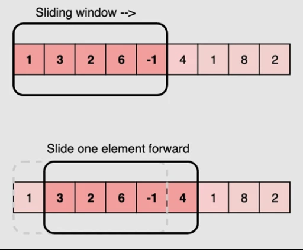
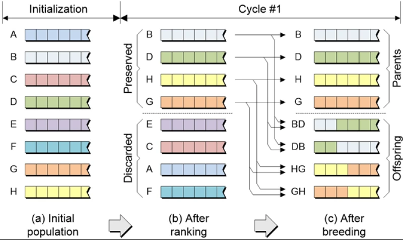

---
jupyter:
  jupytext:
    text_representation:
      extension: .md
      format_name: markdown
      format_version: '1.3'
      jupytext_version: 1.16.4
  kernelspec:
    display_name: Python 3 (ipykernel)
    language: python
    name: python3
---

<!-- #region editable=true slideshow={"slide_type": "slide"} -->
# Лекция 14. Методы построения алгоритмов

Алгоритмы и структуры данных

МГТУ им. Н.Э. Баумана

Красников Александр Сергеевич

2024 год
<!-- #endregion -->

```python editable=true slideshow={"slide_type": "skip"}
%load_ext nb_js_diagrammers
```

<!-- #region editable=true slideshow={"slide_type": "slide"} -->
## Наивные методы

**Наивные методы** (решение в лоб) — это простые, прямолинейные подходы к решению задач, которые часто не оптимизированы по времени или памяти. Они основываются на базовых, очевидных шагах, не учитывающих более сложные оптимизации.

Такие методы могут быть полезны для первоначального понимания проблемы или как базовый вариант, с которым можно сравнивать более сложные алгоритмы.
<!-- #endregion -->

<!-- #region editable=true slideshow={"slide_type": "subslide"} -->
### Преимущества наивных методов:

- **Простота реализации:** Наивные методы часто легко понять и реализовать, что делает их хорошей отправной точкой для решения задачи.
- **Понятность:** Эти методы основаны на прямолинейном подходе, что делает их легко объяснимыми и понятными для новичков.
- **Начальная оценка:** Они могут служить базовым вариантом для сравнения с более сложными и оптимизированными алгоритмами. 
<!-- #endregion -->

<!-- #region editable=true slideshow={"slide_type": "subslide"} -->
### Недостатки наивных методов:

- **Низкая производительность:** Наивные методы часто имеют высокую временную сложность, что делает их непригодными для работы с большими данными.
- **Неэффективность:** Они могут использовать больше ресурсов, чем необходимо, из-за отсутствия оптимизаций.
- **Ограниченная применимость:**
Эти методы могут быть непрактичны для сложных задач или для задач, требующих высокоэффективных решений. 
<!-- #endregion -->

<!-- #region editable=true slideshow={"slide_type": "subslide"} -->
### Примеры задач
<!-- #endregion -->

<!-- #region editable=true slideshow={"slide_type": "subslide"} -->
#### Проверка простоты числа:

Наивный метод состоит в проверке делимости числа на все числа от 2 до n-1. 
<!-- #endregion -->

```python editable=true slideshow={"slide_type": "fragment"}
def is_prime(n):
    """Проверить является ли число простым"""
    if n <= 1:
        return False
    for i in range(2, n):
        if n % i == 0:
            return False
    return True


# Тесты:
assert is_prime(29) == True
assert is_prime(15) == False
```

<!-- #region editable=true slideshow={"slide_type": "subslide"} -->
#### Вычисление наибольшего общего делителя (НОД):

Наивный метод состоит в проверке всех чисел от 1 до минимума из двух чисел и нахождении наибольшего делителя.
<!-- #endregion -->

```python editable=true slideshow={"slide_type": "fragment"}
def gcd_naive(a, b):
    """Вернуть наибольший общий делитель двух чисел"""
    gcd = 1
    for i in range(1, min(a, b) + 1):
        if a % i == 0 and b % i == 0:
            gcd = i
    return gcd


# Тесты:
assert gcd_naive(48, 18) == 6
assert gcd_naive(10, 3) == 1
```

```python editable=true slideshow={"slide_type": "fragment"}
def gcd_naive(a, b):
    """Вернуть наибольший общий делитель двух чисел"""
    gcd = 1
    for i in range(min(a, b), 0, -1):
        if a % i == 0 and b % i == 0:
            return i

# Тесты:
assert gcd_naive(48, 18) == 6
assert gcd_naive(10, 3) == 1
```

<!-- #region editable=true slideshow={"slide_type": "subslide"} -->
#### Поиск подстроки в строке

Наивный метод состоит в том, чтобы последовательно проверять каждую возможную позицию подстроки в строке.
<!-- #endregion -->

```python editable=true slideshow={"slide_type": "fragment"}
def naive_search(text, pattern):
    """Вернуть позицию начала подстроки в строке"""
    n = len(text)
    m = len(pattern)
    for i in range(n - m + 1):
        match = True
        for j in range(m):
            if text[i + j] != pattern[j]:
                match = False
                break
        if match:
            return i
    return -1


# Тесты:
assert naive_search('Hello world!', 'world') == 6
assert naive_search('Hello world!', 'foo') == -1
```

<!-- #region editable=true slideshow={"slide_type": "subslide"} -->
#### Нахождение ближайших пар точек

Наивный метод состоит в проверке расстояния между каждой парой точек и нахождении минимального расстояния.
<!-- #endregion -->

```python editable=true slideshow={"slide_type": "fragment"}
import math

def closest_pair_naive(points):
    """Вернуть пару ближайших точек"""
    min_distance = float('inf')
    closest_pair = None
    n = len(points)
    for i in range(n):
        for j in range(i + 1, n):
            distance = math.dist(points[i], points[j])
            if distance < min_distance:
                min_distance = distance
                closest_pair = (points[i], points[j])
    return closest_pair


# Тесты:
points = [(1, 2), (3, 4), (5, 6), (7, 8)]
assert closest_pair_naive(points) == ((1, 2), (3, 4))
```

<!-- #region editable=true slideshow={"slide_type": "subslide"} -->
Все эти алгоритмы можно улучшить, но, прежде чем что-то улучшать — напишите решение в лоб.
Возможно, если оно вызывается всего пару раз, его будет достаточно.

- Чем проще решение, тем меньше в нем ошибок и скрытых проблем.
- В простое решение легко добавить новую функциональность.
- Такой код легко прочитать и понять.
- Преждевременная же оптимизация — корень всех зол.
<!-- #endregion -->

<!-- #region editable=true slideshow={"slide_type": "slide"} -->
## Метод двух указателей

**Метод двух указателей** — это техника, используемая для решения различных задач на массивах и строках, при которой используются два указателя (индекса), которые перемещаются по данным по определённым правилам. Этот метод позволяет эффективно решать задачи, связанные с поиском пар элементов, подмножеств, которые удовлетворяют заданным условиям.

Этот метод предполагает использование двух указателей, которые обычно инициализируются на противоположных концах структуры данных и перемещаются навстречу друг другу или по определенному правилу. 

Метод двух указателей может значительно уменьшить временную сложность алгоритма по сравнению с более наивными подходами. 


<!-- #endregion -->

<!-- #region editable=true slideshow={"slide_type": "subslide"} -->
### Последовательность действий

1. **Инициализация двух указателей:** Указатели могут быть установлены на начало и конец массива или строки, или на разные индексы в зависимости от задачи.
2. **Перемещение указателей:** Указатели перемещаются по определенному правилу (например, оба указателя двигаются к центру, или один указатель двигается вперед, пока другой остается на месте).
3. **Проверка условия:** На каждом шаге проверяется условие, которое определяет дальнейшее перемещение указателей или завершение алгоритма.
<!-- #endregion -->

<!-- #region editable=true slideshow={"slide_type": "subslide"} -->
### Временная сложность:

$O(n)$ — в большинстве случаев, так как оба указателя проходят по массиву один или несколько раз, но не более $O(n)$ итераций в сумме.

Для некоторых задач, в зависимости от условий и начальных позиций указателей, временная сложность может быть $O(n \log n)$ или $O(n^2)$, но это редкость. 
<!-- #endregion -->

<!-- #region editable=true slideshow={"slide_type": "subslide"} -->
### Примеры задач
<!-- #endregion -->

<!-- #region editable=true slideshow={"slide_type": "subslide"} -->
#### Поиск двух чисел в массиве, сумма которых равна заданному числу

**Задача:**
Найти два числа в отсортированном массиве, которые в сумме дают заданное число target.

**Решение:**

Инициализируем один указатель на начало массива, другой на конец. Проверяем сумму элементов под указателями:
- Если сумма равна target, возвращаем индексы.
- Если сумма меньше target, сдвигаем левый указатель вправо.
- Если сумма больше target, сдвигаем правый указатель влево.

Временная сложность: $O(n)$.
<!-- #endregion -->

```python editable=true slideshow={"slide_type": "fragment"}
def two_sum_sorted(arr, target):
    """Вернуть индексы дву чисел в отсортированном массиве
    сумма которых равна заданному числу"""
    left, right = 0, len(arr) - 1
    while left < right:
        s = arr[left] + arr[right]
        if s == target:
            return left, right
        elif s < target:
            left += 1
        else:
            right -= 1
    return None


# Тесты:
assert two_sum_sorted([1, 4, 6, 7, 10], 8) == (0, 3)
assert two_sum_sorted([0, 1, 2, 3, 4, 5], 6) == (1, 5)
```

<!-- #region editable=true slideshow={"slide_type": "subslide"} -->
#### Проверка палиндрома

**Задача:**
Проверить, является ли строка палиндромом.

**Решение:**

Инициализируем указатели на начало и конец строки. Сравниваем символы под указателями:
- Если символы равны, сдвигаем оба указателя навстречу друг другу.
- Если символы не равны, строка не является палиндромом.

Временная сложность: $O(n)$.
<!-- #endregion -->

```python editable=true slideshow={"slide_type": "fragment"}
def is_palindrome(s):
    """Проверить является ли строка палиндромом"""
    left, right = 0, len(s) - 1
    while left < right:
        if s[left] != s[right]:
            return False
        left += 1
        right -= 1
    return True


# Тесты:
assert is_palindrome('шалаш') == True

s = 'А роза упала на лапу Азора'.replace(' ', '').lower()
assert is_palindrome(s) == True

assert is_palindrome('Hello') == False
```

<!-- #region editable=true slideshow={"slide_type": "subslide"} -->
#### Удаление дубликатов из отсортированного массива

**Задача:**
Удалить дубликаты из отсортированного массива.

**Решение:**

Используем два указателя, один для текущей позиции в результирующем массиве, другой для перебора всех элементов:
- Если текущий элемент не равен предыдущему, записываем его в результирующий массив.


Временная сложность: $O(n)$.
<!-- #endregion -->

```python editable=true slideshow={"slide_type": "fragment"}
def remove_duplicates(arr):
    """Удалить дубликаты из отсортированного массива"""
    if not arr:
        return 0
    clear_arr =  [arr[0]]
    for i in range(1, len(arr)):
        if arr[i] != arr[i - 1]:
            clear_arr.append(arr[i])
    return clear_arr


# Тесты:
assert remove_duplicates([1, 1, 3, 5, 6, 6, 7, 9, 9]) == [1, 3, 5, 6, 7, 9]
assert remove_duplicates([1, 2, 3, 4]) == [1, 2, 3, 4]
```

<!-- #region editable=true slideshow={"slide_type": "slide"} -->
## Метод скользящего окна

Метод скользящего окна (Sliding Window) — это техника, используемая для решения задач на массивах или строках, при которой фиксированный подмассив (или подстрока) перемещается по данным с целью поиска оптимального решения. Это позволяет обрабатывать элементы в окне фиксированного размера и динамически изменять окно в зависимости от условий задачи.

Эта техника особенно полезна для задач, связанных с последовательностями данных, таких как массивы или строки, и помогает уменьшить временную сложность по сравнению с более наивными подходами.


<!-- #endregion -->

<!-- #region editable=true slideshow={"slide_type": "subslide"} -->
### Последовательность действий

1. **Инициализация окна:** Установить начало и конец окна на начальные позиции.
2. **Сдвиг окна:** Последовательно перемещать границы окна, добавляя элементы с одной стороны и удаляя элементы с другой.
3. **Обработка окна:** На каждом шаге выполнять необходимые вычисления для текущего окна.
<!-- #endregion -->

<!-- #region editable=true slideshow={"slide_type": "subslide"} -->
### Временная и пространственная сложность метода скользящего окна

- **Временная сложность:**
  - $O(n)$ — в большинстве случаев, так как указатель или окно перемещается по массиву линейно, проверяя каждую возможную позицию окна.
- **Пространственная сложность:**
  - $O(1)$ — если используется фиксированное количество дополнительной памяти для хранения текущих значений.
  - $O(k)$ — если необходимо хранить элементы внутри текущего окна размером $k$.
<!-- #endregion -->

<!-- #region editable=true slideshow={"slide_type": "subslide"} -->
### Примеры задач
<!-- #endregion -->

<!-- #region editable=true slideshow={"slide_type": "subslide"} -->
#### Нахождение максимальной суммы подмассива фиксированного размера

**Задача:**
Найти подмассив фиксированного размера k с максимальной суммой.

**Решение:**

Используем метод скользящего окна для поддержания текущей суммы подмассива и обновляем максимальную сумму по мере сдвига окна.

Временная сложность: $O(n)$.
<!-- #endregion -->

```python editable=true slideshow={"slide_type": "fragment"}
def max_sum_subarray(arr, k):
    """Вернуть максимальную сумму подмассива размера k"""
    n = len(arr)
    if n < k:
        return -1
    window_sum = sum(arr[:k])
    max_sum = window_sum
    for i in range(n - k):
        window_sum = window_sum - arr[i] + arr[i + k]
        max_sum = max(max_sum, window_sum)
    return max_sum


# Тесты:
assert max_sum_subarray([1, 5, 10, 5, 6, 2, 7, 6, 4], 3) == 21
assert max_sum_subarray([1, 1, 1, 1, 1, 1], 3) == 3
```

<!-- #region editable=true slideshow={"slide_type": "subslide"} -->
#### Поиск всех аннограмм подстроки в строке

**Задача:**
Найти все аннограммы заданной подстроки $p$ в строке $s$.

**Решение:**

Используем метод скользящего окна для поддержания частотного словаря символов текущего окна и сравниваем его с частотным словарем подстроки. 

Временная сложность: $O(n)$.
<!-- #endregion -->

```python editable=true slideshow={"slide_type": "fragment"}
from collections import Counter

def find_anagrams(s, p):
    p_count = Counter(p)
    s_count = Counter()
    result = []
    k = len(p)
    for i in range(len(s)):
        s_count[s[i]] += 1
        if i >= k:
            if s_count[s[i - k]] == 1:
                del s_count[s[i - k]]
            else:
                s_count[s[i - k]] -= 1
        if s_count == p_count:
            result.append(i - k + 1)
    return result


# Тесты:
assert find_anagrams('Hello yellow world!', 'lol') == [2, 8]
assert find_anagrams('Hello yellow world!', 'red') == []
```

<!-- #region editable=true slideshow={"slide_type": "subslide"} -->
#### Нахождение минимального подмассива с суммой, превышающей заданное значение

**Задача:**
Найти минимальный подмассив с суммой элементов, превышающей заданное значение $S$.

**Решение:**

Используем метод скользящего окна для расширения правой границы до тех пор, пока сумма не станет больше $S$, затем сдвигаем левую границу для минимизации длины подмассива.

Временная сложность: $O(n)$.
<!-- #endregion -->

```python editable=true slideshow={"slide_type": "fragment"}
def min_subarray_len(arr, S):
    """Найти минимальный подмассив с суммой элементов, превышающей заданное значение S"""
    n = len(arr)
    min_len = float('inf')
    current_sum = 0
    left = 0
    for right in range(n):
        current_sum += arr[right]
        while current_sum >= S:
            min_len = min(min_len, right - left + 1)
            current_sum -= arr[left]
            left += 1
    return 0 if min_len == float('inf') else min_len

# Тесты:
arr = [1, 2, 4, 1, 3, 10, 3]
assert min_subarray_len(arr, 100) == 0
assert min_subarray_len(arr, 5) == 1
assert min_subarray_len(arr, 15) == 3
```

<!-- #region editable=true slideshow={"slide_type": "slide"} -->
## Жадные алгоритмы

**Жадные алгоритмы (Greedy Algorithms)** &mdash; это класс алгоритмов, которые строят решение путем принятия локально оптимальных решений на каждом шагу. Эти решения принимаются на основе текущего состояния и не пересматриваются в будущем.

Жадные алгоритмы часто используются для решения задач оптимизации, где цель  &mdash; максимизировать или минимизировать определенную величину. 
<!-- #endregion -->

<!-- #region editable=true slideshow={"slide_type": "subslide"} -->
### Основные принципы

- **Жадный выбор:** На каждом шагу алгоритм выбирает лучший локальный вариант, который, по его мнению, приведет к глобально оптимальному решению.
- **Оптимальная подструктура:** Проблема должна иметь свойство, что локально оптимальные решения могут быть объединены для получения глобально оптимального решения.
- **Монотонность:** После выбора очередного локально оптимального шага решение не должно быть ухудшено последующими выборами.
<!-- #endregion -->

<!-- #region editable=true slideshow={"slide_type": "subslide"} -->
## Преимущества и недостатки

- **Преимущества:**
  - **Простота реализации:** Жадные алгоритмы часто просты для понимания и реализации.
  - **Эффективность:** Обычно они работают быстрее, чем более сложные алгоритмы, такие как динамическое программирование.
  - Есть целый класс задач, у которых лучшее решение достигается жадным алгоритмом.
- **Недостатки:**
  - **Отсутствие глобальной оптимальности:** Жадные алгоритмы не всегда приводят к глобально оптимальному решению.
  - **Не все задачи подходят:** Только определенные задачи могут быть решены жадными алгоритмами.

<!-- #endregion -->

<!-- #region editable=true slideshow={"slide_type": "subslide"} -->
#### Задача о размене монет

**Задача:**
Есть монеты разного номинала. Нужно найти минимальное количество монет для сдачи заданной суммы.

**Решение:**

Всегда берется монета с наибольшим номиналом, не превышающим оставшуюся сумму.

Временная сложность: $O(n)$, где $n$ &mdash; количество типов монет.
<!-- #endregion -->

```python editable=true slideshow={"slide_type": "fragment"}
def min_coins(coins, amount):
    """Вернуть количество монет в размене"""
    coins.sort(reverse=True)
    count = 0
    for coin in coins:
        while amount >= coin:
            amount -= coin
            count += 1
    return count


# Тесты:
assert min_coins([1, 5, 11], 15) == 5  # [11, 1, 1, 1, 1]
assert min_coins([1, 5, 11], 15) != 3  # [5, 5, 5]
assert min_coins([1, 2, 5, 10, 25], 98) == 7  # [25, 25, 25, 10, 10, 2, 1]
```

```python editable=true slideshow={"slide_type": "fragment"}
def min_coins(coins, amount):
    """Вернуть размен суммы монетами"""
    coins.sort(reverse=True)
    exchange = []
    for coin in coins:
        while amount >= coin:
            amount -= coin
            exchange.append(coin)
    return exchange


# Тесты:
assert min_coins([1, 5, 11], 15) == [11, 1, 1, 1, 1]
assert min_coins([1, 5, 11], 15) != [5, 5, 5]
assert min_coins([1, 2, 5, 10, 25], 98) == [25, 25, 25, 10, 10, 2, 1]
```

<!-- #region editable=true slideshow={"slide_type": "subslide"} -->
#### Задача о рюкзаке

**Задача:**
Есть предметы с известной стоимостью и весом. Необходимо положить в рюкзак фиксированного размера вещей на как можно большую сумму

**Решение:**

Сортировка предметов по удельной стоимости (стоимость/вес) и выбор наибольших удельных стоимостей до заполнения рюкзака.

Временная сложность: $O(n \log n)$, где $n$ &mdash; количество предметов.
<!-- #endregion -->

```python editable=true slideshow={"slide_type": "fragment"}
class Item:
    def __init__(self, price, weight):
        self.price = price
        self.weight = weight
        self.ratio = price / weight

    def __repr__(self):
        return f'{self.__class__.__name__}(price={self.price}, weight={self.weight})'

def knapsack(items, capacity):
    """Вернуть стоимость рюкзака"""
    items.sort(key=lambda x: x.ratio, reverse=True)
    cost = 0
    for item in items:
        if capacity >= item.weight:
            cost += item.price
            capacity -= item.weight
    return cost


# Тесты:
items = [Item(price, weight) for  price, weight in ((60, 15), (90, 30), (100, 50))]
assert knapsack(items, 80) == 150
assert knapsack(items, 80) != 190

items = [Item(price, weight) for  price, weight in ((2, 1), (100, 100))]
assert knapsack(items, 100) == 2
assert knapsack(items, 100) != 100
```

<!-- #region editable=true slideshow={"slide_type": "subslide"} -->
#### Задача о рюкзаке с возможностью дробить предметы

**Задача:**
Есть предметы с известной стоимостью и весом. Необходимо положить в рюкзак фиксированного размера вещей на как можно большую сумму

В этом варианте задачи предметы можно делить на части. Например можно купить разные крупы и можно хоть 1000 грамм, хоть 512 грамм. Но в пределах имеющегося количества

**Решение:**

<span style='color: red'>Реализуйте самостоятельно</span>

Временная сложность: $O(n \log n)$, где $n$ &mdash; количество предметов.
<!-- #endregion -->

<!-- #region editable=true slideshow={"slide_type": "subslide"} -->
#### Задача о покрытии отрезками

**Задача:**
Есть отрезки на прямой линии, заданные своими концами $(x_1, x_2)$, и один целевой отрезок. Нужно найти минимальное количество отрезков, покрывающих все точки целевого отрезка.

**Решение:**

Сортировка отрезков по правому концу и выбор наименьшего отрезка, покрывающего текущую точку.

<span style='color: red'>Реализуйте самостоятельно</span>

Временная сложность: $O(n \log n)$, где $n$ &mdash; количество отрезков.
<!-- #endregion -->

<!-- #region editable=true slideshow={"slide_type": "slide"} -->
## Динамическое программирование

**Динамическое программирование (Dynamic Programming, DP)** — это метод оптимизации, который используется для решения сложных задач путём разбиения их на более простые подзадачи. Динамическое программирование эффективно используется для задач, которые можно разбить на перекрывающиеся подзадачи с оптимальной структурой подзадач.
<!-- #endregion -->

<!-- #region editable=true slideshow={"slide_type": "subslide"} -->
### Принципы работы:

- **Оптимальная подструктура:**
Задача обладает оптимальной подструктурой, если её оптимальное решение можно построить из оптимальных решений её подзадач. Это означает, что можно решить большую задачу, решив несколько меньших подзадач.
- **Перекрывающиеся подзадачи:**
Задача имеет перекрывающиеся подзадачи, если её подзадачи повторяются несколько раз в процессе решения задачи. Динамическое программирование эффективно решает задачи с перекрывающимися подзадачами путём запоминания результатов уже решённых подзадач (мемоизация).
- **Мемоизация (сверху вниз):**
Рекурсивный подход, при котором результаты подзадач сохраняются в памяти для избежания повторных вычислений.
- **Табуляция (снизу вверх):** Итеративный подход, при котором результаты подзадач вычисляются и сохраняются в таблице (обычно массиве) и используются для вычисления конечного результата.
<!-- #endregion -->

<!-- #region editable=true slideshow={"slide_type": "subslide"} -->
### Основные шаги при разработке динамических алгоритмов

1. **Определение подзадач:**
Разбейте задачу на более мелкие подзадачи, которые могут быть решены независимо друг от друга. Эти подзадачи должны быть перекрывающимися, чтобы можно было использовать результаты предыдущих вычислений.
2. **Идентификация состояний:**
Определите все возможные состояния, которые могут возникнуть при решении задачи. Состояния должны описывать всю необходимую информацию для перехода от одного шага к следующему.
3. **Формулировка рекуррентного соотношения:**
Определите, как решение задачи для текущего состояния зависит от решений для предыдущих состояний. Это соотношение должно выражать, как можно получить оптимальное решение, используя решения для подзадач.
4. **Определение базовых случаев:**
Определите базовые случаи, для которых решение задачи известно непосредственно без необходимости дальнейших вычислений.
5. **Заполнение таблицы:**
Создайте таблицу (обычно массив или матрицу) для хранения решений всех подзадач. Используйте рекуррентное соотношение и базовые случаи для заполнения таблицы снизу вверх или сверху вниз.
6. **Оптимизация (мемоизация):**
Если используется рекурсивный подход, добавьте мемоизацию, чтобы сохранить результаты подзадач и избежать их повторных вычислений. 
<!-- #endregion -->

<!-- #region editable=true slideshow={"slide_type": "subslide"} -->
### Временная с|ложность:
- Временная сложность динамических алгоритмов обычно выражается через количество подзадач и время, необходимое для вычисления каждой подзадачи.
- В большинстве случаев временная сложность составляет $O(n)$ или $O(n^2)$, где $n$ — размер входных данных.
<!-- #endregion -->

<!-- #region editable=true slideshow={"slide_type": "subslide"} -->
### Пространственная сложность:

- Пространственная сложность зависит от количества состояний, которые необходимо хранить.
- В некоторых случаях возможно уменьшение пространственной сложности с использованием оптимизаций, таких как сокращение используемой памяти до $O(n)$ или $O(1)$.

<!-- #endregion -->

<!-- #region editable=true slideshow={"slide_type": "subslide"} -->
### Сравнение с методом полного перебора (brute force)

- **Временная сложность:**
  - **Brute Force:** часто имеет экспоненциальную временную сложность (например, $O(2^n)$ для задачи Фибоначчи).
  - **Динамическое программирование**: уменьшает временную сложность до полиномиальной (например, $O(n)$ для задачи Фибоначчи).
- **Пространственная сложность:**
  - **Brute Force:**  может использовать меньше памяти, но временные затраты высоки.
  - **Динамическое программирование**: может использовать больше памяти для хранения промежуточных результатов (например, $O(n)$ для задачи Фибоначчи с мемоизацией), но выигрывает во времени.
<!-- #endregion -->

<!-- #region editable=true slideshow={"slide_type": "subslide"} -->
### Сравнение с методом жадных алгоритмов (greedy algorithms):

- **Временная сложность:**
  - **Жадные алгоритмы:** не всегда находят глобально оптимальное решение, но работают быстрее и проще в реализации. 
  - **Динамическое программирование**: находит глобально оптимальное решение, но требует больше вычислительных ресурсов. 
- **Пространственная сложность:**
  - **Жадные алгоритмы:**  задача о рюкзаке с дробями (fractional knapsack), минимальное остовное дерево (MST). 
  - **Динамическое программирование**: задача о рюкзаке (целочисленная), наибольшая общая подпоследовательность (LCS). 

<!-- #endregion -->

<!-- #region editable=true slideshow={"slide_type": "subslide"} -->
### Примеры задач
<!-- #endregion -->

<!-- #region editable=true slideshow={"slide_type": "subslide"} -->
#### Задача о рюкзаке

**Задача:**
Есть предметы с известной стоимостью и весом. Необходимо положить в рюкзак фиксированного размера вещей на как можно большую сумму

**Решение:**

Сортировка предметов по удельной стоимости (стоимость/вес) и выбор наибольших удельных стоимостей до заполнения рюкзака.

Временная сложность: $O(n \cdot W)$, где $n$ &mdash; количество предметов, $W$ &mdash; вместимость рюкзака.
<!-- #endregion -->

```python editable=true slideshow={"slide_type": "fragment"}
class Item:
    def __init__(self, price, weight):
        self.price = price
        self.weight = weight
        self.ratio = price / weight

    def __repr__(self):
        return f'{self.__class__.__name__}(price={self.price}, weight={self.weight})'

def knapsack(items, capacity):
    n = len(items)
    dp = [[0] * (capacity + 1) for _ in range(n + 1)]
    for i in range(1, n + 1):
        for w in range(capacity + 1):
            if items[i - 1].weight <= w:
                dp[i][w] = max(dp[i - 1][w], dp[i - 1][w - items[i - 1].weight] + items[i - 1].price)
            else:
                dp[i][w] = dp[i - 1][w]
    return dp[n][capacity]


# Тесты:
items = [Item(price, weight) for  price, weight in ((60, 15), (90, 30), (100, 50))]
assert knapsack(items, 80) != 150
assert knapsack(items, 80) == 190

items = [Item(price, weight) for  price, weight in ((2, 1), (100, 100))]
assert knapsack(items, 100) != 2
assert knapsack(items, 100) == 100
```

<!-- #region editable=true slideshow={"slide_type": "subslide"} -->
#### Задача о нахождении наименьшего пути

**Задача:**
Найти кратчайшие пути между всеми парами вершин взвешенного графа.

**Решение:**

Используется таблица, где строки и столбцы соответствуют вершинам графа. Значение в ячейке представляет кратчайшее расстояние между двумя вершинами.

<span style='color: red'>Реализуйте самостоятельно</span>

Временная сложность: $O(V^3)$, где $V$ — количество вершин

<!-- #endregion -->

<!-- #region editable=true slideshow={"slide_type": "subslide"} -->
#### Задача о размене монет

**Задача:**
Есть монеты разного номинала. Нужно найти минимальное количество монет для сдачи заданной суммы.

**Решение:**

- Пусть `dp[i]` обозначает минимальное количество монет, необходимое для составления суммы `i`.
- Для каждой монеты c из набора монет, если `i ≥ c`, тогда: `dp[i] = min(dp[i], dp[i − c] + 1)`
- Базовый случай: `dp[0] = 0` (для суммы 0 требуется 0 монет).
- Временная сложность: $O(n \cdot S)$, где $n$ — количество номиналов монет, $S$ — целевая сумма.
- Пространственная сложность: $O(S)$, так как требуется массив для хранения минимального количества монет для каждой суммы от $0$ до $S$.

<span style='color: red'>Реализуйте самостоятельно</span>
<!-- #endregion -->

<!-- #region editable=true slideshow={"slide_type": "subslide"} -->
### Оптимизация динамических алгоритмов

Оптимизация динамических алгоритмов направлена на улучшение их временной и пространственной эффективности. Существует несколько подходов к оптимизации, включая использование мемоизации, сокращение используемой памяти и оптимизацию рекурсии.
<!-- #endregion -->

<!-- #region editable=true slideshow={"slide_type": "subslide"} -->
#### Мемоизация:

**Мемоизация** — это техника, при которой результаты вычислений сохраняются, чтобы избежать повторных вычислений той же самой подзадачи. 
<!-- #endregion -->

```python editable=true slideshow={"slide_type": "fragment"}
def fibonacci(n, memo={}):
    """Вычисление n-го числа Фибоначчи с испльзованием мемоизации"""
    if n in memo:
        return memo[n]
    if n <= 2:
        return 1
    memo[n] = fibonacci(n - 1, memo) + fibonacci(n - 2, memo)
    return memo[n]


# Тесты:
assert fibonacci(5) == 5
assert fibonacci(50) == 12_586_269_025
```

<!-- #region editable=true slideshow={"slide_type": "subslide"} -->
#### Табличное решение (Bottom-Up):

**Табличное решение (bottom-up)** строит таблицу решений для всех возможных подзадач от базового случая до целевой задачи. Это позволяет избежать накладных расходов на рекурсивные вызовы.
<!-- #endregion -->

```python editable=true slideshow={"slide_type": "fragment"}
def fibonacci(n):
    """Вычисление n-го числа Фибоначчи  с вычислением таблицы всех промежуточных значений"""
    dp = [0] * (n + 1)
    dp[1] = dp[2] = 1
    for i in range(3, n + 1):
        dp[i] = dp[i - 1] + dp[i - 2]
    return dp[n]


# Тесты:
assert fibonacci(5) == 5
assert fibonacci(50) == 12_586_269_025
```

<!-- #region editable=true slideshow={"slide_type": "subslide"} -->
#### Сокращение используемой памяти:

В некоторых задачах можно оптимизировать использование памяти, сокращая размер таблицы или массива, используемого для хранения промежуточных результатов.
<!-- #endregion -->

```python editable=true slideshow={"slide_type": "fragment"}
def fibonacci(n):
    """Вычисление n-го числа Фибоначчи  с вычислением таблицы всех промежуточных значений"""
    fib1 = fib2 = 1
    for i in range(2, n):
        fib1, fib2 = fib2, fib1 + fib2
    return fib2


# Тесты:
assert fibonacci(5) == 5
assert fibonacci(50) == 12_586_269_025
```

<!-- #region editable=true slideshow={"slide_type": "subslide"} -->
####  Хвостовая рекурсия:

Хвостовая рекурсия — это рекурсивный вызов, который выполняется в конце функции. Это позволяет компилятору или интерпретатору оптимизировать стек вызовов. 
<!-- #endregion -->

```python editable=true slideshow={"slide_type": "fragment"}
def fibonacci_tail_recursive(n, fib1=0, fib2=1):
    """Вычисление n-го числа Фибоначчи с использованием хвостовой рекурсии"""

    if n == 0:
        return fib1
    elif n == 1:
        return fib2
    else:
        return fibonacci_tail_recursive(n - 1, fib2, fib1 + fib2)


# Тесты:
assert fibonacci(5) == 5
assert fibonacci(50) == 12_586_269_025
```

<!-- #region editable=true slideshow={"slide_type": "subslide"} -->
### Применение динамического программирования в реальных задачах

Динамическое программирование находит широкое применение в различных областях, включая компьютерные науки, экономику, биоинформатику и операционные исследования. Вот несколько примеров его использования в реальных задачах:

- **Оптимизация маршрутов и логистика:**
В задачах логистики и транспортных систем динамическое программирование используется для нахождения оптимальных маршрутов и минимизации затрат.
  - Задача коммивояжера (Travelling Salesman Problem, TSP) — найти кратчайший путь, проходящий через все города.
- **Выравнивание последовательностей в биоинформатике:**
В биоинформатике динамическое программирование используется для выравнивания ДНК, РНК и белковых последовательностей.
  - Алгоритм Нидлмана-Вунша (Needleman-Wunsch) для глобального выравнивания последовательностей
  - Алгоритм Смита-Ватермана (Smith-Waterman) для локального выравнивания.
- **Финансовые расчеты и экономическое планирование:**
Динамическое программирование применяется для оптимизации инвестиционных портфелей, управления рисками и планирования производства.
  - Задача о размене монет и задача о рюкзаке используются для управления активами и оптимального распределения ресурсов.
- **Управление запасами и производством:**
В производстве и управлении запасами динамическое программирование помогает оптимизировать процессы и минимизировать затраты.
  - Модель управления запасами (Inventory Management Model) для минимизации издержек на хранение и заказ продукции.
- **Машинное обучение и искусственный интеллект:**
В машинном обучении динамическое программирование используется для оптимизации алгоритмов и нахождения глобальных оптимумов.
  - Метод обратного распространения в нейронных сетях.
<!-- #endregion -->

<!-- #region editable=true slideshow={"slide_type": "slide"} -->
## Комбинаторные алгоритмы

**Комбинаторные алгоритмы** — это алгоритмы, предназначенные для решения задач, связанных с подсчётом, перечислением и генерацией различных комбинаторных структур. Эти алгоритмы применяются для работы с множествами, подмножествами, перестановками, сочетаниями и другими комбинаторными объектами. 
<!-- #endregion -->

<!-- #region editable=true slideshow={"slide_type": "subslide"} -->
### Основные типы комбинаторных задач
 - **Перестановки:** Все возможные упорядоченные комбинации элементов множества.
- **Сочетания:** Все возможные неупорядоченные подмножества заданного размера.
- **Размещения:** Все возможные упорядоченные подмножества заданного размера.
- **Разбиения:** Все возможные способы разбить множество на подмножества.
- **Комбинаторные объекты:** Другие структуры, такие как графы, матрицы и т.д.
<!-- #endregion -->

<!-- #region editable=true slideshow={"slide_type": "subslide"} -->
### Преимущества комбинаторных алгоритмов

- **Полное перечисление:** Эти алгоритмы могут перечислять все возможные комбинации, что полезно для задач исчерпывающего поиска.
- **Гибкость:** Их можно адаптировать для решения широкого спектра задач, связанных с комбинаторикой.
- Интуитивность:** Многим алгоритмы легко понять и реализовать благодаря рекурсивному подходу и технике обратного отслеживания (backtracking).

<!-- #endregion -->

<!-- #region editable=true slideshow={"slide_type": "subslide"} -->
### Недостатки комбинаторных алгоритмов
- **Комбинаторный взрыв:** С ростом размера входных данных время выполнения и объем памяти могут резко увеличиваться (например, $O(n!)$).
- **Неоптимальность:** В случае большого числа комбинаций эти алгоритмы могут быть неэффективными и требовать улучшения или замены на более продвинутые техники (например, использование динамического программирования или жадных алгоритмов).

<!-- #endregion -->

<!-- #region editable=true slideshow={"slide_type": "subslide"} -->
### Временная сложность комбинаторных алгоритмов

- **Перестановки:** $O(n!)$, где $n$ — количество элементов множества.
- **Сочетания:** $O(C(n, k))$, где $C(n, k) = \cfrac{n!}{(k! \cdot (n - k)!}$ — биномиальный коэффициент.
- **Размещения:** $O(A(n, k))$, где $A(n, k) = \cfrac{n!}{(n - k)!}$ — количество размещений, равное.
- **Подмножества:** $O(2^n)$, так как каждое из $n$ элементов может быть включено или не включено в подмножество.

<!-- #endregion -->

<!-- #region editable=true slideshow={"slide_type": "subslide"} -->
### Пространственная сложность комбинаторных алгоритмов

Обычно $O(n)$ для хранения промежуточных результатов в процессе рекурсивного построения, но итоговая память может потребоваться для хранения всех результатов (например, $O(n \cdot n!)$ для перестановок). 
<!-- #endregion -->

<!-- #region editable=true slideshow={"slide_type": "subslide"} -->
### Примеры задач
<!-- #endregion -->

<!-- #region editable=true slideshow={"slide_type": "subslide"} -->
#### Генерация перестановок

**Задача:**
Найти все уникальные перестановки элементов заданного множества.

**Решение:**

Используется рекурсия или итеративные методы для генерации всех возможных упорядоченных комбинаций элементов. 
<!-- #endregion -->

```python editable=true slideshow={"slide_type": "fragment"}
def permute(nums):
    """Найти все уникальные перестановки элементов заданного множества."""
    result = []

    def backtrack(start):
        if start == len(nums):
            result.append(nums[:])
        for i in range(start, len(nums)):
            nums[start], nums[i] = nums[i], nums[start]
            backtrack(start + 1)
            nums[start], nums[i] = nums[i], nums[start]

    backtrack(0)
    return result


# Тесты:
assert permute([1, 2, 3]) == [[1, 2, 3], [1, 3, 2], [2, 1, 3], [2, 3, 1], [3, 2, 1], [3, 1, 2]]
assert permute(['a', 'b']) == [['a', 'b'], ['b', 'a']]
```

<!-- #region editable=true slideshow={"slide_type": "subslide"} -->
#### Генерация сочетаний

**Задача:**
Найти все сочетания заданного размера из множества.

**Решение:**

Используется рекурсия или итерация для генерации всех возможных подмножеств заданного размера. 
<!-- #endregion -->

```python editable=true slideshow={"slide_type": "fragment"}
def combine(n, k):
    """Найти все сочетания заданного размера из множества."""

    result = []

    def backtrack(start, path):
        if len(path) == k:
            result.append(path[:])
            return
        for i in range(start, n + 1):
            path.append(i)
            backtrack(i + 1, path)
            path.pop()

    backtrack(1, [])
    return result


# Тесты:
assert combine(4, 2) == [[1, 2], [1, 3], [1, 4], [2, 3], [2, 4], [3, 4]]
assert combine(3, 2) == [[1, 2], [1, 3], [2, 3]]
```

<!-- #region editable=true slideshow={"slide_type": "subslide"} -->
#### ГГенерация разбиений множества

**Задача:**
Найти все возможные способы разбить множество на подмножества.

**Решение:**

Используется рекурсия для генерации всех возможных разбиений множества.

<span style='color: red'>Реализуйте самостоятельно</span>
<!-- #endregion -->

<!-- #region editable=true slideshow={"slide_type": "slide"} -->
## Генетические алгоритмы

 Генетические алгоритмы (GA) — это метод оптимизации и поиска, вдохновлённый процессом естественного отбора, который имитирует биологические эволюционные процессы.

Генетические алгоритмы применяются для решения сложных задач, где традиционные методы могут быть неэффективными. Эти алгоритмы используют механизмы селекции, скрещивания (кроссовер) и мутаций для эволюции решений. 

Фактически генетический алгоритм является высокоэффективной эвристикой. Он не гарантирует что найдет лучшее решение, даже если у него есть доступ ко все данных. Но для сложных ситуаций и громадных объемов данных он очень быстро выдает решение приближенное к идеальному. 


<!-- #endregion -->

<!-- #region editable=true slideshow={"slide_type": "subslide"} -->
### Принципы работы

1. **Инициализация:**
Создаётся начальная популяция возможных решений (хромосом). Каждое решение кодируется в виде строки (битовой строки, строки символов или других структур).
2. **Функция приспособленности (fitness function):**
Оценивает качество каждого решения в популяции.
3. **Оценка:**
Каждое решение (индивид) оценивается с помощью функции приспособленности (fitness function), которая определяет, насколько хорошо решение решает задачу.
4. **Селекция:**
Решения с лучшей приспособленностью имеют больше шансов быть выбранными для воспроизводства. Часто используются методы, такие как рулеточный отбор (roulette wheel selection), турнирный отбор (tournament selection) и отбор по ранжированию (rank selection).
5. **Скрещивание (кроссовер):**
Избранные решения (родители) комбинируются для создания новых решений (потомков). Кроссовер может быть одноточечным, двуточечным или многоточечным.
6. **Мутация:**
Случайные изменения в новых решениях (мутации) применяются для введения разнообразия. Это помогает алгоритму избежать локальных минимумов. 
7. **Замена:**
Новая популяция заменяет старую, и процесс повторяется до тех пор, пока не будет выполнено условие остановки (например, достижение определённого количества поколений или достижение определённой приспособленности)
<!-- #endregion -->

<!-- #region editable=true slideshow={"slide_type": "subslide"} -->
### Преимущества:

- **Широкий спектр применения:** Могут применяться для решения различных задач, включая те, где аналитические методы не работают.
- **Глобальная оптимизация:** Способны находить глобальные оптимумы в многомерных и сложных пространствах.
- **Гибкость:** Могут использоваться с любой функцией приспособленности.

<!-- #endregion -->

<!-- #region editable=true slideshow={"slide_type": "subslide"} -->
### Недостатки:

- **Высокие вычислительные затраты:** Требуют значительных вычислительных ресурсов, особенно для больших популяций и сложных задач.
- **Трудности с настройкой параметров:** Подбор параметров (размер популяции, вероятность мутации и кроссовера) может быть сложным и сильно влиять на производительность.
- **Отсутствие гарантии оптимального решения:** Нет гарантии, что найденное решение будет глобально оптимальным.


<!-- #endregion -->

<!-- #region editable=true slideshow={"slide_type": "subslide"} -->
### Примеры задач
<!-- #endregion -->

```python editable=true slideshow={"slide_type": "subslide"}
# Оптимизация функции

import random

# Параметры генетического алгоритма
POPULATION_SIZE = 100
GENERATIONS = 1000
MUTATION_RATE = 0.01
TOURNAMENT_SIZE = 5

# Определение функции приспособленности
def fitness_function(x):
    return -x**2 + 10*x

# Инициализация популяции
def initialize_population(size):
    return [random.uniform(-10, 10) for _ in range(size)]

# Селекция (турнирный отбор)
def tournament_selection(population):
    tournament = random.sample(population, TOURNAMENT_SIZE)
    return max(tournament, key=fitness_function)

# Кроссовер (одноточечный)
def crossover(parent1, parent2):
    alpha = random.random()
    return alpha * parent1 + (1 - alpha) * parent2

# Мутация
def mutate(individual):
    if random.random() < MUTATION_RATE:
        return individual + random.gauss(0, 1)
    return individual

# Основной цикл генетического алгоритма
population = initialize_population(POPULATION_SIZE)

for generation in range(GENERATIONS):
    new_population = []
    for _ in range(POPULATION_SIZE):
        parent1 = tournament_selection(population)
        parent2 = tournament_selection(population)
        offspring = crossover(parent1, parent2)
        offspring = mutate(offspring)
        new_population.append(offspring)
    population = new_population

# Вывод лучшего решения
best_individual = max(population, key=fitness_function)
print("Лучшее решение:", best_individual)
print("Значение функции:", fitness_function(best_individual))
```

```python editable=true slideshow={"slide_type": "subslide"}
# Оптимизация многомерной функции
## Реализуйте самостоятельно
```

<!-- #region editable=true slideshow={"slide_type": "subslide"} -->
## Cложные алгоритмические задачи

Комплексные задачи часто требуют использования комбинации различных алгоритмов и методов для достижения оптимального решения. Эти задачи могут включать динамическое программирование, жадные алгоритмы, графовые алгоритмы и другие техники. 

Сложные алгоритмические задачи требуют комбинации различных методов и алгоритмов для эффективного решения. Подходы, такие как анализ и декомпозиция задачи, выбор подходящих алгоритмов и итеративное улучшение, позволяют разработчикам создавать эффективные решения для сложных задач.

Комбинирование динамического программирования и жадных алгоритмов позволяет использовать преимущества обоих методов, обеспечивая оптимальные результаты в реальных приложениях. Тут нужно больше читать про чужие решение, чем придумывать свои. 
<!-- #endregion -->

<!-- #region editable=true slideshow={"slide_type": "subslide"} -->
### Примеры сложных алгоритмических задач
<!-- #endregion -->

<!-- #region editable=true slideshow={"slide_type": "subslide"} -->
#### Задача коммивояжера (Travelling Salesman Problem, TSP):

- **Описание:** Найти кратчайший путь, который проходит через все заданные города и возвращается в исходный город.
- **Комбинация методов:** Используются методы динамического программирования для оптимального решения малых подзадач и эвристики (например, ближайшего соседа) для улучшения времени выполнения на больших данных.
<!-- #endregion -->

<!-- #region editable=true slideshow={"slide_type": "subslide"} -->
#### Задача о максимальном потоке (Maximum Flow Problem):

- **Описание:** Найти максимальный поток в сети с источником и стоком.
- **Комбинация методов:** Используются графовые алгоритмы (алгоритм Форда-Фалкерсона), комбинированные с методами поиска в ширину и в глубину.
<!-- #endregion -->

<!-- #region editable=true slideshow={"slide_type": "subslide"} -->
#### Задача о рюкзаке с ограничениями (Constrained Knapsack Problem):

- **Описание:** Найти набор предметов, максимизирующий ценность, но с дополнительными ограничениями (например, ограничения на количество каждого предмета).
- **Комбинация методов:** Динамическое программирование используется для основной задачи о рюкзаке, а жадные алгоритмы могут применяться для удовлетворения дополнительных ограничений.
<!-- #endregion -->

<!-- #region editable=true slideshow={"slide_type": "subslide"} -->
### Рекомендации к решению сложных задач.

1. **Разделение на подзадачи:**
Разбейте задачу на меньшие подзадачи, которые можно решить независимо. Это облегчает понимание и упрощает процесс решения.
2. **Использование различных методов:**
Применяйте комбинацию различных алгоритмических методов, таких как динамическое программирование, жадные алгоритмы, графовые алгоритмы и т.д., чтобы найти наиболее эффективное решение.
3. **Эвристики и приближенные алгоритмы:**
Используйте эвристики и приближенные алгоритмы для сложных задач, где точное решение найти трудно или невозможно за разумное время.
4. **Оптимизация времени и памяти:**
Оптимизируйте временную и пространственную сложность, используя методы мемоизации, табличное решение и другие техники для улучшения производительности.
5. **Проверка и тестирование:**
Тщательно тестируйте решения на различных наборах данных, чтобы убедиться в их корректности и эффективности.
<!-- #endregion -->

<!-- #region editable=true slideshow={"slide_type": "subslide"} -->
### Примеры задач на комбинирование ДП и жадных алгоритмов.
<!-- #endregion -->

<!-- #region editable=true slideshow={"slide_type": "subslide"} -->
#### Задача о рюкзаке с дробными предметами (Fractional Knapsack Problem):

- **Описание:** Найти набор предметов, максимизирующий ценность, где можно брать дробные части предметов.
- **Комбинация методов:** Используется жадный алгоритм для выбора предметов на основе их удельной ценности (ценность/вес). Дополнительно можно использовать динамическое программирование для частей задачи с целыми предметами.
<!-- #endregion -->

<!-- #region editable=true slideshow={"slide_type": "subslide"} -->
#### Задача о нахождении минимального пути с ограничениями:

- **Описание:** Найти кратчайший путь в графе, где некоторые пути могут иметь дополнительные ограничения (например, количество остановок).
- **Комбинация методов:** Используется алгоритм Дейкстры (жадный алгоритм) для нахождения кратчайших путей, комбинированный с динамическим программированием для учета дополнительных ограничений.
<!-- #endregion -->

<!-- #region editable=true slideshow={"slide_type": "subslide"} -->
#### Задача о планировании мероприятий:
- **Описание:** Найти оптимальное расписание для набора мероприятий, чтобы максимизировать общее удовлетворение (или минимизировать затраты), учитывая ограничения на время и ресурсы.
- **Комбинация методов:** Используется жадный алгоритм для первичной сортировки мероприятий по их важности или времени начала, а затем динамическое программирование для оптимального распределения времени и ресурсов.
<!-- #endregion -->

<!-- #region editable=true slideshow={"slide_type": "subslide"} -->
#### Задача о покрытии множества (Set Cover Problem)
- **Описание:** Дан универсум и набор подмножеств. Необходимо выбрать минимальное количество подмножеств, которые покрывают весь универсум.
- **Комбинация методов:** Используйте жадный алгоритм для выбора подмножеств, покрывающих наибольшее количество оставшихся элементов, и динамическое программирование для оптимизации выбора подмножеств.
<!-- #endregion -->
